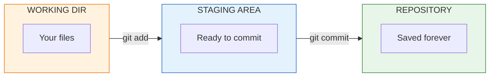
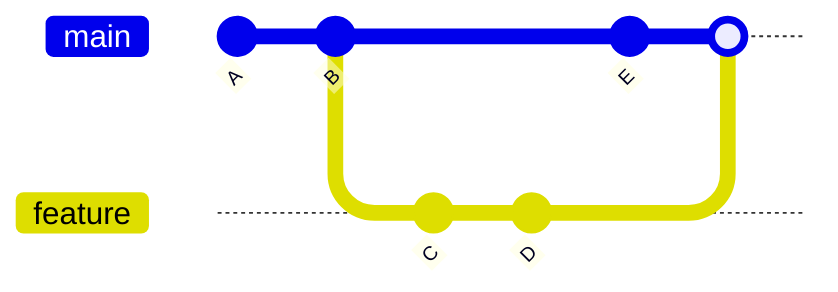

# Module 2: Git & Version Control

> **Duration**: Week 1 | **Lessons**: 20 | **Project**: First GitHub Repository

## 🎯 Module Overview

Git is your code's time machine. Every change is recorded. Every mistake is reversible. Every experiment is safe.

By the end of this module, you'll understand not just HOW to use Git, but WHY it works the way it does.

## 🧠 The Core Problem

> You've been coding for 3 hours. You try something new. It breaks everything. You can't remember what the code looked like before. You wish you had a time machine.

Git IS that time machine.

## 📚 What You'll Learn

### Section A: What IS Git? (Lessons 2.0-2.6)

The mental model that makes everything else make sense:

- **Working Directory**: Your files as you see them
- **Staging Area**: Changes you're preparing to save
- **Repository**: The complete history of your project

### Section B: Branching (Lessons 2.7-2.12)

Parallel universes for your code:

- Create experimental branches
- Switch between timelines
- Merge changes back together
- Resolve conflicts when timelines collide

### Section C: Remote Repositories (Lessons 2.13-2.19)

Collaboration with the world:

- Push your code to GitHub
- Pull changes from teammates
- Submit pull requests for review
- The complete Git workflow

## 🛠️ Key Commands

| Command | Purpose |
|:--------|:--------|
| `git init` | Create a new repository |
| `git add` | Stage changes |
| `git commit` | Save a snapshot |
| `git log` | View history |
| `git branch` | Create parallel timeline |
| `git checkout` | Switch branches |
| `git merge` | Combine branches |
| `git push` | Upload to remote |
| `git pull` | Download from remote |
| `git clone` | Copy a repository |

## 🎯 Module Project

**Goal**: Create a GitHub repository, make a feature branch, submit a pull request, and merge it.

You'll do this multiple times until it becomes muscle memory.

## ✅ Independence Check

By the end of this module, you should be able to handle these situations WITHOUT Googling:

| Situation | You Know How To |
|:----------|:----------------|
| "I want to undo my last commit" | `git reset` or `git revert` |
| "I committed to main by accident" | Move commits to a branch |
| "I need to switch branches but have uncommitted changes" | `git stash` |
| "My merge has conflicts" | Read conflict markers, resolve manually |
| "I want to see what changed yesterday" | `git log`, `git diff` |

## 📖 Lesson Index

### Section A: What IS Git?

| # | Lesson | Duration |
|:-:|:-------|:--------:|
| 2.0 | The Disaster Problem | 10 min |
| 2.1 | Version Control: The Time Machine | 20 min |
| 2.2 | Git Under the Hood | 25 min |
| 2.3 | Your First Repository | 20 min |
| 2.4 | Making Snapshots | 25 min |
| 2.5 | Viewing History | 20 min |
| 2.6 | Git Basics Q&A | 10 min |

### Section B: Branching

| # | Lesson | Duration |
|:-:|:-------|:--------:|
| 2.7 | The Feature Problem | 5 min |
| 2.8 | Branches Under the Hood | 25 min |
| 2.9 | Creating & Switching Branches | 25 min |
| 2.10 | Merging Branches | 25 min |
| 2.11 | Merge Conflicts | 30 min |
| 2.12 | Branching Q&A | 10 min |

### Section C: Remote Repositories

| # | Lesson | Duration |
|:-:|:-------|:--------:|
| 2.13 | The Team Problem | 5 min |
| 2.14 | Remotes Under the Hood | 25 min |
| 2.15 | Push & Pull | 25 min |
| 2.16 | Clone & Fork | 20 min |
| 2.17 | Pull Requests | 25 min |
| 2.18 | Git Workflow Q&A | 10 min |
| 2.19 | Module 2 Review | 15 min |

## 🔗 References

- [Pro Git Book](https://git-scm.com/book/en/v2) - The definitive Git resource
- [GitHub Docs](https://docs.github.com/en) - Official GitHub documentation
- [Git Visualizer](https://git-school.github.io/visualizing-git/) - See Git operations visually
- [Learn Git Branching](https://learngitbranching.js.org/) - Interactive Git tutorial
- [Oh Shit, Git!?!](https://ohshitgit.com/) - Fixing common Git mistakes
- [Conventional Commits](https://www.conventionalcommits.org/) - Commit message standards

## ⏭️ What's Next?

After mastering Git, you'll move on to **Module 3: Python Core**, where you'll build a CLI tool with API integration—all version controlled with Git!
