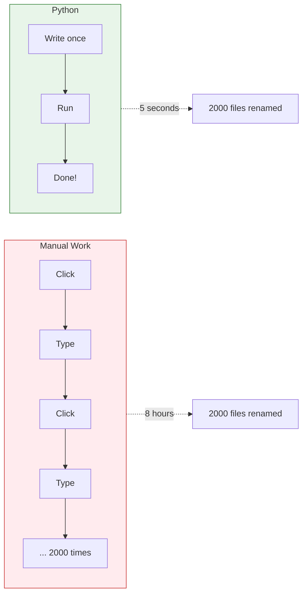
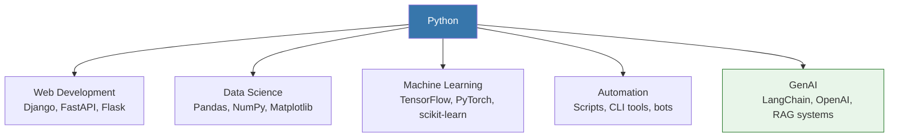

# Lesson 3.0: The Automation Problem

> **Duration**: 10 min | **Module Intro**

## 🎯 The Problem

You're a professional. Your time is valuable. But look at your day:

- Rename 500 files by hand *(20 minutes)*
- Copy data from 10 websites *(45 minutes)*
- Update a spreadsheet with calculations *(30 minutes)*
- Send the same email to 50 people *(25 minutes)*

**You're not doing your job. You're doing a computer's job.**

> **Scenario**: Your boss hands you a folder with 2,000 image files named `IMG_0001.jpg` through `IMG_2000.jpg`. They need to be renamed to include the date and a project code: `2024-03-15_ProjectX_0001.jpg`. By tomorrow.

Do you:
1. Click-rename each file manually? (That's 8+ hours of mind-numbing work)
2. Write 10 lines of Python? (That's 5 minutes of work)

```python
import os
from datetime import date

for i, filename in enumerate(sorted(os.listdir("images")), 1):
    old = f"images/{filename}"
    new = f"images/{date.today()}_ProjectX_{i:04d}.jpg"
    os.rename(old, new)
```

**10 lines. 5 seconds to run. Done.**

## 💭 What We Need



Programming isn't about being smart. It's about being **lazy in the right way**—automating repetitive work so you can focus on what matters.

## 🐍 Why Python?

| Reason | What It Means |
|:-------|:--------------|
| **Readable** | Code looks like English. Easy to learn. |
| **Batteries Included** | Standard library does most things you need. |
| **Massive Ecosystem** | 400,000+ packages for everything. |
| **AI/ML Standard** | LLMs, data science, automation—Python dominates. |
| **Fast Enough** | For most tasks, speed isn't the bottleneck. |



## 📍 What You'll Learn

In this module, you'll master:

1. **How Python runs code** - What actually happens when you type `python script.py`
2. **Variables and memory** - Why `x = 42` doesn't mean what you think
3. **Data types** - Numbers, strings, lists, dictionaries
4. **Control flow** - Making decisions, repeating actions
5. **Functions** - Writing reusable code
6. **Classes** - Building your own objects
7. **Error handling** - When things go wrong
8. **Files and APIs** - Real-world input/output

## 🎯 The Goal

By the end of this module, you'll:
- Understand exactly what's in memory when your code runs
- Debug errors by reasoning about execution, not guessing
- Build a CLI tool that fetches data from APIs

**No more "it works but I don't know why."**

Let's begin.
