# Lesson 3.1: What IS Python?

> **Duration**: 20 min | **Section**: A - Python Execution Model

## 🎯 The Problem (3-5 min)

You write this:

```python
print("Hello, World!")
```

You run it. Text appears. But **what actually happened?**

> **Scenario**: Your computer only understands 1s and 0s. You wrote English-like text. How did it become something the computer could execute?

## 🧪 Try It: The Naive Approach (5-10 min)

You might think:
- "Python reads my file and runs it" (Partially true, but what does 'runs it' mean?)
- "It's compiled like C" (No, not quite)
- "It's magic" (Never an acceptable answer!)

Let's see what Python really is.

## 🔍 Under the Hood (10-15 min)

### Interpreted vs Compiled


| Approach | Compile Time | Runtime | Speed |
|:---------|:-------------|:--------|:------|
| Compiled | Slow (compile first) | Fast (native code) | ⚡ Fast |
| Interpreted | None (just run) | Slower (interpreter overhead) | 🐢 Slower |

Python is **interpreted**. No compile step—just run your code.

### But Wait—Python Does Compile!

Python actually does a hidden compilation step:


1. **Source code** → Your `.py` file
2. **Bytecode** → Intermediate form (`.pyc` files in `__pycache__`)
3. **Python Virtual Machine (PVM)** → Executes bytecode

You don't see the bytecode usually—Python handles it automatically.

### Line by Line Execution

```python
# Line 1
x = 10
# Line 2
y = 20
# Line 3
print(x + y)
```

Python executes:
1. Line 1: Create object `10`, bind name `x`
2. Line 2: Create object `20`, bind name `y`
3. Line 3: Look up `x`, look up `y`, add, print result

Each line runs in order, top to bottom (unless you use control flow).

### The Python Interpreter

When you type `python`:

```bash
python script.py    # Run a script
python              # Start interactive mode (REPL)
python -c "print(1)" # Run a one-liner
```

The **interpreter** is the program that reads and executes your Python code. CPython is the standard interpreter (written in C).

### REPL: Read-Eval-Print Loop

```bash
$ python
>>> 2 + 2
4
>>> name = "Alice"
>>> print(f"Hello, {name}")
Hello, Alice
>>> exit()
```

| Step | What Happens |
|:-----|:-------------|
| **Read** | You type code |
| **Eval** | Python evaluates it |
| **Print** | Result is printed |
| **Loop** | Wait for next input |

REPL is perfect for experimentation.

## 💥 Where It Breaks (3-5 min)

| Misconception | Reality |
|:--------------|:--------|
| "Python is slow" | Slow vs C, yes. But fast enough for 95% of tasks. |
| "Python is untyped" | It's dynamically typed—types exist, checked at runtime. |
| "Python runs my code directly" | It compiles to bytecode first (just hidden from you). |

### Speed Comparison (Rough)


But Python can call C libraries (NumPy, TensorFlow) for speed-critical code!

## ✅ The Fix (5-10 min)

### Python's Tradeoff

```mermaid
flowchart TD
    TRADEOFF["Python's Philosophy"]
    TRADEOFF --> DEV["Developer Speed ✓
    Fast to write, easy to read"]
    TRADEOFF --> RUN["Runtime Speed ✗
    Slower than compiled languages"]
    TRADEOFF --> SOLUTION["Solution: Critical code in C
    (NumPy, Pandas, etc.)"]
    
    style DEV fill:#E8F5E9,stroke:#2E7D32
    style RUN fill:#FFEBEE,stroke:#C62828
    style SOLUTION fill:#E3F2FD,stroke:#1565C0
```



Python prioritizes **developer productivity** over raw speed. For GenAI work (our focus), this is the right tradeoff—LLM API calls take seconds; Python's overhead is irrelevant.

### Key Points

```python
# Python is:
# 1. Interpreted (with hidden bytecode compilation)
# 2. Dynamically typed (types checked at runtime)
# 3. High-level (handles memory for you)
# 4. General-purpose (web, data, ML, automation, AI)
```

## 🎯 Practice

1. Open a terminal and start Python:
   ```bash
   python3
   ```

2. Try the REPL:
   ```python
   >>> 2 ** 10
   >>> "hello" * 3
   >>> import this
   ```

3. Exit the REPL:
   ```python
   >>> exit()
   ```

4. Check your Python version:
   ```bash
   python3 --version
   ```

## 🔑 Key Takeaways

- Python is interpreted but compiles to bytecode
- The PVM (Python Virtual Machine) executes bytecode
- Python prioritizes readability over speed
- REPL lets you experiment interactively
- CPython is the standard Python interpreter

## ❓ Common Questions

| Question | Answer |
|----------|--------|
| What's CPython? | The standard Python, written in C. There are others (PyPy, Jython). |
| Is Python slow? | Compared to C, yes. For most tasks, it doesn't matter. |
| What's bytecode? | Intermediate representation between your code and machine code. |
| When should I NOT use Python? | Real-time systems, embedded devices, game engines. |

## 🔗 Further Reading

- [Python Execution Model](https://docs.python.org/3/reference/executionmodel.html)
- [How Python Works](https://realpython.com/cpython-source-code-guide/)
