# Lesson 3.2: Running Python

> **Duration**: 15 min | **Section**: A - Python Execution Model

## 🎯 The Problem (3-5 min)

You have Python code. How do you actually run it?

> **Scenario**: You wrote a script. Your colleague says "just run it." But there are multiple ways—REPL, scripts, one-liners, Jupyter. Which do you use when?

## 🧪 Try It: The Different Ways (5-10 min)

### 1. Interactive Mode (REPL)

```bash
$ python3
>>> x = 42
>>> print(x)
42
>>> exit()
```

**Best for**: Experimenting, testing ideas, quick calculations.

### 2. Script Files

Create `hello.py`:
```python
print("Hello from a script!")
```

Run it:
```bash
python3 hello.py
```

**Best for**: Reusable code, programs, automation.

### 3. One-liners

```bash
python3 -c "print('Hello')"
python3 -c "import sys; print(sys.version)"
```

**Best for**: Quick commands in shell scripts.

### 4. Module Execution

```bash
python3 -m http.server 8000
python3 -m json.tool data.json
```

**Best for**: Running modules as scripts (built-in tools).

## 🔍 Under the Hood (10-15 min)

### The `python` Command

```mermaid
flowchart TD
    CMD["python3"]
    CMD --> REPL["(no args)
    → REPL mode"]
    CMD --> SCRIPT["script.py
    → Run file"]
    CMD --> C["-c 'code'
    → One-liner"]
    CMD --> M["-m module
    → Run module"]
    
    style CMD fill:#3776AB,color:#fff
```



| Flag | Purpose | Example |
|:-----|:--------|:--------|
| *(none)* | Start REPL | `python3` |
| `file.py` | Run script | `python3 app.py` |
| `-c "code"` | Run string | `python3 -c "print(1)"` |
| `-m module` | Run module | `python3 -m pip install x` |
| `-i file.py` | Run then REPL | `python3 -i app.py` |
| `-V` | Show version | `python3 -V` |

### Script Execution Flow


### The Shebang

Make scripts directly executable:

```python
#!/usr/bin/env python3
print("I can run without typing 'python3'!")
```

```bash
chmod +x script.py
./script.py  # Works!
```

The `#!` (shebang) tells the system which interpreter to use.

### `__name__` and `__main__`

Every Python file has a special variable `__name__`:

```python
# script.py
print(f"__name__ is: {__name__}")

if __name__ == "__main__":
    print("Running as main script!")
```

```bash
$ python3 script.py
__name__ is: __main__
Running as main script!
```

But if imported:
```python
>>> import script
__name__ is: script
```

This pattern lets code work as both a script AND an importable module.

### Working Directory

Python runs from wherever you call it:

```bash
/home/user/projects$ python3 app/main.py
# Working dir is /home/user/projects, NOT /home/user/projects/app
```

This affects file paths! Use `os.path` or `pathlib` for robust paths.

## 💥 Where It Breaks (3-5 min)

| Problem | Cause | Fix |
|:--------|:------|:----|
| `python: command not found` | Python not installed or not in PATH | Install Python, check PATH |
| `python` runs Python 2 | System still has Python 2 | Use `python3` explicitly |
| `ModuleNotFoundError` | Wrong working directory | Check path, use absolute imports |
| Script won't run with `./` | Missing shebang or chmod | Add shebang, `chmod +x` |

### Python 2 vs Python 3

```bash
python --version   # Might be Python 2!
python3 --version  # Always Python 3

# ALWAYS use python3 to be explicit
```

## ✅ The Fix (5-10 min)

### When to Use What


### Standard Script Template

```python
#!/usr/bin/env python3
"""
Description of what this script does.
"""


def main():
    """Main function."""
    print("Hello, World!")


if __name__ == "__main__":
    main()
```

This is the professional way to structure a script.

## 🎯 Practice

1. Create a script:
   ```bash
   echo 'print("Hello from script!")' > hello.py
   python3 hello.py
   ```

2. Try REPL:
   ```bash
   python3
   >>> 2 + 2
   >>> exit()
   ```

3. Run a one-liner:
   ```bash
   python3 -c "print('one-liner works!')"
   ```

4. Try a built-in module:
   ```bash
   python3 -m calendar 2024
   ```

5. Make a script executable:
   ```bash
   echo '#!/usr/bin/env python3
   print("I am executable!")' > runme.py
   chmod +x runme.py
   ./runme.py
   ```

## 🔑 Key Takeaways

- REPL for experimenting, scripts for reusable code
- Use `python3` (not `python`) to ensure Python 3
- Shebang (`#!/usr/bin/env python3`) makes scripts executable
- `if __name__ == "__main__":` for script entry points
- `-m` runs modules as scripts

## ❓ Common Questions

| Question | Answer |
|----------|--------|
| What's the difference between python and python3? | `python` might be Python 2 on some systems. Always use `python3`. |
| What's the shebang for? | Tells the OS which interpreter to use when you run `./script.py`. |
| Why use `if __name__ == "__main__"`? | So your file works as both a script AND an importable module. |
| What's `-m` for? | Runs a module as a script. Handles paths correctly. |

## 🔗 Further Reading

- [Python Command Line](https://docs.python.org/3/using/cmdline.html)
- [Python Scripts Tutorial](https://realpython.com/run-python-scripts/)
