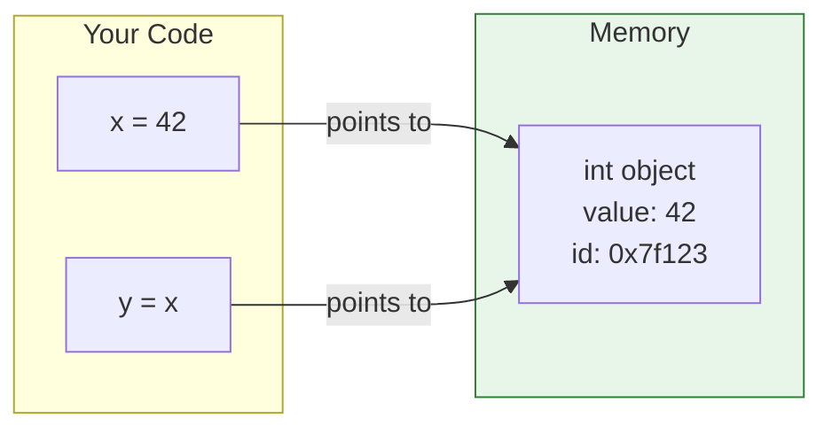
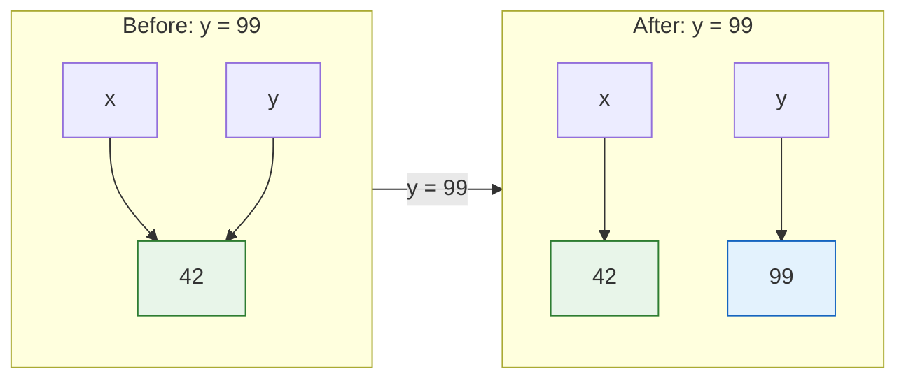
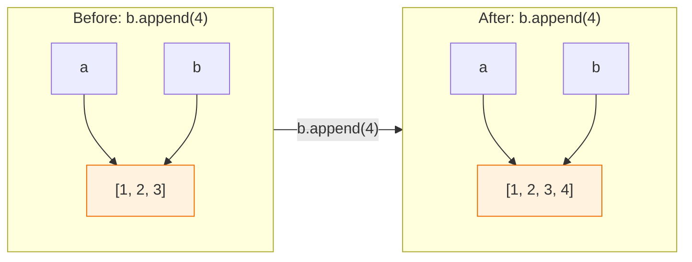

# Lesson 3.3: Variables Under the Hood

> **Duration**: 25 min | **Section**: A - Python Execution Model

## 🎯 The Problem (3-5 min)

You write:

```python
x = 42
y = x
y = 99
print(x)  # What prints?
```

The answer is `42`. But **why**? What is `x` really? What happened when we said `y = x`?

> **Scenario**: Coming from other languages, you might think variables are "boxes" that store values. In Python, that mental model is **wrong**—and it will cause bugs.

## 🧪 Try It: The Wrong Mental Model (5-10 min)

### The "Box" Model (WRONG!)

```
x = 42     →  [ box x: 42 ]
y = x      →  [ box y: 42 ]  (copy value)
y = 99     →  [ box y: 99 ]  (change y's value)
x is still 42
```

This seems to work... but try this:

```python
a = [1, 2, 3]
b = a
b.append(4)
print(a)  # [1, 2, 3, 4] — WAIT, WE CHANGED b!
```

The box model can't explain this. Let's fix our mental model.

## 🔍 Under the Hood (10-15 min)

### Variables Are Labels, Not Boxes

In Python, variables are **names** (labels) that **point to** objects in memory.



Both `x` and `y` point to the **same object**!

### What `=` Actually Does

```python
x = 42
```

This does NOT put 42 "into" x. It does:
1. Create an integer object with value 42
2. Bind the name `x` to that object

```python
y = x
```

This does NOT copy 42 into y. It does:
1. Look up what `x` points to
2. Bind the name `y` to that **same object**

### Proving It: The `id()` Function

```python
x = 42
y = x
print(id(x))  # 140234567890
print(id(y))  # 140234567890  ← SAME!
print(x is y) # True ← Same object!
```

`id()` returns the object's memory address. Same id = same object.

### Rebinding vs Mutating



`y = 99` doesn't change the 42 object. It:
1. Creates a new object (99)
2. Points `y` to the new object
3. `x` still points to 42

### Lists Are Different (Mutable!)

```python
a = [1, 2, 3]
b = a           # b points to same list
b.append(4)     # Modifies the list object itself
print(a)        # [1, 2, 3, 4] — a sees the change!
```



The list object was **mutated** (changed in place). Both `a` and `b` see the change because they point to the same object!

### Mutable vs Immutable

| Type | Mutable? | What happens on "change" |
|:-----|:---------|:-------------------------|
| `int`, `float` | Immutable | New object created |
| `str` | Immutable | New object created |
| `tuple` | Immutable | New object created |
| `list` | Mutable | Object modified in place |
| `dict` | Mutable | Object modified in place |
| `set` | Mutable | Object modified in place |

### The Full Picture

```python
x = 42        # Create int(42), x points to it
y = x         # y points to same int(42)
y = 99        # Create int(99), y points to NEW object
print(x)      # 42 — x unchanged

a = [1, 2]    # Create list, a points to it
b = a         # b points to SAME list
b.append(3)   # Mutate the list (in place)
print(a)      # [1, 2, 3] — a sees change (same object!)
```

## 💥 Where It Breaks (3-5 min)

| Bug | Cause | Fix |
|:----|:------|:----|
| Modifying b changes a | Both point to same mutable object | Copy the list: `b = a.copy()` |
| Function changes my list | Passed by reference | Pass a copy, or don't mutate |
| String won't change | Strings are immutable | Create new string: `s = s + "more"` |

### The Accidental Shared List Bug

```python
def add_item(item, lst=[]):  # DEFAULT LIST — BUG!
    lst.append(item)
    return lst

print(add_item(1))  # [1]
print(add_item(2))  # [1, 2] — WAIT, IT REMEMBERS!
```

The default list is created **once** and shared across calls!

**Fix**:
```python
def add_item(item, lst=None):
    if lst is None:
        lst = []
    lst.append(item)
    return lst
```

## ✅ The Fix (5-10 min)

### Copying Objects

```python
# Shallow copy (copies list, not nested objects)
original = [1, 2, 3]
copy1 = original.copy()
copy2 = list(original)
copy3 = original[:]

# Deep copy (copies everything, including nested)
import copy
nested = [[1, 2], [3, 4]]
deep = copy.deepcopy(nested)
```

### Checking Identity vs Equality

```python
a = [1, 2, 3]
b = [1, 2, 3]
c = a

a == b   # True — same VALUE
a is b   # False — different OBJECTS

a == c   # True — same value
a is c   # True — same OBJECT
```

- `==` checks value equality
- `is` checks identity (same object in memory)

## 🎯 Practice

1. Predict the output:
   ```python
   x = [1, 2, 3]
   y = x
   y.append(4)
   print(x)
   print(x is y)
   ```

2. Predict the output:
   ```python
   a = "hello"
   b = a
   b = "world"
   print(a)
   print(a is b)
   ```

3. Check identity:
   ```python
   x = 42
   y = 42
   print(x is y)  # What prints? (Hint: small integer caching)
   ```

4. Fix this bug:
   ```python
   def process(data=[]):
       data.append("processed")
       return data
   ```

## 🔑 Key Takeaways

- Variables are **names** pointing to **objects**, not boxes
- `=` binds a name to an object, doesn't copy
- Multiple names can point to the same object
- Mutable objects (list, dict) can be changed in place
- Immutable objects (int, str, tuple) create new objects on "change"
- Use `.copy()` or `copy.deepcopy()` to avoid shared references

## ❓ Common Questions

| Question | Answer |
|----------|--------|
| Why are small integers cached? | Optimization. `-5` to `256` are pre-created and reused. |
| What's the difference between `is` and `==`? | `is` = same object. `==` = same value. |
| How do I know if something is mutable? | Lists, dicts, sets are mutable. Strings, tuples, numbers are not. |
| Why does Python work this way? | Efficiency. Passing references is faster than copying. |

## 🔗 Further Reading

- [Python Data Model](https://docs.python.org/3/reference/datamodel.html)
- [Facts and Myths about Python Names and Values](https://nedbatchelder.com/text/names.html)
