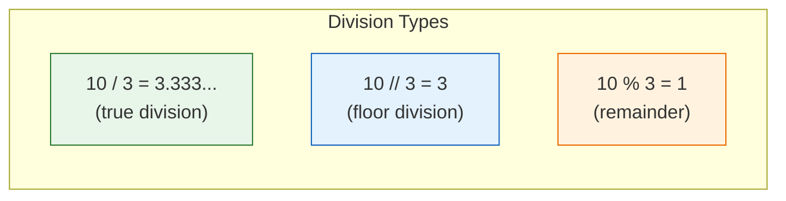
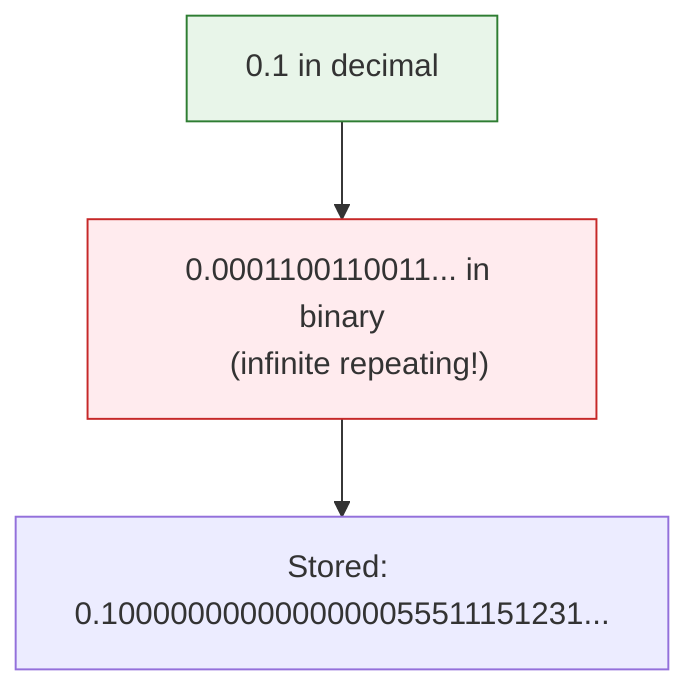

# Lesson 3.4: Data Types - Numbers & Booleans

> **Duration**: 20 min | **Section**: A - Python Execution Model

## 🎯 The Problem (3-5 min)

You need to work with data. Python has different types for different purposes:

> **Scenario**: You're calculating prices. Should you use integers or floats? What happens when you divide? Why does `0.1 + 0.2` not equal `0.3`?

## 🧪 Try It: Number Types (5-10 min)

### Integers (`int`)

Whole numbers, positive or negative, no decimal:

```python
age = 25
population = 8_000_000_000  # Underscores for readability!
negative = -42
zero = 0
```

Python integers have **unlimited precision**:
```python
huge = 10 ** 100  # No overflow!
print(huge)       # A googol (1 followed by 100 zeros)
```

### Floats (`float`)

Numbers with decimals:

```python
price = 19.99
temperature = -40.0
scientific = 6.022e23  # Avogadro's number
```

### Booleans (`bool`)

True or False (exactly two values):

```python
is_active = True
has_access = False

# Booleans are actually integers!
print(True + True)   # 2
print(False + False) # 0
```

## 🔍 Under the Hood (10-15 min)

### Numeric Operations

```python
# Arithmetic
10 + 3   # 13 (addition)
10 - 3   # 7 (subtraction)
10 * 3   # 30 (multiplication)
10 / 3   # 3.333... (true division - ALWAYS returns float!)
10 // 3  # 3 (floor division - rounds down)
10 % 3   # 1 (modulo - remainder)
10 ** 3  # 1000 (exponentiation)
```



### Type Coercion

When mixing types, Python promotes to the more precise type:

```python
5 + 2.0    # 7.0 (int + float = float)
True + 3   # 4 (bool + int = int)
```

### The Floating Point Problem

```python
>>> 0.1 + 0.2
0.30000000000000004  # NOT 0.3!
```

**Why?** Computers use binary. Some decimals can't be represented exactly.



**Fix**: Use `decimal` module for financial calculations:
```python
from decimal import Decimal
Decimal('0.1') + Decimal('0.2')  # Decimal('0.3')
```

### Boolean Logic

```python
# Comparison operators (return bool)
5 > 3      # True
5 < 3      # False
5 == 5     # True (equality)
5 != 3     # True (not equal)
5 >= 5     # True
5 <= 3     # False

# Logical operators
True and True   # True
True and False  # False
True or False   # True
not True        # False
```

### Truthiness

Everything in Python has a boolean value:

```python
# Falsy values (evaluate to False)
bool(0)       # False
bool(0.0)     # False
bool("")      # False
bool([])      # False
bool({})      # False
bool(None)    # False

# Truthy values (everything else)
bool(42)      # True
bool(-1)      # True
bool("hi")    # True
bool([1,2])   # True
```

This is why you can write:
```python
if my_list:  # Instead of: if len(my_list) > 0:
    print("List has items")
```

### Type Checking and Conversion

```python
# Check type
type(42)         # <class 'int'>
type(3.14)       # <class 'float'>
type(True)       # <class 'bool'>

isinstance(42, int)     # True
isinstance(42, float)   # False

# Convert between types
int(3.7)         # 3 (truncates, doesn't round!)
float(42)        # 42.0
bool(0)          # False
bool(1)          # True
```

## 💥 Where It Breaks (3-5 min)

| Problem | Cause | Fix |
|:--------|:------|:----|
| `0.1 + 0.2 != 0.3` | Floating point imprecision | Use `decimal` or `round()` |
| `int(3.9) = 3` not 4 | `int()` truncates, doesn't round | Use `round(3.9)` |
| `"5" + 3` = Error | Can't add string and int | Convert: `int("5") + 3` |
| Division by zero | `x / 0` | Check before dividing |

## ✅ The Fix (5-10 min)

### Comparing Floats

```python
# WRONG
0.1 + 0.2 == 0.3  # False!

# RIGHT
import math
math.isclose(0.1 + 0.2, 0.3)  # True
```

### Safe Division

```python
# Check for zero
if divisor != 0:
    result = dividend / divisor
else:
    result = 0  # or raise an error
```

### Quick Reference

```python
# Type constructors
int("42")      # 42
float("3.14")  # 3.14
bool(1)        # True

# Rounding
round(3.7)     # 4
round(3.14159, 2)  # 3.14

# Absolute value
abs(-42)       # 42

# Min/Max
min(1, 2, 3)   # 1
max(1, 2, 3)   # 3

# Power
pow(2, 10)     # 1024
```

## 🎯 Practice

1. Calculate and check types:
   ```python
   print(type(10 / 3))   # What type?
   print(type(10 // 3))  # What type?
   ```

2. Experiment with truthiness:
   ```python
   values = [0, 1, "", "hello", [], [1], None]
   for v in values:
       print(f"{repr(v)}: {bool(v)}")
   ```

3. Fix the float comparison:
   ```python
   result = 0.1 + 0.2
   # Make this work:
   # if result == 0.3:  # Fails!
   ```

4. What does this print?
   ```python
   print(True + True + True)
   print(10 / 3)
   print(10 // 3)
   print(10 % 3)
   ```

## 🔑 Key Takeaways

- `int`: Unlimited precision whole numbers
- `float`: Decimal numbers (can be imprecise!)
- `bool`: True or False (subclass of int)
- `/` always returns float, `//` returns int
- Everything has truthiness (0, "", [], None are falsy)
- Use `decimal.Decimal` for financial calculations

## ❓ Common Questions

| Question | Answer |
|----------|--------|
| Why is `True + True = 2`? | `bool` is a subclass of `int`. True=1, False=0. |
| How do I round properly? | Use `round()`. `int()` truncates (chops off decimal). |
| Why use `//` instead of `int(/)`? | Same result, but `//` is cleaner and works with floats too. |
| What's the biggest int? | No limit! Python handles arbitrary precision. |

## 🔗 Further Reading

- [Python Numeric Types](https://docs.python.org/3/library/stdtypes.html#numeric-types-int-float-complex)
- [Floating Point Arithmetic: Issues and Limitations](https://docs.python.org/3/tutorial/floatingpoint.html)
