# Lesson 3.5: Data Types - Strings

> **Duration**: 30 min | **Section**: A - Python Execution Model

## 🎯 The Problem (3-5 min)

Text is everywhere in programming:
- User names
- Error messages
- API responses
- File contents

> **Scenario**: You need to extract the domain from an email, format a message with data, and clean up user input. How do you work with text in Python?

## 🧪 Try It: Creating Strings (5-10 min)

```python
# Single or double quotes (no difference)
name = "Alice"
message = 'Hello'

# Multi-line strings
poem = """Roses are red,
Violets are blue,
Python is awesome,
And so are you."""

# Raw strings (backslashes are literal)
path = r"C:\Users\name"  # No escaping needed

# Escape sequences
newline = "Line 1\nLine 2"
tab = "Column1\tColumn2"
```

## 🔍 Under the Hood (10-15 min)

### Strings Are Sequences

A string is a **sequence of characters**. Each character has an **index** (position):

```
String:  P  y  t  h  o  n
Index:   0  1  2  3  4  5
Neg:    -6 -5 -4 -3 -2 -1
```

```python
s = "Python"
s[0]    # 'P' (first character)
s[5]    # 'n' (last character)
s[-1]   # 'n' (last, using negative index)
s[-2]   # 'o' (second to last)
```

### Slicing

Extract parts of strings with `[start:end:step]`:

```python
s = "Python"
s[0:3]   # 'Pyt' (index 0, 1, 2 — end is exclusive!)
s[:3]    # 'Pyt' (start defaults to 0)
s[3:]    # 'hon' (end defaults to len)
s[::2]   # 'Pto' (every 2nd character)
s[::-1]  # 'nohtyP' (reversed!)
```


### Strings Are IMMUTABLE

You cannot change a string in place:

```python
s = "Hello"
s[0] = "J"  # ERROR! TypeError!

# Instead, create a NEW string
s = "J" + s[1:]  # "Jello"
```



```mermaid
flowchart LR
    subgraph IMMUTABLE["Immutable = No In-Place Changes"]
        OLD["'Hello'"] -->|"can't modify"| ERROR["❌"]
        CORRECT["s = 'J' + s[1:]"] --> NEW["'Jello'
        (new object)"]
    end
    
    style ERROR fill:#FFEBEE,stroke:#C62828
    style NEW fill:#E8F5E9,stroke:#2E7D32
```

### String Methods

Strings have many built-in methods:

```python
s = "  Hello, World!  "

# Case
s.upper()      # "  HELLO, WORLD!  "
s.lower()      # "  hello, world!  "
s.title()      # "  Hello, World!  "

# Whitespace
s.strip()      # "Hello, World!" (remove both ends)
s.lstrip()     # "Hello, World!  " (left only)
s.rstrip()     # "  Hello, World!" (right only)

# Find & Replace
s.find("World")    # 9 (index where found, -1 if not)
s.replace("World", "Python")  # "  Hello, Python!  "

# Check content
s.startswith("  H")   # True
s.endswith("!  ")     # True
s.isdigit()           # False
s.isalpha()           # False (has space, punctuation)

# Split & Join
"a,b,c".split(",")        # ['a', 'b', 'c']
"-".join(["a", "b", "c"]) # "a-b-c"
```

### Common Operations

```python
# Length
len("Hello")  # 5

# Concatenation
"Hello" + " " + "World"  # "Hello World"

# Repetition
"Ha" * 3  # "HaHaHa"

# Membership
"ell" in "Hello"   # True
"xyz" in "Hello"   # False

# Iteration
for char in "Hello":
    print(char)
```

### String Comparison

Strings compare lexicographically (dictionary order):

```python
"apple" < "banana"   # True (a comes before b)
"Apple" < "apple"    # True (uppercase < lowercase in ASCII)
"10" < "9"           # True (string comparison, not numeric!)
```

## 💥 Where It Breaks (3-5 min)

| Problem | Cause | Fix |
|:--------|:------|:----|
| `s[0] = "x"` error | Strings are immutable | Create new string |
| `"10" < "9"` is True | String comparison, not numeric | Convert to int |
| `"Hello" + 5` error | Can't add string and int | Convert: `str(5)` |
| Encoding errors | Non-ASCII characters | Use proper encoding |

### The Number-String Confusion

```python
user_input = input("Enter number: ")  # Returns STRING
print(user_input + 5)  # ERROR!
print(int(user_input) + 5)  # Works
```

## ✅ The Fix (5-10 min)

### String Formatting (f-strings)

The modern way to build strings:

```python
name = "Alice"
age = 30

# Old way (don't use)
"Hello, " + name + "! You are " + str(age)

# f-string (use this!)
f"Hello, {name}! You are {age}"

# With expressions
f"Next year you'll be {age + 1}"

# With formatting
pi = 3.14159
f"Pi is approximately {pi:.2f}"  # "Pi is approximately 3.14"
```

We'll cover f-strings in depth in the next lesson.

### Useful Patterns

```python
# Check if string is empty
if not s:  # Empty string is falsy
    print("Empty!")

# Clean user input
user_input = user_input.strip().lower()

# Extract parts
email = "user@example.com"
name, domain = email.split("@")

# Build paths safely
import os
path = os.path.join("folder", "subfolder", "file.txt")
```

### Quick Reference

```python
# Common methods
s.strip()           # Remove whitespace
s.split(sep)        # Split into list
sep.join(lst)       # Join list into string
s.replace(old, new) # Replace substring
s.find(sub)         # Find index (-1 if not found)
s.upper() / lower() # Change case
s.startswith(x)     # Check prefix
s.endswith(x)       # Check suffix

# Formatting
f"{value}"          # f-string
f"{x:10}"           # Width 10
f"{x:.2f}"          # 2 decimal places
f"{x:>10}"          # Right align
```

## 🎯 Practice

1. Extract email parts:
   ```python
   email = "john.doe@company.com"
   # Get "john.doe" and "company.com"
   ```

2. Clean and normalize:
   ```python
   user = "  JoHn DOE  "
   # Make it "john doe"
   ```

3. Reverse a string:
   ```python
   text = "Hello"
   # Make it "olleH"
   ```

4. Count words:
   ```python
   sentence = "The quick brown fox"
   # How many words?
   ```

5. Check valid username (alphanumeric only):
   ```python
   username = "user123"
   # Is it valid?
   ```

## 🔑 Key Takeaways

- Strings are sequences of characters (indexable, sliceable)
- Strings are **immutable** (cannot change in place)
- Indexing: `s[0]`, `s[-1]`
- Slicing: `s[start:end:step]`
- Methods: `.strip()`, `.split()`, `.join()`, `.replace()`, etc.
- Use f-strings for formatting: `f"Hello, {name}!"`

## ❓ Common Questions

| Question | Answer |
|----------|--------|
| Why are strings immutable? | Safety and efficiency. Strings can be shared and hashed. |
| What's the difference between `find` and `index`? | `find` returns -1 if not found. `index` raises an error. |
| How do I handle Unicode? | Python 3 strings are Unicode by default. Just use them! |
| Single or double quotes? | No difference. Pick one style and be consistent. |

## 🔗 Further Reading

- [Python String Methods](https://docs.python.org/3/library/stdtypes.html#string-methods)
- [String Formatting](https://realpython.com/python-f-strings/)
