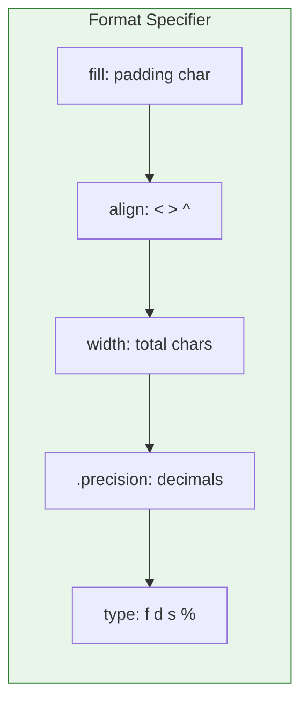

# Lesson 3.6: f-strings - String Building

> **Duration**: 20 min | **Section**: A - Python Execution Model

## 🎯 The Problem (3-5 min)

You need to build strings with dynamic data:

> **Scenario**: You're generating a report. "User {name} logged in at {time} from {location}." How do you insert variables into text elegantly?

## 🧪 Try It: The Evolution (5-10 min)

### The Old Ways (Don't Use These)

```python
name = "Alice"
age = 30

# Concatenation (ugly, error-prone)
msg = "Hello, " + name + "! You are " + str(age) + "."

# %-formatting (old, limited)
msg = "Hello, %s! You are %d." % (name, age)

# .format() (better, but verbose)
msg = "Hello, {}! You are {}.".format(name, age)
```

### The Modern Way: f-strings

```python
msg = f"Hello, {name}! You are {age}."
```

Clean. Readable. Fast. **Always use f-strings.**

## 🔍 Under the Hood (10-15 min)

### Basic f-string Syntax

```python
name = "Alice"
f"Hello, {name}!"  # "Hello, Alice!"
```

The `f` prefix makes it a "formatted string literal". Anything in `{}` is evaluated as Python code.

### Expressions Inside {}

```python
x = 10
y = 20

f"{x} + {y} = {x + y}"          # "10 + 20 = 30"
f"Uppercase: {name.upper()}"     # "Uppercase: ALICE"
f"List: {[1, 2, 3]}"             # "List: [1, 2, 3]"
```

You can put **any valid expression** inside `{}`.

### Formatting Specifiers

Use `:` after the expression for formatting:

```python
# Numbers
pi = 3.14159265
f"{pi:.2f}"      # "3.14" (2 decimal places)
f"{pi:.4f}"      # "3.1416" (4 decimal places)

# Thousands separator
big = 1234567
f"{big:,}"       # "1,234,567"

# Percentage
ratio = 0.85
f"{ratio:.1%}"   # "85.0%"

# Width and alignment
name = "Bob"
f"{name:>10}"    # "       Bob" (right align, width 10)
f"{name:<10}"    # "Bob       " (left align)
f"{name:^10}"    # "   Bob    " (center)
f"{name:_^10}"   # "___Bob____" (center with fill)
```

### Format Specifier Syntax

```
{value:[[fill]align][width][,][.precision][type]}
```



| Specifier | Meaning | Example |
|:----------|:--------|:--------|
| `d` | Integer | `f"{42:d}"` → "42" |
| `f` | Float | `f"{3.14:.1f}"` → "3.1" |
| `s` | String | `f"{'hi':s}"` → "hi" |
| `%` | Percentage | `f"{0.25:%}"` → "25.000000%" |
| `e` | Scientific | `f"{1000:e}"` → "1.000000e+03" |
| `x` | Hex | `f"{255:x}"` → "ff" |
| `b` | Binary | `f"{10:b}"` → "1010" |

### Practical Examples

```python
# Prices
price = 49.99
f"Total: ${price:,.2f}"  # "Total: $49.99"

# Dates (informal)
day, month, year = 25, 12, 2024
f"{year}-{month:02d}-{day:02d}"  # "2024-12-25" (zero-padded)

# Tables
for item in [("Apple", 1.50), ("Banana", 0.75)]:
    name, price = item
    print(f"{name:<10} ${price:>6.2f}")
# Apple      $  1.50
# Banana     $  0.75

# Debug (Python 3.8+)
x = 42
f"{x=}"  # "x=42" (shows variable name!)
```

### Multiline f-strings

```python
name = "Alice"
age = 30
job = "Engineer"

bio = f"""
Name: {name}
Age: {age}
Job: {job}
"""
```

### Escaping Braces

To include literal `{` or `}`, double them:

```python
f"Use {{braces}} like this"  # "Use {braces} like this"
```

## 💥 Where It Breaks (3-5 min)

| Problem | Cause | Fix |
|:--------|:------|:----|
| `SyntaxError` in f-string | Invalid expression | Check code inside `{}` |
| Quotes conflict | Used same quotes inside | Use different quotes |
| Can't use backslash | `\n` not allowed in `{}` | Use variable instead |

### Quote Matching

```python
# WRONG
f"She said "hello""  # SyntaxError

# RIGHT
f'She said "hello"'  # Mix quote types
f"She said \"hello\""  # Escape (less readable)
```

### Backslash Limitation

```python
# WRONG
f"Line 1{\n}Line 2"  # SyntaxError

# RIGHT
newline = "\n"
f"Line 1{newline}Line 2"
```

## ✅ The Fix (5-10 min)

### f-string Best Practices

```python
# 1. Keep expressions simple
# BAD
f"{users[0].profile.get_display_name().upper()}"

# GOOD
display_name = users[0].profile.get_display_name().upper()
f"{display_name}"

# 2. Use for debugging
x, y = 10, 20
print(f"{x=}, {y=}, {x+y=}")  # x=10, y=20, x+y=30

# 3. Format numbers consistently
f"{value:,.2f}"  # Thousands separator, 2 decimals
```

### Quick Reference

```python
# Basic
f"{variable}"

# Expressions
f"{x + y}"
f"{name.upper()}"

# Numbers
f"{n:d}"       # Integer
f"{n:.2f}"     # 2 decimal float
f"{n:,}"       # Thousands separator
f"{n:.1%}"     # Percentage

# Alignment
f"{s:<10}"     # Left align
f"{s:>10}"     # Right align
f"{s:^10}"     # Center
f"{s:_^10}"    # Center with fill

# Debug (3.8+)
f"{x=}"        # Shows "x=value"
```

## 🎯 Practice

1. Format a price:
   ```python
   price = 1234.5
   # Output: "$1,234.50"
   ```

2. Create a padded ID:
   ```python
   id_num = 42
   # Output: "ID-0042"
   ```

3. Build a table row:
   ```python
   name, score = "Alice", 95.5
   # Output: "Alice          95.50" (name left, score right)
   ```

4. Format a percentage:
   ```python
   completion = 0.756
   # Output: "75.6% complete"
   ```

5. Debug with f-string:
   ```python
   x, y = 10, 20
   # Print "x=10, y=20, sum=30"
   ```

## 🔑 Key Takeaways

- Always use f-strings for string formatting
- Prefix with `f`: `f"Hello, {name}!"`
- Put any expression inside `{}`
- Use `:` for format specifiers
- Common formats: `:.2f` (decimals), `:,` (thousands), `:.1%` (percent)
- Alignment: `:<` (left), `:>` (right), `:^` (center)

## ❓ Common Questions

| Question | Answer |
|----------|--------|
| Are f-strings faster? | Yes, slightly. They're evaluated at runtime. |
| Can I use f-strings in Python 2? | No, f-strings are Python 3.6+. |
| What's the debug `=` thing? | Python 3.8+. `f"{x=}"` prints "x=value". |
| Can I nest f-strings? | Yes, but keep it readable. |

## 🔗 Further Reading

- [PEP 498 – Literal String Interpolation](https://peps.python.org/pep-0498/)
- [f-string Tutorial](https://realpython.com/python-f-strings/)
