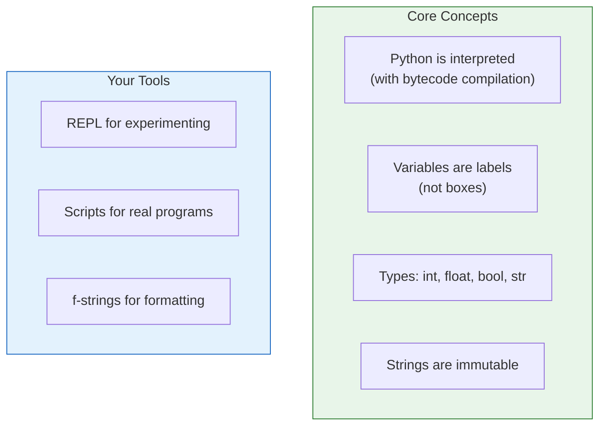
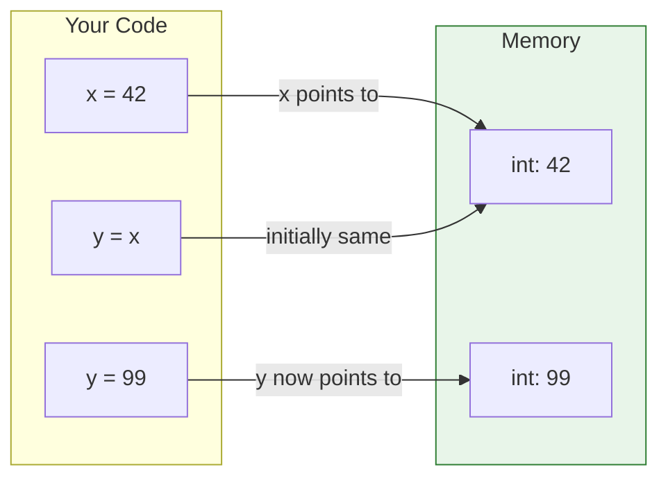

# Lesson 3.7: Python Basics Q&A

> **Duration**: 10 min | **Section**: A - Python Execution Model (Wrap-up)

## 📋 Section A Summary



## 🧠 Concept Check

| Concept | Question | Answer |
|:--------|:---------|:-------|
| Interpreter | How does Python run code? | Compiles to bytecode, PVM executes it |
| Variables | What IS a variable? | A name (label) pointing to an object |
| Assignment | What does `y = x` do? | Points `y` to same object as `x` |
| int | Precision limit? | Unlimited! |
| float | Why `0.1 + 0.2 != 0.3`? | Binary representation can't be exact |
| bool | What is `True + True`? | 2 (booleans are integers) |
| str | Can you change a string? | No, strings are immutable |
| f-string | How to format? | `f"Hello, {name}!"` |

## ❓ Frequently Asked Questions

### Python Execution

| Question | Answer |
|----------|--------|
| Is Python compiled or interpreted? | Both! Compiled to bytecode, then interpreted. |
| What's the difference between python and python3? | `python` might be Python 2 on some systems. Use `python3`. |
| What's a REPL? | Read-Eval-Print Loop. Interactive Python session. |

### Variables and Memory

| Question | Answer |
|----------|--------|
| Why does changing `b` affect `a`? | If `b = a` and both point to a mutable object (list/dict), changes affect both. |
| How do I copy a list? | `b = a.copy()` or `b = list(a)` or `b = a[:]` |
| What's `is` vs `==`? | `is` = same object. `==` = same value. |
| What's `None`? | Python's "nothing" value. Represents absence of a value. |

### Types

| Question | Answer |
|----------|--------|
| Why are strings immutable? | Safety (can't accidentally change), hashability, optimization. |
| When use `int()` vs `round()`? | `int()` truncates (3.9→3). `round()` rounds (3.9→4). |
| What's truthiness? | Everything has a boolean value. `0, "", [], None` are falsy. |
| Single vs double quotes? | No difference. Pick one style. |

### Common Mistakes

| Mistake | What Happens | Fix |
|:--------|:-------------|:----|
| `"5" + 3` | TypeError | `int("5") + 3` |
| `s[0] = "x"` | TypeError | Create new string |
| `0.1 + 0.2 == 0.3` | False! | `math.isclose()` |
| `x = x + 1` before assign | NameError | Initialize first |

## 🔗 Command Quick Reference

```python
# === RUNNING PYTHON ===
python3                    # REPL
python3 script.py          # Run script
python3 -c "print(1)"      # One-liner
python3 -m module          # Run module

# === TYPE FUNCTIONS ===
type(x)                    # Get type
isinstance(x, int)         # Check type
int(), float(), str(), bool()  # Convert

# === STRING METHODS ===
s.strip()                  # Remove whitespace
s.split(",")               # Split to list
",".join(list)             # Join list
s.replace("a", "b")        # Replace
s.upper(), s.lower()       # Case

# === F-STRINGS ===
f"{x}"                     # Insert value
f"{x:.2f}"                 # 2 decimals
f"{x:,}"                   # Thousands sep
f"{x:>10}"                 # Right align
f"{x=}"                    # Debug print
```

## 📊 The Python Memory Model



**Key Insight**: `y = 99` creates a NEW object and points `y` to it. It doesn't change the 42 object. That's why `x` is still 42.

## 🔑 Key Takeaways

1. **Python compiles to bytecode** - Then PVM interprets it
2. **Variables are labels** - They point to objects, they're not boxes
3. **Assignment = pointing** - `y = x` makes both point to same object
4. **Types are objects** - `int`, `float`, `bool`, `str` are all objects
5. **Strings are immutable** - Can't change in place, must create new
6. **f-strings for formatting** - `f"Hello {name}"` is clean and fast

## ✅ Section Complete!

You now understand:
- How Python executes code (bytecode → PVM)
- Variables are labels pointing to objects
- Basic types: `int`, `float`, `bool`, `str`
- Strings are immutable sequences
- f-strings for clean formatting

**Next up**: Section B - Collections (Lists, Dictionaries, and more)

We'll explore:
- Lists (ordered, mutable sequences)
- Dictionaries (key-value lookup)
- Tuples and Sets
- When to use which collection
