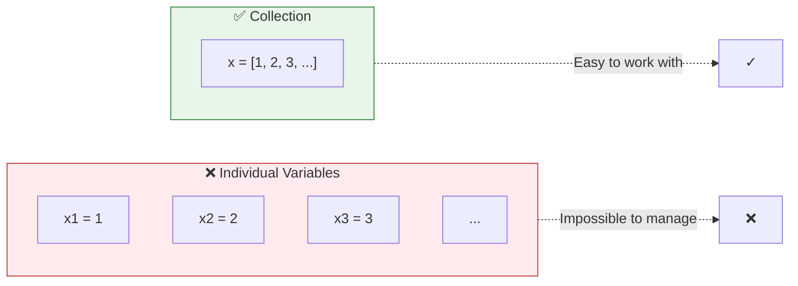
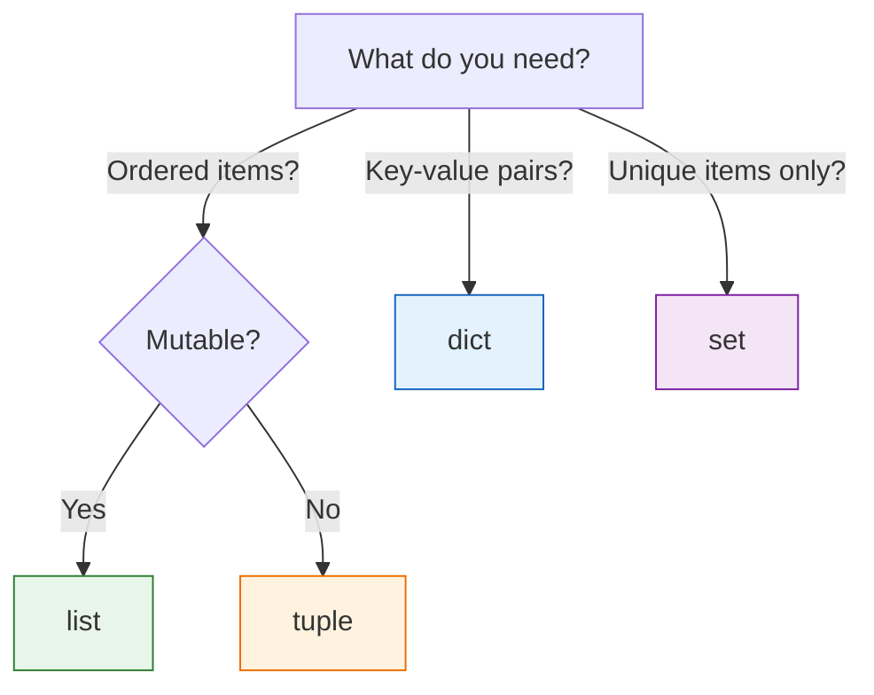

# Lesson 3.8: The Multiple Items Problem

> **Duration**: 5 min | **Section**: B - Collections (Intro)

## 🎯 The Problem

You have 1000 user IDs. Do you do this?

```python
user_id_1 = "abc123"
user_id_2 = "def456"
user_id_3 = "ghi789"
# ... 997 more variables?!
```

**No.** That's insane.

> **Scenario**: You're processing a list of transactions. There are 50,000 of them. You can't create 50,000 variables. You need a way to store **multiple items in one place**.

## 💭 What We Need



We need **collections**—data structures that hold multiple items.

## 📦 Python's Collections

| Collection | What It Is | Best For |
|:-----------|:-----------|:---------|
| **list** | Ordered, mutable sequence | General purpose, iteration |
| **dict** | Key → Value mapping | Fast lookup by key |
| **tuple** | Ordered, immutable sequence | Fixed data, function returns |
| **set** | Unordered unique items | Membership testing, deduplication |



## 🎯 What You'll Learn

In this section:
1. **Lists** - The workhorse collection (ordered, mutable)
2. **Dictionaries** - Key-value lookup (O(1) speed!)
3. **Tuples** - Immutable sequences
4. **Sets** - Unique items, fast membership tests

Let's start with lists.
