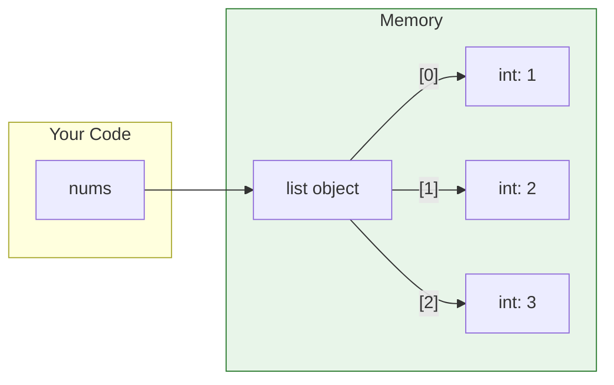
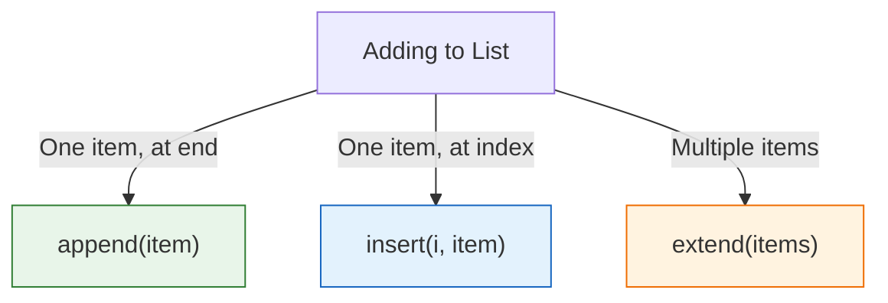

# Lesson 3.9: Lists Under the Hood

> **Duration**: 30 min | **Section**: B - Collections

## 🎯 The Problem (3-5 min)

You need to store an ordered sequence of items that you can modify:

> **Scenario**: You're building a shopping cart. Items can be added, removed, reordered. How do you store this in Python?

## 🧪 Try It: Creating Lists (5-10 min)

```python
# Empty list
cart = []

# List with items
numbers = [1, 2, 3, 4, 5]
names = ["Alice", "Bob", "Charlie"]

# Mixed types (allowed, but usually avoid)
mixed = [1, "hello", 3.14, True]

# List from other iterables
chars = list("hello")  # ['h', 'e', 'l', 'l', 'o']
nums = list(range(5))  # [0, 1, 2, 3, 4]
```

## 🔍 Under the Hood (10-15 min)

### Lists Are Ordered Sequences

Each item has a position (index), starting at 0:

```
List:  ["a", "b", "c", "d", "e"]
Index:   0    1    2    3    4
Neg:    -5   -4   -3   -2   -1
```

```python
letters = ["a", "b", "c", "d", "e"]
letters[0]   # "a" (first)
letters[2]   # "c" (third)
letters[-1]  # "e" (last)
letters[-2]  # "d" (second to last)
```

### Lists Are Mutable

Unlike strings, you CAN change lists in place:

```python
nums = [1, 2, 3]
nums[0] = 100    # Modify in place!
print(nums)      # [100, 2, 3]
```

### Memory Model



A list is a container that holds **references** to other objects.

### Slicing Lists

Same syntax as strings—`[start:end:step]`:

```python
nums = [0, 1, 2, 3, 4, 5, 6, 7, 8, 9]

nums[2:5]    # [2, 3, 4] (index 2, 3, 4)
nums[:3]     # [0, 1, 2] (first 3)
nums[7:]     # [7, 8, 9] (from 7 to end)
nums[::2]    # [0, 2, 4, 6, 8] (every 2nd)
nums[::-1]   # [9, 8, 7, 6, 5, 4, 3, 2, 1, 0] (reversed)

# Slicing COPIES the list
copy = nums[:]  # Full copy
```

### Basic Operations

```python
nums = [1, 2, 3]

# Length
len(nums)           # 3

# Concatenation (creates NEW list)
nums + [4, 5]       # [1, 2, 3, 4, 5]

# Repetition
[0] * 5             # [0, 0, 0, 0, 0]

# Membership
2 in nums           # True
10 in nums          # False

# Iteration
for n in nums:
    print(n)
```

### Adding Items

```python
nums = [1, 2, 3]

# append: add to end (modifies in place)
nums.append(4)      # [1, 2, 3, 4]

# insert: add at index
nums.insert(0, 0)   # [0, 1, 2, 3, 4]

# extend: add multiple items
nums.extend([5, 6]) # [0, 1, 2, 3, 4, 5, 6]
```



### Removing Items

```python
nums = [1, 2, 3, 4, 5]

# pop: remove and return (by index)
last = nums.pop()       # returns 5, list is [1, 2, 3, 4]
first = nums.pop(0)     # returns 1, list is [2, 3, 4]

# remove: remove by value (first occurrence)
nums.remove(3)          # [2, 4]

# del: remove by index (no return)
del nums[0]             # [4]

# clear: remove all
nums.clear()            # []
```

### Finding Items

```python
letters = ['a', 'b', 'c', 'b', 'd']

# Index of item
letters.index('b')      # 1 (first occurrence)
letters.index('b', 2)   # 3 (start search at index 2)

# Count occurrences
letters.count('b')      # 2

# Check membership
'c' in letters          # True
```

## 💥 Where It Breaks (3-5 min)

| Problem | Cause | Fix |
|:--------|:------|:----|
| `IndexError` | Index out of range | Check `len()` first |
| `ValueError` on `index()` | Item not in list | Use `in` check first |
| Unexpected mutation | Shared reference | Copy the list |
| Slow membership test | Lists are O(n) | Use `set` instead |

### The Shared Reference Bug

```python
a = [1, 2, 3]
b = a           # Both point to SAME list!
b.append(4)
print(a)        # [1, 2, 3, 4] — Surprise!

# Fix: Copy the list
b = a.copy()    # or: b = list(a) or b = a[:]
```

## ✅ The Fix (5-10 min)

### List Methods Reference

```python
# Adding
lst.append(x)         # Add to end
lst.insert(i, x)      # Add at index
lst.extend(iterable)  # Add multiple

# Removing
lst.pop()             # Remove/return last
lst.pop(i)            # Remove/return at index
lst.remove(x)         # Remove first x
lst.clear()           # Remove all

# Finding
lst.index(x)          # Index of x
lst.count(x)          # Count of x

# Ordering
lst.sort()            # Sort in place
lst.reverse()         # Reverse in place
sorted(lst)           # Return sorted copy

# Copying
lst.copy()            # Shallow copy
```

### Safe Access Patterns

```python
# Check before accessing
if i < len(lst):
    item = lst[i]

# Check before removing
if x in lst:
    lst.remove(x)

# Get with default (for dicts; for lists use try/except)
try:
    item = lst[i]
except IndexError:
    item = default
```

## 🎯 Practice

1. Create and modify a list:
   ```python
   fruits = ["apple", "banana"]
   # Add "cherry" to the end
   # Insert "apricot" at the beginning
   # Remove "banana"
   ```

2. Practice slicing:
   ```python
   nums = [0, 1, 2, 3, 4, 5, 6, 7, 8, 9]
   # Get [3, 4, 5]
   # Get last 3 items
   # Get every other item
   # Reverse the list
   ```

3. Find an item safely:
   ```python
   items = ["a", "b", "c"]
   # Find index of "b"
   # Find index of "z" (handle not found)
   ```

## 🔑 Key Takeaways

- Lists are ordered, mutable sequences
- Index starts at 0, negative indexes from end
- Slicing: `[start:end:step]`
- `append()` adds one item, `extend()` adds many
- `pop()` removes and returns, `remove()` removes by value
- Lists are mutable—changes affect all references!
- Copy with `.copy()` or `[:]` to avoid shared reference bugs

## ❓ Common Questions

| Question | Answer |
|----------|--------|
| List vs tuple? | List is mutable, tuple is immutable. |
| How to check if empty? | `if not my_list:` (empty list is falsy). |
| Are lists fast? | Access by index: O(1). Search by value: O(n). |
| Max size? | Limited by memory only. |

## 🔗 Further Reading

- [Python Lists](https://docs.python.org/3/tutorial/datastructures.html#more-on-lists)
- [List Methods](https://docs.python.org/3/tutorial/datastructures.html#more-on-lists)
