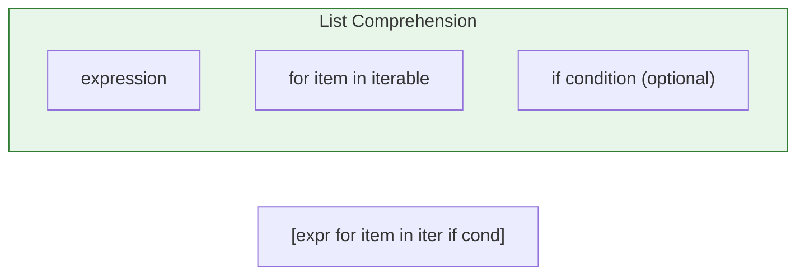
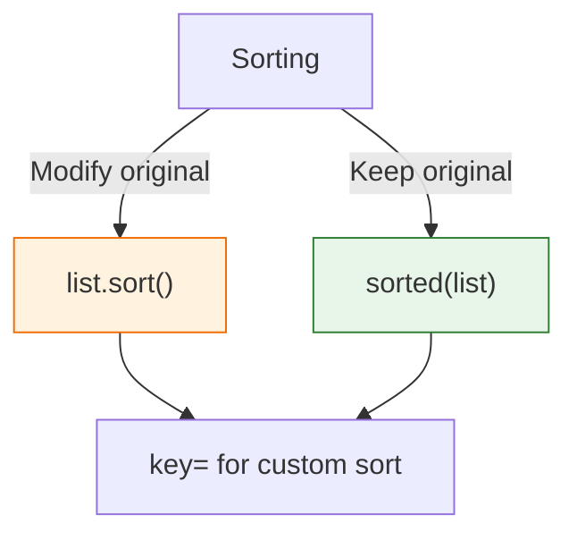

# Lesson 3.10: List Operations

> **Duration**: 30 min | **Section**: B - Collections

## 🎯 The Problem (3-5 min)

You have a list. Now you need to:
- Transform every item
- Filter out some items
- Sort and organize

> **Scenario**: You have a list of prices. You need to apply a 10% discount, remove items over $100, and sort from lowest to highest.

## 🧪 Try It: The Verbose Way (5-10 min)

```python
prices = [45.0, 120.0, 89.0, 15.0, 200.0, 67.0]

# Apply 10% discount
discounted = []
for p in prices:
    discounted.append(p * 0.9)

# Filter over $100
affordable = []
for p in discounted:
    if p <= 100:
        affordable.append(p)

# Sort
affordable.sort()
```

This works, but it's **verbose**. Let's learn better ways.

## 🔍 Under the Hood (10-15 min)

### List Comprehensions

A concise way to create lists:

```python
# Traditional loop
squares = []
for x in range(10):
    squares.append(x ** 2)

# List comprehension (same result, one line)
squares = [x ** 2 for x in range(10)]
```

**Syntax**: `[expression for item in iterable]`



### With Filtering

```python
# Only even numbers
evens = [x for x in range(20) if x % 2 == 0]
# [0, 2, 4, 6, 8, 10, 12, 14, 16, 18]

# Only positive values
positives = [x for x in numbers if x > 0]
```

**Syntax**: `[expression for item in iterable if condition]`

### Transform AND Filter

```python
prices = [45.0, 120.0, 89.0, 15.0, 200.0, 67.0]

# Discount and filter in one comprehension
result = [p * 0.9 for p in prices if p * 0.9 <= 100]
# [40.5, 80.1, 13.5, 60.3]
```

### Nested Comprehensions

```python
# Flatten a matrix
matrix = [[1, 2, 3], [4, 5, 6], [7, 8, 9]]
flat = [num for row in matrix for num in row]
# [1, 2, 3, 4, 5, 6, 7, 8, 9]

# Read as: for row in matrix: for num in row: append num
```

### Sorting

```python
nums = [3, 1, 4, 1, 5, 9, 2, 6]

# sort() modifies in place
nums.sort()           # [1, 1, 2, 3, 4, 5, 6, 9]

# sorted() returns new list
nums = [3, 1, 4, 1, 5, 9, 2, 6]
new_list = sorted(nums)  # nums unchanged!

# Reverse sort
nums.sort(reverse=True)  # [9, 6, 5, 4, 3, 2, 1, 1]

# Custom sort key
words = ["banana", "pie", "apple", "cherry"]
words.sort(key=len)   # ['pie', 'apple', 'banana', 'cherry']
```



### Sorting with Key Functions

```python
# Sort by last character
words = ["apple", "pie", "banana"]
sorted(words, key=lambda w: w[-1])  # ['banana', 'apple', 'pie']

# Sort by absolute value
nums = [-5, 2, -1, 8, -3]
sorted(nums, key=abs)  # [-1, 2, -3, -5, 8]

# Sort dicts by a field
users = [
    {"name": "Bob", "age": 25},
    {"name": "Alice", "age": 30},
    {"name": "Charlie", "age": 20}
]
sorted(users, key=lambda u: u["age"])
# Sorted by age: Charlie, Bob, Alice
```

### Common List Functions

```python
nums = [1, 2, 3, 4, 5]

len(nums)       # 5
sum(nums)       # 15
min(nums)       # 1
max(nums)       # 5
any(nums)       # True (any truthy?)
all(nums)       # True (all truthy?)

# With comprehension
sum([x**2 for x in nums])  # Sum of squares: 55
```

### Enumerate and Zip

```python
# enumerate: get index AND value
names = ["Alice", "Bob", "Charlie"]
for i, name in enumerate(names):
    print(f"{i}: {name}")
# 0: Alice
# 1: Bob
# 2: Charlie

# zip: iterate multiple lists together
names = ["Alice", "Bob"]
ages = [30, 25]
for name, age in zip(names, ages):
    print(f"{name} is {age}")
# Alice is 30
# Bob is 25
```

## 💥 Where It Breaks (3-5 min)

| Problem | Cause | Fix |
|:--------|:------|:----|
| Comprehension too complex | Too many operations | Use regular loop |
| `sort()` returns `None` | It modifies in place | Don't assign: `lst.sort()` |
| Sorting mixed types | Can't compare str and int | Convert to same type |
| Memory with huge lists | Comprehension builds full list | Use generator |

### Common Mistake

```python
# WRONG: sort() returns None!
sorted_list = my_list.sort()  # sorted_list is None!

# RIGHT
my_list.sort()  # Modifies in place
# or
sorted_list = sorted(my_list)  # Returns new list
```

## ✅ The Fix (5-10 min)

### When to Use Comprehensions

```python
# ✅ Simple transformations
squares = [x**2 for x in nums]

# ✅ Simple filters
evens = [x for x in nums if x % 2 == 0]

# ❌ Complex logic - use regular loop
result = []
for item in items:
    if complex_condition(item):
        transformed = complex_transform(item)
        if another_check(transformed):
            result.append(transformed)
```

**Rule**: If your comprehension is hard to read, use a loop.

### Solving the Original Problem

```python
prices = [45.0, 120.0, 89.0, 15.0, 200.0, 67.0]

# One-liner solution
result = sorted([p * 0.9 for p in prices if p * 0.9 <= 100])
# [13.5, 40.5, 60.3, 80.1]
```

### Quick Reference

```python
# Comprehensions
[expr for x in iter]             # Transform all
[expr for x in iter if cond]     # Transform and filter
[x for row in matrix for x in row]  # Flatten

# Sorting
lst.sort()                       # In-place
sorted(lst)                      # New list
sorted(lst, reverse=True)        # Descending
sorted(lst, key=func)            # Custom order

# Useful functions
enumerate(lst)                   # Index + value
zip(lst1, lst2)                  # Pair up lists
sum(), min(), max(), len()       # Aggregates
any(), all()                     # Boolean checks
```

## 🎯 Practice

1. Use comprehension to get squares of odd numbers:
   ```python
   nums = range(10)
   # Result: [1, 9, 25, 49, 81]
   ```

2. Extract uppercase letters:
   ```python
   text = "Hello World"
   # Result: ['H', 'W']
   ```

3. Sort by second element:
   ```python
   pairs = [(1, 'b'), (3, 'a'), (2, 'c')]
   # Result: [(3, 'a'), (1, 'b'), (2, 'c')]
   ```

4. Flatten and sort:
   ```python
   matrix = [[3, 1], [4, 1], [5, 9]]
   # Result: [1, 1, 3, 4, 5, 9]
   ```

## 🔑 Key Takeaways

- List comprehensions: `[expr for x in iter if cond]`
- Use comprehensions for simple transforms/filters
- `sort()` modifies in place, returns None
- `sorted()` returns new list, keeps original
- Use `key=` for custom sorting
- `enumerate()` for index+value, `zip()` for pairing lists

## ❓ Common Questions

| Question | Answer |
|----------|--------|
| Comprehension vs map/filter? | Comprehensions are more Pythonic and readable. |
| When not to use comprehensions? | When logic is complex—readability matters. |
| Can I nest comprehensions? | Yes, but limit to 2 levels for readability. |
| What's a generator expression? | `(x for x in iter)` — lazy evaluation, saves memory. |

## 🔗 Further Reading

- [List Comprehensions](https://docs.python.org/3/tutorial/datastructures.html#list-comprehensions)
- [Sorting HOW TO](https://docs.python.org/3/howto/sorting.html)
