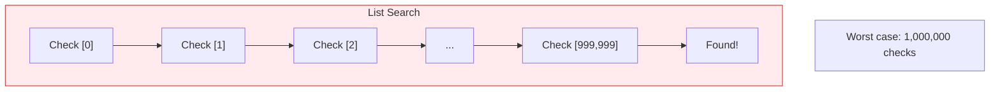
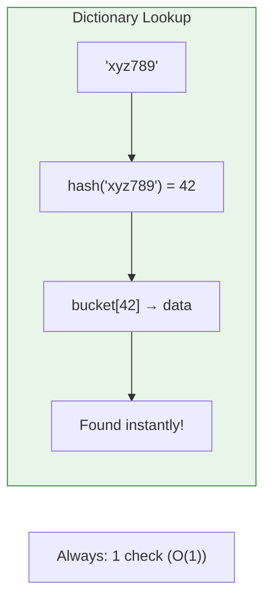

# Lesson 3.11: The Lookup Problem

> **Duration**: 5 min | **Section**: B - Collections

## 🎯 The Problem

You have 1 million users. You need to find one by their ID.

```python
users = [
    {"id": "abc123", "name": "Alice"},
    {"id": "def456", "name": "Bob"},
    # ... 999,998 more users
]

# Find user with id "xyz789"
for user in users:
    if user["id"] == "xyz789":
        return user
```

**How long does this take?**

In the worst case, you check ALL 1 million users. This is **O(n)**—linear time.

> **Scenario**: Your API needs to respond in under 100ms. Scanning 1 million items takes too long. You need instant lookup.

## 💭 The Math



| Operation | List | What We Need |
|:----------|:-----|:-------------|
| Find by value | O(n) | O(1) |
| 1M items | 1M checks | 1 check |

**We need O(1)—constant time—regardless of size.**

## 🔑 The Solution: Hash Tables

What if, instead of searching, you could **compute** where to find the item?

```python
# Instead of searching...
user_dict = {
    "abc123": {"id": "abc123", "name": "Alice"},
    "def456": {"id": "def456", "name": "Bob"},
    # ...
}

# Instant lookup!
user = user_dict["xyz789"]  # O(1) - no searching!
```



## 📊 The Comparison

| Items | List Search (O(n)) | Dict Lookup (O(1)) |
|------:|-------------------:|-------------------:|
| 100 | 100 checks | 1 check |
| 10,000 | 10,000 checks | 1 check |
| 1,000,000 | 1,000,000 checks | 1 check |

**This is the power of dictionaries.**

## 🎯 What You'll Learn

In the next lesson, you'll understand:
1. How dictionaries use **hash tables**
2. Why lookup is O(1)
3. When to choose dict over list

Let's dive in.
