# Lesson 3.12: Dictionaries Under the Hood

> **Duration**: 30 min | **Section**: B - Collections

## 🎯 The Problem (3-5 min)

You need to associate keys with values:
- User ID → User data
- Word → Definition  
- Product code → Price

> **Scenario**: You're building a cache. Given a URL, you need to instantly retrieve the cached response. How?

## 🧪 Try It: Creating Dictionaries (5-10 min)

```python
# Empty dict
cache = {}

# Dict with items
user = {
    "id": "abc123",
    "name": "Alice",
    "age": 30
}

# Dict from pairs
pairs = [("a", 1), ("b", 2)]
d = dict(pairs)  # {"a": 1, "b": 2}

# Dict with constructor
d = dict(name="Alice", age=30)
```

## 🔍 Under the Hood (10-15 min)

### Key → Value Mapping


Each **key** maps to exactly one **value**.

### How Hash Tables Work

Dictionaries use **hash tables** for O(1) lookup:

```python
# When you write:
user["name"]

# Python does:
# 1. hash("name") → produces integer (e.g., 12345)
# 2. Use hash to find bucket in array
# 3. Retrieve value from bucket
```



```mermaid
flowchart TD
    KEY["Key: 'name'"]
    HASH["hash('name') = 12345"]
    BUCKET["buckets[12345 % size] → slot"]
    VALUE["Value: 'Alice'"]
    
    KEY --> HASH --> BUCKET --> VALUE
    
    style KEY fill:#E3F2FD,stroke:#1565C0
    style VALUE fill:#E8F5E9,stroke:#2E7D32
```

### Why O(1)?

- **List**: Must check each item (O(n))
- **Dict**: Compute hash → go directly to location (O(1))

No matter if you have 100 or 100 million items, lookup takes the same time!

### Basic Operations

```python
user = {"name": "Alice", "age": 30}

# Access value
user["name"]      # "Alice"
user["email"]     # KeyError! Key doesn't exist

# Safe access with .get()
user.get("email")           # None (no error)
user.get("email", "N/A")    # "N/A" (default)

# Set/update value
user["email"] = "alice@example.com"  # Add new
user["age"] = 31                      # Update existing

# Delete
del user["age"]         # Remove key
user.pop("age", None)   # Remove and return (with default)
```

### Checking Keys

```python
user = {"name": "Alice", "age": 30}

# Check if key exists
"name" in user    # True
"email" in user   # False

# WRONG (checks values, not keys!)
"Alice" in user   # False!

# Check values explicitly
"Alice" in user.values()  # True
```

### Iterating

```python
user = {"name": "Alice", "age": 30, "city": "NYC"}

# Iterate keys (default)
for key in user:
    print(key)  # name, age, city

# Iterate values
for value in user.values():
    print(value)  # Alice, 30, NYC

# Iterate both (most common)
for key, value in user.items():
    print(f"{key}: {value}")
```

### Dictionary Views

```python
user = {"name": "Alice", "age": 30}

user.keys()    # dict_keys(['name', 'age'])
user.values()  # dict_values(['Alice', 30])
user.items()   # dict_items([('name', 'Alice'), ('age', 30)])

# These are views - they update if dict changes!
keys = user.keys()
user["city"] = "NYC"
print(keys)    # dict_keys(['name', 'age', 'city'])
```

### Key Requirements

Keys must be **hashable** (immutable):

```python
# ✅ Valid keys
d = {
    "string": 1,
    42: 2,
    (1, 2): 3,     # Tuple is OK
    True: 4,        # Bool is OK
}

# ❌ Invalid keys
d = {
    [1, 2]: 5,     # List is NOT hashable - ERROR!
    {"a": 1}: 6,   # Dict is NOT hashable - ERROR!
}
```



```mermaid
flowchart TD
    Q["Can it be a key?"]
    Q -->|"Hashable?"| CHECK{"Mutable?"}
    CHECK -->|"No (immutable)"| YES["✅ Yes
    str, int, tuple, bool"]
    CHECK -->|"Yes (mutable)"| NO["❌ No
    list, dict, set"]
    
    style YES fill:#E8F5E9,stroke:#2E7D32
    style NO fill:#FFEBEE,stroke:#C62828
```

## 💥 Where It Breaks (3-5 min)

| Problem | Cause | Fix |
|:--------|:------|:----|
| `KeyError` | Key doesn't exist | Use `.get()` or check `in` |
| Using list as key | Lists aren't hashable | Use tuple instead |
| Dict changed during iteration | Modified while looping | Iterate copy: `list(d.items())` |
| Order assumption | (Pre-3.7 dicts unordered) | Python 3.7+ maintains order |

### The KeyError Problem

```python
user = {"name": "Alice"}

# WRONG - will crash if key missing
age = user["age"]  # KeyError!

# RIGHT - handle missing keys
age = user.get("age")           # None
age = user.get("age", 0)        # 0 (default)

if "age" in user:
    age = user["age"]
```

## ✅ The Fix (5-10 min)

### Common Patterns

```python
# Count occurrences
counts = {}
for item in items:
    counts[item] = counts.get(item, 0) + 1

# Or use defaultdict
from collections import defaultdict
counts = defaultdict(int)
for item in items:
    counts[item] += 1

# Group items
groups = {}
for item in items:
    key = item["category"]
    if key not in groups:
        groups[key] = []
    groups[key].append(item)

# Or use defaultdict
groups = defaultdict(list)
for item in items:
    groups[item["category"]].append(item)
```

### Dictionary Comprehensions

```python
# Create dict from computation
squares = {x: x**2 for x in range(5)}
# {0: 0, 1: 1, 2: 4, 3: 9, 4: 16}

# Filter and transform
prices = {"apple": 1.0, "banana": 0.5, "orange": 1.5}
expensive = {k: v for k, v in prices.items() if v > 0.75}
# {"apple": 1.0, "orange": 1.5}
```

### Merging Dictionaries

```python
d1 = {"a": 1, "b": 2}
d2 = {"b": 3, "c": 4}

# Python 3.9+
merged = d1 | d2   # {"a": 1, "b": 3, "c": 4}

# Python 3.5+
merged = {**d1, **d2}

# In-place update
d1.update(d2)
```

### Quick Reference

```python
# Access
d[key]              # Get (KeyError if missing)
d.get(key)          # Get (None if missing)
d.get(key, default) # Get (default if missing)

# Modify
d[key] = value      # Set/update
del d[key]          # Delete
d.pop(key, default) # Delete and return

# Check
key in d            # Key exists?
d.keys()            # All keys
d.values()          # All values
d.items()           # All (key, value) pairs

# Iterate
for k in d:              # Keys
for v in d.values():     # Values
for k, v in d.items():   # Both
```

## 🎯 Practice

1. Create and access:
   ```python
   # Create a dict for a book
   # with title, author, year, pages
   # Access the author safely
   ```

2. Count letters:
   ```python
   text = "hello world"
   # Create dict: letter → count
   ```

3. Invert a dict:
   ```python
   d = {"a": 1, "b": 2, "c": 3}
   # Create: {1: "a", 2: "b", 3: "c"}
   ```

4. Merge with preference:
   ```python
   defaults = {"timeout": 30, "retries": 3}
   custom = {"timeout": 60}
   # Result: {"timeout": 60, "retries": 3}
   ```

## 🔑 Key Takeaways

- Dictionaries map keys to values with O(1) lookup
- Keys must be hashable (immutable)
- Use `.get()` to avoid `KeyError`
- Iterate with `.items()` for key-value pairs
- Dict comprehensions: `{k: v for ...}`
- Python 3.7+ maintains insertion order

## ❓ Common Questions

| Question | Answer |
|----------|--------|
| Why O(1) lookup? | Hash function computes location directly. |
| Can keys be duplicates? | No, each key maps to one value. Latest wins. |
| Why can't lists be keys? | Lists are mutable, hash could change. |
| When dict vs list? | Dict for lookup by key. List for ordered sequence. |

## 🔗 Further Reading

- [Python Dictionaries](https://docs.python.org/3/tutorial/datastructures.html#dictionaries)
- [Hash Tables Explained](https://realpython.com/python-hash-table/)
