# Lesson 3.13: Dictionary Operations

> **Duration**: 25 min | **Section**: B - Collections

## 🎯 The Problem (3-5 min)

You have dictionaries. Now you need to:
- Merge them
- Transform them
- Handle missing keys gracefully
- Work with nested structures

> **Scenario**: You're building a config system. Default settings merge with user settings. Some keys might be missing. How do you handle this cleanly?

## 🧪 Try It: Common Operations (5-10 min)

### Merging Dictionaries

```python
defaults = {"timeout": 30, "retries": 3, "debug": False}
user_config = {"timeout": 60, "debug": True}

# Method 1: Update (modifies defaults!)
config = defaults.copy()  # Don't forget to copy!
config.update(user_config)
# {"timeout": 60, "retries": 3, "debug": True}

# Method 2: Unpacking (Python 3.5+)
config = {**defaults, **user_config}

# Method 3: Union operator (Python 3.9+)
config = defaults | user_config
```

### Getting with Defaults

```python
user = {"name": "Alice", "age": 30}

# get() with default value
email = user.get("email", "not provided")

# setdefault() - get OR set if missing
cache = {}
cache.setdefault("key", []).append("value1")
cache.setdefault("key", []).append("value2")
# cache = {"key": ["value1", "value2"]}
```

## 🔍 Under the Hood (10-15 min)

### Dictionary Comprehensions

Transform dictionaries concisely:

```python
prices = {"apple": 1.00, "banana": 0.50, "orange": 0.75}

# Apply discount
discounted = {k: v * 0.9 for k, v in prices.items()}
# {"apple": 0.9, "banana": 0.45, "orange": 0.675}

# Filter expensive items
expensive = {k: v for k, v in prices.items() if v > 0.60}
# {"apple": 1.00, "orange": 0.75}

# Swap keys and values
inverted = {v: k for k, v in prices.items()}
# {1.00: "apple", 0.50: "banana", 0.75: "orange"}
```

### Nested Dictionaries

```python
users = {
    "alice": {
        "email": "alice@example.com",
        "profile": {
            "age": 30,
            "city": "NYC"
        }
    },
    "bob": {
        "email": "bob@example.com",
        "profile": {
            "age": 25,
            "city": "LA"
        }
    }
}

# Access nested values
users["alice"]["profile"]["city"]  # "NYC"

# Safe nested access (ugly but works)
city = users.get("alice", {}).get("profile", {}).get("city", "Unknown")
```

### defaultdict

From `collections`—auto-creates missing values:

```python
from collections import defaultdict

# Auto-create empty lists
groups = defaultdict(list)
groups["fruit"].append("apple")
groups["fruit"].append("banana")
groups["veggie"].append("carrot")
# {"fruit": ["apple", "banana"], "veggie": ["carrot"]}

# Auto-create zeros (for counting)
counts = defaultdict(int)
for word in ["a", "b", "a", "c", "a", "b"]:
    counts[word] += 1
# {"a": 3, "b": 2, "c": 1}

# Auto-create empty dicts (for nesting)
nested = defaultdict(dict)
nested["user1"]["name"] = "Alice"
nested["user1"]["age"] = 30
```



```mermaid
flowchart TD
    ACCESS["Access missing key"]
    
    subgraph REGULAR["Regular dict"]
        R1["d['missing']"] --> R2["KeyError ❌"]
    end
    
    subgraph DEFAULT["defaultdict"]
        D1["d['missing']"] --> D2["Create default"] --> D3["Return value ✓"]
    end
    
    style REGULAR fill:#FFEBEE,stroke:#C62828
    style DEFAULT fill:#E8F5E9,stroke:#2E7D32
```

### Counter

Specialized dict for counting:

```python
from collections import Counter

# Count items
words = ["apple", "banana", "apple", "cherry", "banana", "apple"]
counts = Counter(words)
# Counter({"apple": 3, "banana": 2, "cherry": 1})

# Most common
counts.most_common(2)  # [("apple", 3), ("banana", 2)]

# Arithmetic
c1 = Counter("aab")    # {"a": 2, "b": 1}
c2 = Counter("abc")    # {"a": 1, "b": 1, "c": 1}
c1 + c2                # {"a": 3, "b": 2, "c": 1}
c1 - c2                # {"a": 1}
```

### ChainMap

View multiple dicts as one:

```python
from collections import ChainMap

defaults = {"color": "red", "size": "medium"}
user_prefs = {"color": "blue"}
cli_args = {"size": "large"}

# Chain: looks up in order (first match wins)
config = ChainMap(cli_args, user_prefs, defaults)
config["color"]  # "blue" (from user_prefs)
config["size"]   # "large" (from cli_args)
```

## 💥 Where It Breaks (3-5 min)

| Problem | Cause | Fix |
|:--------|:------|:----|
| Deep nested access | `.get()` chains are ugly | Use helper function |
| Mutating shared defaults | Forgot to copy | Always `.copy()` first |
| JSON has null | `None` values | Handle explicitly |
| Unexpected key types | JSON keys are always strings | Convert as needed |

### Safe Nested Access

```python
def get_nested(d, *keys, default=None):
    """Safely get nested dictionary value."""
    for key in keys:
        if isinstance(d, dict):
            d = d.get(key, default)
        else:
            return default
    return d

# Usage
user = {"profile": {"address": {"city": "NYC"}}}
city = get_nested(user, "profile", "address", "city")  # "NYC"
zip_code = get_nested(user, "profile", "address", "zip", default="N/A")  # "N/A"
```

## ✅ The Fix (5-10 min)

### Practical Patterns

```python
# Pattern 1: Counting
from collections import Counter
word_counts = Counter(words)

# Pattern 2: Grouping
from collections import defaultdict
by_category = defaultdict(list)
for item in items:
    by_category[item["category"]].append(item)

# Pattern 3: Merging configs
config = {**defaults, **env_config, **cli_config}

# Pattern 4: Building incrementally
result = {}
for key, value in source:
    result.setdefault(key, []).append(value)
```

### Quick Reference

```python
# Merging
d1 | d2              # Union (3.9+)
{**d1, **d2}         # Unpacking
d1.update(d2)        # In-place

# Safe access
d.get(k, default)    # Get with default
d.setdefault(k, [])  # Get or set default

# Comprehensions
{k: v for k, v in d.items()}        # Transform
{k: v for k, v in d.items() if cond} # Filter

# Collections
defaultdict(list)    # Auto-create lists
defaultdict(int)     # Auto-create 0s
Counter(items)       # Count occurrences
ChainMap(d1, d2)     # Layer dicts
```

## 🎯 Practice

1. Merge configs:
   ```python
   defaults = {"host": "localhost", "port": 8080, "debug": False}
   override = {"port": 3000, "debug": True}
   # Result: {"host": "localhost", "port": 3000, "debug": True}
   ```

2. Count characters:
   ```python
   text = "hello world"
   # Result: {"h": 1, "e": 1, "l": 3, "o": 2, ...}
   ```

3. Group by first letter:
   ```python
   words = ["apple", "banana", "apricot", "blueberry", "cherry"]
   # Result: {"a": ["apple", "apricot"], "b": ["banana", "blueberry"], "c": ["cherry"]}
   ```

4. Safe nested access:
   ```python
   data = {"user": {"profile": {"name": "Alice"}}}
   # Get name, or "Unknown" if any key missing
   ```

## 🔑 Key Takeaways

- Merge dicts: `{**d1, **d2}` or `d1 | d2`
- Use `.get()` and `.setdefault()` for safe access
- `defaultdict(list/int/dict)` auto-creates missing values
- `Counter` for counting, `ChainMap` for layering
- Dict comprehensions: `{k: v for k, v in items}`

## ❓ Common Questions

| Question | Answer |
|----------|--------|
| When use defaultdict vs get? | defaultdict when building, get when just reading. |
| Can I chain update()? | No, but you can: `d = d1.copy(); d.update(d2)` |
| How to deep merge nested dicts? | Need custom function or library like `deepmerge`. |
| Counter vs defaultdict(int)? | Counter adds `most_common()` and arithmetic. |

## 🔗 Further Reading

- [collections Module](https://docs.python.org/3/library/collections.html)
- [Dictionary Views](https://docs.python.org/3/library/stdtypes.html#dict-views)
