# Lesson 3.14: Tuples & Sets

> **Duration**: 25 min | **Section**: B - Collections

## 🎯 The Problem (3-5 min)

You need:
1. A collection that **can't be changed** (for safety)
2. A collection with **no duplicates** (for uniqueness)

> **Scenario**: You're storing GPS coordinates—they shouldn't change. You're also tracking which users have voted—no duplicates allowed.

## 🧪 Try It: Tuples and Sets (5-10 min)

### Tuples: Immutable Lists

```python
# Create tuple
point = (10, 20)
rgb = (255, 128, 0)
single = (42,)  # Note the comma!

# Access like list
point[0]     # 10
point[-1]    # 20

# But can't modify!
point[0] = 5  # TypeError! Tuples are immutable
```

### Sets: Unique Items Only

```python
# Create set
numbers = {1, 2, 3, 3, 3}  # {1, 2, 3} - duplicates removed!
empty_set = set()          # NOT {} - that's an empty dict!

# From list (deduplication)
names = ["Alice", "Bob", "Alice", "Charlie", "Bob"]
unique_names = set(names)  # {"Alice", "Bob", "Charlie"}
```

## 🔍 Under the Hood (10-15 min)

### Tuples

Ordered, immutable sequences:

```python
# Creation
t1 = (1, 2, 3)
t2 = 1, 2, 3      # Parentheses optional
t3 = tuple([1, 2, 3])

# Operations (same as list, but read-only)
len(t1)           # 3
t1[0]             # 1
t1[1:]            # (2, 3)
1 in t1           # True

# Unpacking
x, y, z = (1, 2, 3)
first, *rest = (1, 2, 3, 4)  # first=1, rest=[2,3,4]
```


**When to use tuples:**
- Return multiple values from function
- Use as dictionary keys
- Store fixed data (coordinates, RGB colors)
- When you want immutability guarantees

```python
# Multiple return values
def get_user():
    return "Alice", 30  # Returns tuple

name, age = get_user()

# As dictionary keys (lists can't do this!)
locations = {
    (40.7, -74.0): "New York",
    (51.5, -0.1): "London"
}
```

### Sets

Unordered, unique items, with fast membership testing:

```python
# Creation
s = {1, 2, 3}
s = set([1, 2, 2, 3])  # {1, 2, 3}

# Add/remove
s.add(4)          # {1, 2, 3, 4}
s.remove(1)       # {2, 3, 4} — error if not found
s.discard(99)     # No error if not found
s.pop()           # Remove arbitrary element

# Membership (O(1) - very fast!)
3 in s            # True
99 in s           # False
```



```mermaid
flowchart LR
    subgraph SET["Set"]
        UNORDERED["✗ No order"]
        UNIQUE["✓ Unique items only"]
        FAST["✓ O(1) membership test"]
        HASHABLE_ITEMS["✓ Items must be hashable"]
    end
    
    style SET fill:#F3E5F5,stroke:#7B1FA2
```

### Set Operations

Sets support mathematical set operations:

```python
a = {1, 2, 3, 4}
b = {3, 4, 5, 6}

# Union (all elements)
a | b           # {1, 2, 3, 4, 5, 6}
a.union(b)

# Intersection (common elements)
a & b           # {3, 4}
a.intersection(b)

# Difference (in a but not b)
a - b           # {1, 2}
a.difference(b)

# Symmetric difference (in a or b but not both)
a ^ b           # {1, 2, 5, 6}
a.symmetric_difference(b)
```


### Membership Testing: Set vs List

```python
# List: O(n) - must scan all items
big_list = list(range(1_000_000))
999_999 in big_list  # Slow!

# Set: O(1) - instant lookup
big_set = set(range(1_000_000))
999_999 in big_set   # Fast!
```

| Collection | Membership Test |
|:-----------|:----------------|
| list | O(n) — slower |
| set | O(1) — instant |

**Use sets when you need fast membership testing!**

### Frozen Sets

Immutable sets (can be dict keys):

```python
fs = frozenset([1, 2, 3])
# fs.add(4)  # Error! Can't modify

# Can be dict key
cache = {
    frozenset(["a", "b"]): "result1",
    frozenset(["c", "d"]): "result2"
}
```

## 💥 Where It Breaks (3-5 min)

| Problem | Cause | Fix |
|:--------|:------|:----|
| `{}` is not a set | It's an empty dict | Use `set()` |
| Can't add list to set | Lists aren't hashable | Use tuple |
| Set items unordered | Sets don't preserve order | Use list or dict |
| `remove()` raises error | Item not in set | Use `discard()` |

### Common Mistakes

```python
# WRONG: empty set
empty = {}         # This is a dict!
empty = set()      # This is a set

# WRONG: set with list
s = {[1, 2]}       # Error! Lists not hashable
s = {(1, 2)}       # OK, tuples are hashable

# WRONG: expecting order
s = {3, 1, 2}
list(s)            # Order not guaranteed!
```

## ✅ The Fix (5-10 min)

### When to Use What

```mermaid
flowchart TD
    Q["What do you need?"]
    Q -->|"Ordered, mutable"| LIST["list"]
    Q -->|"Ordered, immutable"| TUPLE["tuple"]
    Q -->|"Key→value"| DICT["dict"]
    Q -->|"Unique items"| SET["set"]
    
    style LIST fill:#E8F5E9,stroke:#2E7D32
    style TUPLE fill:#FFF3E0,stroke:#EF6C00
    style DICT fill:#E3F2FD,stroke:#1565C0
    style SET fill:#F3E5F5,stroke:#7B1FA2
```



### Practical Examples

```python
# Deduplicate a list (preserving order - Python 3.7+)
items = [1, 2, 2, 3, 1, 4]
unique = list(dict.fromkeys(items))  # [1, 2, 3, 4]

# Fast lookup with set
valid_codes = {"ABC", "DEF", "GHI"}
if user_code in valid_codes:
    print("Valid!")

# Find common elements
list1 = [1, 2, 3, 4]
list2 = [3, 4, 5, 6]
common = list(set(list1) & set(list2))  # [3, 4]

# Return multiple values
def min_max(numbers):
    return min(numbers), max(numbers)

lo, hi = min_max([3, 1, 4, 1, 5])
```

### Quick Reference

```python
# Tuples
t = (1, 2, 3)
x, y, z = t          # Unpack
t[0]                 # Index

# Sets
s = {1, 2, 3}
s = set()            # Empty set
s.add(x)             # Add item
s.remove(x)          # Remove (error if missing)
s.discard(x)         # Remove (no error)
x in s               # Membership (O(1))

# Set operations
a | b                # Union
a & b                # Intersection
a - b                # Difference
a ^ b                # Symmetric difference
```

## 🎯 Practice

1. Deduplicate while preserving order:
   ```python
   items = ["b", "a", "b", "c", "a", "d"]
   # Result: ["b", "a", "c", "d"]
   ```

2. Find items in both lists:
   ```python
   list1 = [1, 2, 3, 4, 5]
   list2 = [4, 5, 6, 7, 8]
   # Result: {4, 5}
   ```

3. Check if all items are unique:
   ```python
   items = [1, 2, 3, 4, 5]
   # Return True if no duplicates
   ```

4. Use tuple as dict key:
   ```python
   # Create dict mapping (x, y) coordinates to values
   ```

## 🔑 Key Takeaways

- Tuples: Ordered, immutable (use for fixed data, dict keys, returns)
- Sets: Unordered, unique items (use for deduplication, membership)
- `{}` is empty dict, `set()` is empty set
- Set membership is O(1), list is O(n)
- Set operations: `|` union, `&` intersection, `-` difference

## ❓ Common Questions

| Question | Answer |
|----------|--------|
| When tuple vs list? | Tuple for immutable/fixed data. List for mutable. |
| Why use sets? | Fast membership test, automatic deduplication. |
| Can sets be nested? | No, sets must contain hashable items. Use frozenset. |
| Is set order random? | No guaranteed order (though CPython 3.7+ may seem ordered). |

## 🔗 Further Reading

- [Tuples and Sequences](https://docs.python.org/3/tutorial/datastructures.html#tuples-and-sequences)
- [Sets](https://docs.python.org/3/tutorial/datastructures.html#sets)
