# Lesson 3.15: Collections Q&A

> **Duration**: 10 min | **Section**: B - Collections (Wrap-up)

## 📋 Section B Summary

```mermaid
flowchart TD
    subgraph COLLECTIONS["Python Collections"]
        LIST["list
        Ordered, mutable"]
        DICT["dict
        Key→Value, O(1)"]
        TUPLE["tuple
        Ordered, immutable"]
        SET["set
        Unique, fast membership"]
    end
    
    subgraph CHOOSE["When to Use"]
        C1["Sequence of items?"] --> LIST
        C2["Lookup by key?"] --> DICT
        C3["Fixed data / dict key?"] --> TUPLE
        C4["Unique items / fast `in`?"] --> SET
    end
    
    style LIST fill:#E8F5E9,stroke:#2E7D32
    style DICT fill:#E3F2FD,stroke:#1565C0
    style TUPLE fill:#FFF3E0,stroke:#EF6C00
    style SET fill:#F3E5F5,stroke:#7B1FA2
```



## 🧠 Concept Check

| Collection | Ordered? | Mutable? | Duplicates? | Key Access? |
|:-----------|:--------:|:--------:|:-----------:|:-----------:|
| list | ✓ | ✓ | ✓ | Index |
| dict | ✓* | ✓ | ✗ (keys) | Key |
| tuple | ✓ | ✗ | ✓ | Index |
| set | ✗ | ✓ | ✗ | N/A |

*Python 3.7+ maintains insertion order

## ❓ Frequently Asked Questions

### Lists

| Question | Answer |
|----------|--------|
| List vs array? | Python lists are dynamic arrays. Use `array` module for typed arrays. |
| How to copy? | `lst.copy()`, `list(lst)`, or `lst[:]` |
| How to check empty? | `if not my_list:` (empty is falsy) |
| Max size? | Limited by memory only |

### Dictionaries

| Question | Answer |
|----------|--------|
| Dict vs JSON? | Dict is Python object. JSON is text format. Use `json` module to convert. |
| Can values be duplicate? | Yes, only keys must be unique. |
| Why O(1) lookup? | Hash table with computed index. |
| Why can't lists be keys? | Lists are mutable, hash could change. |

### Tuples

| Question | Answer |
|----------|--------|
| Tuple vs list? | Tuple is immutable. Use for fixed data, dict keys, function returns. |
| Why immutable? | Safety, hashability, can be dict key. |
| Single item tuple? | `(42,)` — note the comma! |
| Named tuples? | `from collections import namedtuple` |

### Sets

| Question | Answer |
|----------|--------|
| `{}` vs `set()`? | `{}` is empty dict! Use `set()` for empty set. |
| Set vs list for `in`? | Set is O(1), list is O(n). Set is faster. |
| Can sets contain lists? | No, only hashable (immutable) items. |
| Preserve order in set? | No. Use `dict.fromkeys()` for ordered unique. |

## 🔗 Quick Reference

```python
# === LIST ===
lst = [1, 2, 3]
lst.append(4)         # Add end
lst.pop()             # Remove end
lst[0]                # Index access
for x in lst:         # Iterate
[x*2 for x in lst]    # Comprehension

# === DICT ===
d = {"a": 1, "b": 2}
d["c"] = 3            # Add/update
d.get("x", default)   # Safe access
for k, v in d.items() # Iterate
{k: v*2 for k, v in d.items()}  # Comprehension

# === TUPLE ===
t = (1, 2, 3)
x, y, z = t           # Unpack
t[0]                  # Index (read-only)
# Can be dict key!

# === SET ===
s = {1, 2, 3}
s.add(4)              # Add
s.discard(5)          # Remove (safe)
x in s                # O(1) membership
s1 | s2               # Union
s1 & s2               # Intersection
```

## 📊 Performance Comparison

| Operation | list | dict | set |
|:----------|:----:|:----:|:---:|
| Access by index | O(1) | N/A | N/A |
| Access by key | N/A | O(1) | N/A |
| Search (`in`) | O(n) | O(1) | O(1) |
| Add item | O(1)* | O(1) | O(1) |
| Remove item | O(n) | O(1) | O(1) |

*Amortized; occasionally O(n) for reallocation

## 🎯 Decision Tree


## 💥 Common Pitfalls

| Pitfall | What Happens | Fix |
|---------|--------------|-----|
| `d[key]` on missing key | KeyError | Use `d.get(key, default)` |
| Modifying list while iterating | Skips items or infinite loop | Iterate over copy: `for x in lst[:]` |
| `{}` for empty set | Creates empty dict, not set | Use `set()` for empty set |
| Mutable default in function | Shared across calls | Use `None`, create inside function |
| Forgetting list is reference | Changes affect original | Use `lst.copy()` or `lst[:]` |

## 🔑 Key Takeaways

1. **Lists for sequences** - Ordered, indexed, mutable
2. **Dicts for mapping** - Key→Value, O(1) lookup, keys must be hashable
3. **Tuples for fixed data** - Immutable, can be dict keys
4. **Sets for uniqueness** - No duplicates, O(1) membership test
5. **Choose by use case** - Not by habit
6. **Comprehensions are Pythonic** - `[x*2 for x in lst]` over manual loops

## ✅ Section Complete!

You now understand:
- Lists for ordered, mutable sequences
- Dictionaries for O(1) key-value lookup
- Tuples for immutable sequences
- Sets for unique items and fast membership

**Next up**: Section C - Control Flow

We'll explore:
- Making decisions with if/elif/else
- Repeating actions with loops
- Breaking and continuing
