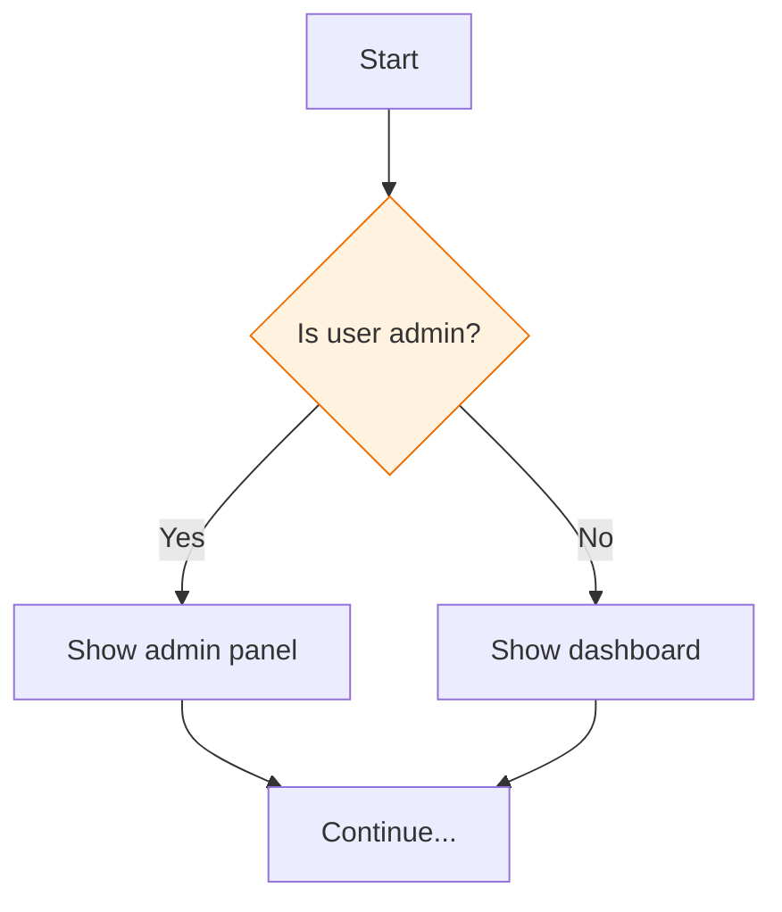
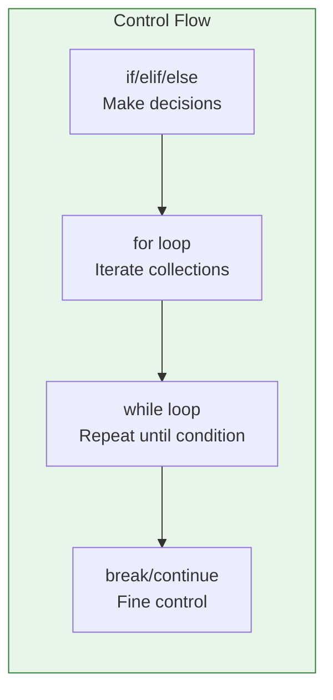

# Lesson 3.16: The Decision Problem

> **Duration**: 5 min | **Section**: C - Control Flow (Intro)

## 🎯 The Problem

Your code runs top to bottom. Every line executes. But what if you need different behavior based on conditions?

> **Scenario**: "If user is admin, show admin panel. Otherwise, show regular dashboard." You can't always run the same code—you need to make **decisions**.

## 💭 What We Need



Without decisions, code would be:
```python
show_admin_panel()   # Every user sees admin? NO!
```

With decisions:
```python
if user.is_admin:
    show_admin_panel()
else:
    show_dashboard()
```

## 📍 What You'll Learn

In this section:
1. **Conditionals** - if/elif/else for branching
2. **Loops** - for and while for repetition
3. **Loop control** - break, continue, else



Let's start making decisions.
