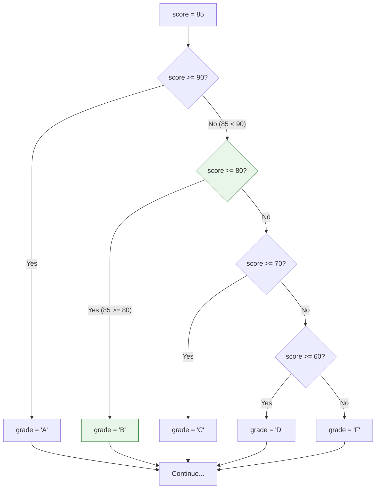

# Lesson 3.17: Conditionals - if/elif/else

> **Duration**: 25 min | **Section**: C - Control Flow

## 🎯 The Problem (3-5 min)

You need code that runs ONLY when certain conditions are met:

> **Scenario**: A grading system: A (90+), B (80-89), C (70-79), D (60-69), F (below 60). Different scores need different grades.

## 🧪 Try It: Basic Conditionals (5-10 min)

### The if Statement

```python
score = 85

if score >= 60:
    print("You passed!")
```

**Key points**:
- Condition must evaluate to True or False
- Code block is indented (4 spaces)
- Colon `:` after condition

### if/else

```python
score = 45

if score >= 60:
    print("You passed!")
else:
    print("You failed.")
```

### if/elif/else

```python
score = 85

if score >= 90:
    grade = "A"
elif score >= 80:
    grade = "B"
elif score >= 70:
    grade = "C"
elif score >= 60:
    grade = "D"
else:
    grade = "F"

print(f"Grade: {grade}")  # Grade: B
```

## 🔍 Under the Hood (10-15 min)

### Execution Flow



**Only one branch executes!** Once a condition is True, the rest are skipped.

### Comparison Operators

```python
a == b    # Equal
a != b    # Not equal
a < b     # Less than
a > b     # Greater than
a <= b    # Less than or equal
a >= b    # Greater than or equal
```

### Logical Operators

```python
# and - both must be True
if age >= 18 and has_license:
    print("Can drive")

# or - at least one must be True
if is_admin or is_owner:
    print("Has access")

# not - inverts boolean
if not is_banned:
    print("Welcome!")
```

### Truthiness in Conditions

Remember: Python evaluates truthiness, not just booleans:

```python
# These are all falsy (evaluate to False)
if 0:        # False
if "":       # False
if []:       # False
if None:     # False

# These are truthy (evaluate to True)
if 42:       # True
if "hello":  # True
if [1, 2]:   # True
```

**Practical use**:
```python
name = ""

# Instead of:
if name != "":
    print(name)

# Write:
if name:
    print(name)
```

### Nested Conditionals

```python
if user.is_logged_in:
    if user.is_admin:
        show_admin_panel()
    else:
        show_dashboard()
else:
    show_login()
```

**Better: flatten when possible**:
```python
if not user.is_logged_in:
    show_login()
elif user.is_admin:
    show_admin_panel()
else:
    show_dashboard()
```

### Conditional Expressions (Ternary)

One-liner for simple conditions:

```python
# Traditional
if score >= 60:
    result = "Pass"
else:
    result = "Fail"

# Ternary (one line)
result = "Pass" if score >= 60 else "Fail"
```

**Syntax**: `value_if_true if condition else value_if_false`

### Multiple Conditions

```python
# Check if in range
if 0 <= x <= 100:
    print("Valid percentage")

# Same as
if x >= 0 and x <= 100:
    print("Valid percentage")
```

### Membership Testing

```python
# Check if value in collection
if grade in ["A", "B", "C"]:
    print("Passing grade")

# Check if key in dict
if "email" in user:
    send_email(user["email"])
```

## 💥 Where It Breaks (3-5 min)

| Problem | Cause | Fix |
|:--------|:------|:----|
| `=` vs `==` | Assignment vs comparison | Use `==` for comparison |
| IndentationError | Inconsistent spaces | Use 4 spaces consistently |
| `if x = 5:` | Assignment in condition | Use `if x == 5:` |
| Unexpected None | Forgot to return | Check all branches return |

### Common Mistakes

```python
# WRONG: Assignment, not comparison
if x = 5:  # SyntaxError!

# RIGHT: Comparison
if x == 5:

# WRONG: Checking for None
if x == None:

# RIGHT: Use is for None
if x is None:

# WRONG: Double negative confusion
if not x != y:

# RIGHT: Clearer
if x == y:
```

## ✅ The Fix (5-10 min)

### Best Practices

```python
# 1. Use early returns to reduce nesting
def process_user(user):
    if not user:
        return None
    if not user.is_active:
        return None
    return do_processing(user)

# 2. Use `in` for multiple comparisons
# Instead of:
if x == "a" or x == "b" or x == "c":
    
# Write:
if x in ("a", "b", "c"):

# 3. Use `is` for None, True, False
if x is None:
if flag is True:  # Though `if flag:` is usually better

# 4. Avoid deep nesting
# Instead of:
if a:
    if b:
        if c:
            do_thing()
            
# Write:
if a and b and c:
    do_thing()
```

### Quick Reference

```python
# Basic if
if condition:
    code

# if-else
if condition:
    code
else:
    other_code

# if-elif-else
if cond1:
    code1
elif cond2:
    code2
else:
    code3

# Ternary
value = x if condition else y

# Comparisons
==, !=, <, >, <=, >=

# Logical
and, or, not

# Identity (for None)
is, is not
```

## 🎯 Practice

1. Write a grade calculator:
   ```python
   score = 78
   # Output the letter grade (A, B, C, D, F)
   ```

2. Check login status:
   ```python
   is_logged_in = True
   is_admin = False
   # Print appropriate message
   ```

3. Validate age:
   ```python
   age = 25
   # Check if valid (0-120) and adult (18+)
   ```

4. Use ternary:
   ```python
   temperature = 35
   # Set weather to "hot" if >= 30, else "cool"
   ```

## 🔑 Key Takeaways

- `if` checks condition, runs block if True
- `elif` chains multiple conditions (first True wins)
- `else` catches everything that didn't match
- Use `==` for comparison (not `=`)
- Use `is` for None: `if x is None:`
- Ternary: `value = x if cond else y`
- Truthiness: empty collections and 0 are falsy

## ❓ Common Questions

| Question | Answer |
|----------|--------|
| Can I have multiple elif? | Yes, as many as needed. |
| Is else required? | No, it's optional. |
| `if x:` vs `if x == True:`? | `if x:` is better (checks truthiness). |
| How to check None? | `if x is None:` (not `if x == None:`). |

## 🔗 Further Reading

- [Control Flow - if Statements](https://docs.python.org/3/tutorial/controlflow.html#if-statements)
- [Truth Value Testing](https://docs.python.org/3/library/stdtypes.html#truth-value-testing)
