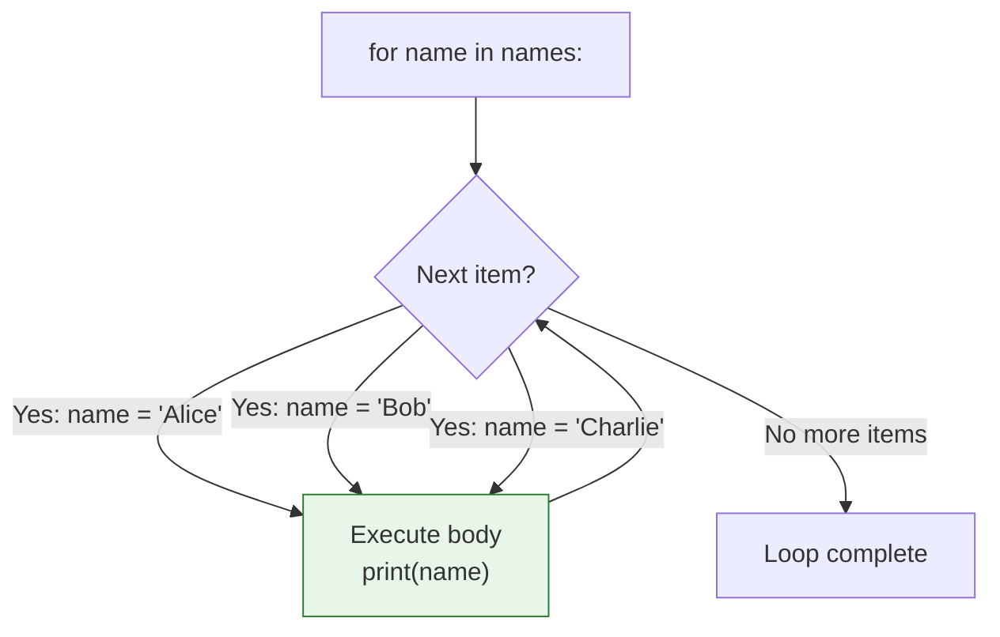
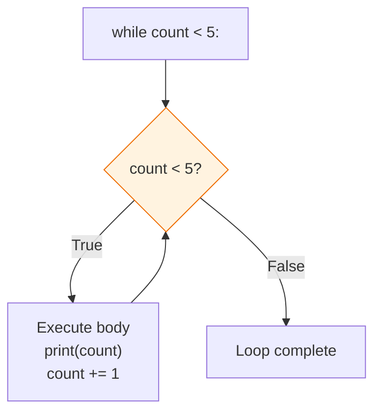

# Lesson 3.18: Loops - Repeating Actions

> **Duration**: 30 min | **Section**: C - Control Flow

## 🎯 The Problem (3-5 min)

You need to do the same thing many times:

> **Scenario**: Send an email to 1000 users. Process 10,000 transactions. Check each file in a directory. You can't write 1000 lines of code—you need **loops**.

## 🧪 Try It: Basic Loops (5-10 min)

### for Loop

Iterate over a collection:

```python
# Iterate over list
names = ["Alice", "Bob", "Charlie"]
for name in names:
    print(f"Hello, {name}!")

# Iterate over string
for char in "Python":
    print(char)

# Iterate over range
for i in range(5):
    print(i)  # 0, 1, 2, 3, 4
```

### while Loop

Repeat while condition is True:

```python
count = 0
while count < 5:
    print(count)
    count += 1  # Don't forget this!
```

## 🔍 Under the Hood (10-15 min)

### for Loop Execution



**for** loops iterate over **iterables** (lists, strings, ranges, dicts, files, etc.).

### The range() Function

```python
range(5)         # 0, 1, 2, 3, 4 (start=0, end excluded)
range(2, 5)      # 2, 3, 4 (start=2, end=5 excluded)
range(0, 10, 2)  # 0, 2, 4, 6, 8 (step=2)
range(5, 0, -1)  # 5, 4, 3, 2, 1 (counting down)
```

```python
# Print 1 to 10
for i in range(1, 11):
    print(i)

# Count by 5s
for i in range(0, 50, 5):
    print(i)  # 0, 5, 10, 15, ...
```

### while Loop Execution



### for vs while

| Use Case | Loop Type |
|:---------|:----------|
| Iterate collection | `for` |
| Known number of iterations | `for` with `range()` |
| Unknown iterations | `while` |
| Until condition met | `while` |
| User input loop | `while` |

```python
# for: when you know what to iterate
for item in items:
    process(item)

# while: when you don't know when to stop
while user_input != "quit":
    user_input = input("Enter command: ")
```

### Iterating with Index

```python
# DON'T: Manual indexing
for i in range(len(names)):
    print(f"{i}: {names[i]}")

# DO: Use enumerate
for i, name in enumerate(names):
    print(f"{i}: {name}")

# With start index
for i, name in enumerate(names, start=1):
    print(f"{i}: {name}")  # 1: Alice, 2: Bob, ...
```

### Iterating Multiple Collections

```python
names = ["Alice", "Bob", "Charlie"]
ages = [30, 25, 35]

# DON'T: Manual indexing
for i in range(len(names)):
    print(f"{names[i]} is {ages[i]}")

# DO: Use zip
for name, age in zip(names, ages):
    print(f"{name} is {age}")
```

### Iterating Dictionaries

```python
user = {"name": "Alice", "age": 30, "city": "NYC"}

# Keys (default)
for key in user:
    print(key)

# Values
for value in user.values():
    print(value)

# Both (most common)
for key, value in user.items():
    print(f"{key}: {value}")
```

### Nested Loops

```python
# Multiplication table
for i in range(1, 4):
    for j in range(1, 4):
        print(f"{i} x {j} = {i * j}")

# Flatten nested list
matrix = [[1, 2], [3, 4], [5, 6]]
for row in matrix:
    for num in row:
        print(num)
```

## 💥 Where It Breaks (3-5 min)

| Problem | Cause | Fix |
|:--------|:------|:----|
| Infinite loop | Condition never False | Add break or fix condition |
| Off-by-one | Wrong range bounds | Remember end is exclusive |
| Modifying during iteration | Changed list while looping | Iterate copy |
| Empty iteration | Empty collection | Check before or handle empty |

### Infinite Loop

```python
# DANGER: This runs forever!
while True:
    print("Forever...")
    # Forgot break condition!

# Fix: Add exit condition
while True:
    cmd = input("Command: ")
    if cmd == "quit":
        break
```

### Modifying During Iteration

```python
# WRONG: Removing while iterating
items = [1, 2, 3, 4, 5]
for item in items:
    if item % 2 == 0:
        items.remove(item)  # BUG! Skips items!

# RIGHT: Iterate copy or use comprehension
items = [1, 2, 3, 4, 5]
for item in items[:]:  # Copy with [:]
    if item % 2 == 0:
        items.remove(item)

# BETTER: Comprehension
items = [x for x in items if x % 2 != 0]
```

## ✅ The Fix (5-10 min)

### Common Patterns

```python
# Pattern 1: Find first match
for item in items:
    if condition(item):
        result = item
        break

# Pattern 2: Collect results
results = []
for item in items:
    results.append(process(item))

# Better: Comprehension
results = [process(item) for item in items]

# Pattern 3: Count matches
count = 0
for item in items:
    if condition(item):
        count += 1

# Better: sum with generator
count = sum(1 for item in items if condition(item))
```

### Quick Reference

```python
# for loop
for item in collection:
    # process item

for i in range(n):
    # repeat n times

for i, item in enumerate(collection):
    # with index

for a, b in zip(list1, list2):
    # parallel iteration

# while loop
while condition:
    # repeat while true
    # don't forget to update condition!

# Dictionary iteration
for k, v in d.items():
    # key and value
```

## 🎯 Practice

1. Sum numbers 1 to 100:
   ```python
   # Using a for loop
   # Using sum() and range()
   ```

2. Find first even number:
   ```python
   nums = [1, 3, 5, 8, 9, 10]
   # Stop when found
   ```

3. Print multiplication table (1-5):
   ```python
   # Output:
   # 1 x 1 = 1
   # 1 x 2 = 2
   # ...
   ```

4. Countdown:
   ```python
   # Print 10, 9, 8, ... 1, Blastoff!
   ```

5. User input loop:
   ```python
   # Keep asking for input until user types "quit"
   ```

## 🔑 Key Takeaways

- `for` iterates over collections (list, str, range, dict)
- `while` repeats while condition is True
- `range(n)` generates 0 to n-1
- Use `enumerate()` for index + value
- Use `zip()` for parallel iteration
- Don't modify a list while iterating over it
- Always ensure while loops can terminate!

## ❓ Common Questions

| Question | Answer |
|----------|--------|
| for vs while? | `for` for collections. `while` for conditions. |
| How to get index in for? | `enumerate(items)` |
| How to loop forever? | `while True:` with `break` |
| Why is range(5) not [0,1,2,3,4]? | range is lazy—generates on demand. |

## 🔗 Further Reading

- [for Statements](https://docs.python.org/3/tutorial/controlflow.html#for-statements)
- [The range() Function](https://docs.python.org/3/library/stdtypes.html#range)
