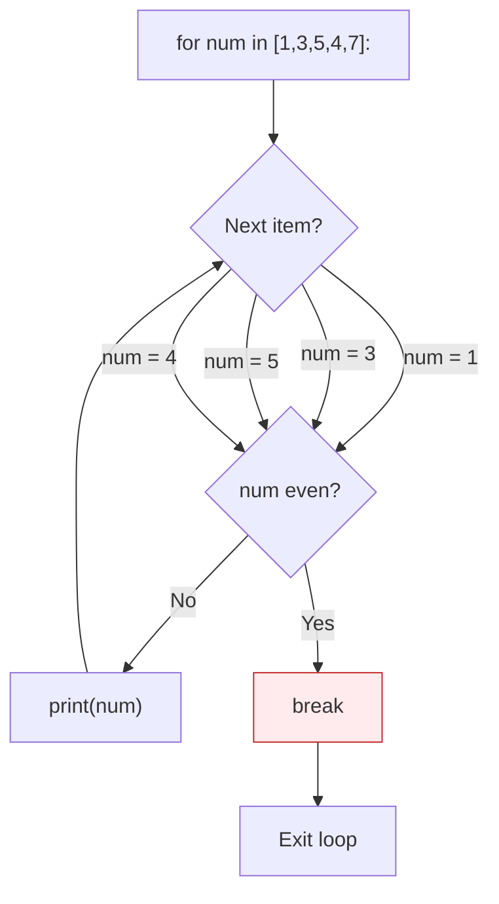
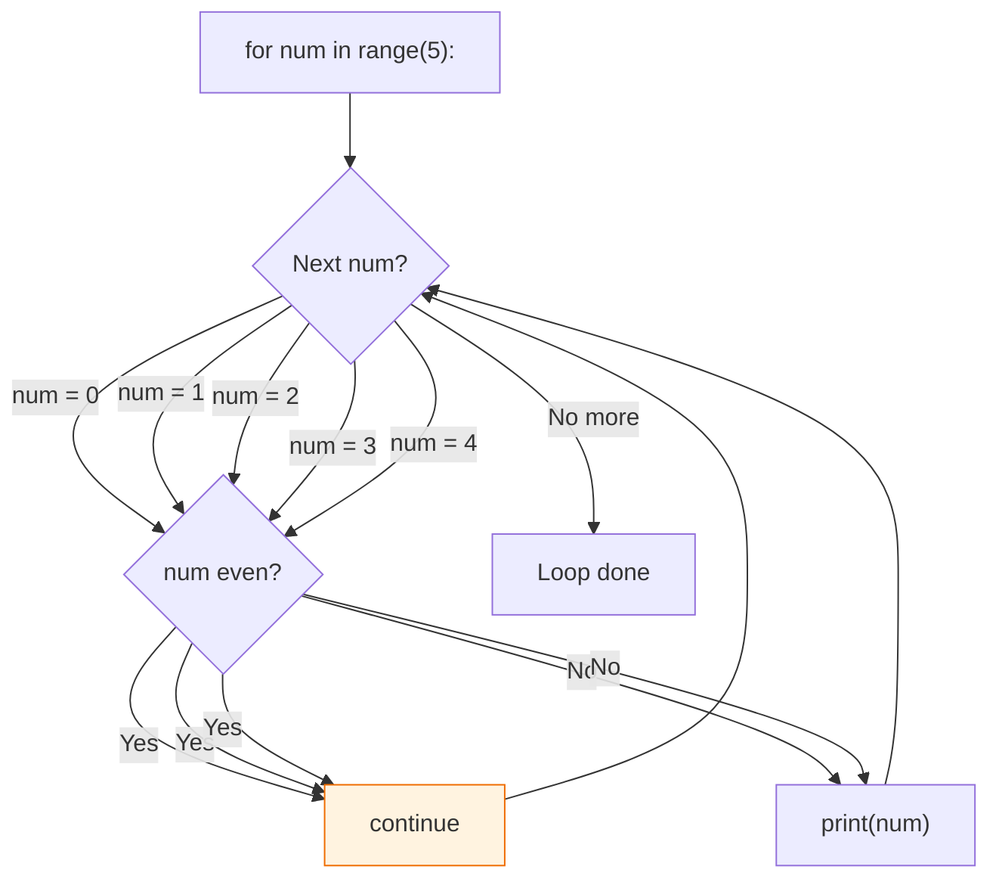
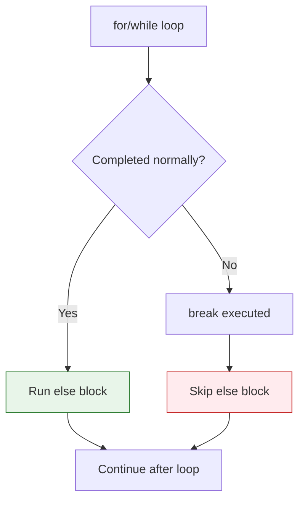
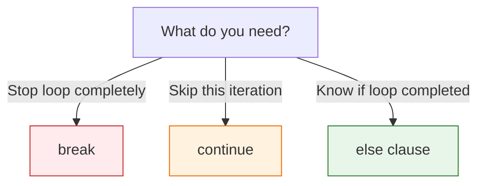

# Lesson 3.19: Loop Control

> **Duration**: 20 min | **Section**: C - Control Flow

## 🎯 The Problem (3-5 min)

Sometimes you need finer control over loops:
- Stop early when you find what you need
- Skip certain items
- Know if loop completed without breaking

> **Scenario**: Search through 1 million records. When you find the match, stop immediately—don't process the remaining 999,999 records!

## 🧪 Try It: Control Statements (5-10 min)

### break - Exit Loop Immediately

```python
# Find first even number
for num in [1, 3, 5, 4, 7, 9]:
    if num % 2 == 0:
        print(f"Found: {num}")
        break  # Stop here!
# Output: Found: 4 (doesn't check 7, 9)
```

### continue - Skip to Next Iteration

```python
# Print only odd numbers
for num in range(10):
    if num % 2 == 0:
        continue  # Skip even numbers
    print(num)
# Output: 1, 3, 5, 7, 9
```

### else on Loops

```python
# else runs if loop completes WITHOUT break
for num in [1, 3, 5, 7, 9]:
    if num % 2 == 0:
        print(f"Found even: {num}")
        break
else:
    print("No even numbers found")
# Output: No even numbers found
```

## 🔍 Under the Hood (10-15 min)

### break Execution



**break** immediately exits the innermost loop.

### continue Execution



**continue** skips to the next iteration.

### else on Loops

The `else` clause runs when the loop finishes **without** hitting `break`:

```python
# With break triggered → else doesn't run
for n in [1, 2, 3]:
    if n == 2:
        print("Found 2")
        break
else:
    print("Didn't find it")
# Output: Found 2

# Without break → else runs
for n in [1, 3, 5]:
    if n == 2:
        print("Found 2")
        break
else:
    print("Didn't find it")
# Output: Didn't find it
```



### Nested Loop Control

`break` and `continue` only affect the **innermost** loop:

```python
for i in range(3):
    for j in range(3):
        if j == 1:
            break  # Only breaks inner loop!
    print(f"i = {i}")
# Output: i = 0, i = 1, i = 2 (outer loop continues)
```

To break outer loop, use a flag or restructure:

```python
# Method 1: Flag variable
found = False
for i in range(3):
    if found:
        break
    for j in range(3):
        if condition:
            found = True
            break

# Method 2: Put in function
def find_item():
    for i in range(3):
        for j in range(3):
            if condition:
                return (i, j)  # Exits everything
    return None
```

### while with break

Common pattern for user input:

```python
while True:  # Infinite loop
    command = input("Enter command (quit to exit): ")
    if command == "quit":
        break  # Exit loop
    process(command)
```

## 💥 Where It Breaks (3-5 min)

| Problem | Cause | Fix |
|:--------|:------|:----|
| break doesn't exit outer loop | break is innermost only | Use flag or function |
| else always runs | No break in loop | That's how it works! |
| continue in wrong place | Skips important code | Move code before continue |

### Common Mistakes

```python
# WRONG: Condition after continue is skipped
for item in items:
    if skip_condition:
        continue
    counter += 1  # This is correctly after continue
    if other_condition:  # This runs for non-skipped items
        continue
    more_processing  # This might be unexpectedly skipped!

# Be careful with continue placement
```

## ✅ The Fix (5-10 min)

### When to Use What



### Practical Examples

```python
# Search with else
def find_user(users, target_id):
    for user in users:
        if user["id"] == target_id:
            return user
    else:  # Runs if not found
        return None

# Actually, just:
def find_user(users, target_id):
    for user in users:
        if user["id"] == target_id:
            return user
    return None  # Same behavior, clearer

# Filter with continue
valid_items = []
for item in items:
    if not is_valid(item):
        continue  # Skip invalid
    processed = process(item)
    valid_items.append(processed)

# Break when found
def has_duplicate(items):
    seen = set()
    for item in items:
        if item in seen:
            return True  # Found duplicate, stop immediately
        seen.add(item)
    return False
```

### Quick Reference

```python
# break - exit loop
for item in items:
    if condition:
        break

# continue - skip iteration
for item in items:
    if skip_condition:
        continue
    process(item)

# else - runs if no break
for item in items:
    if found_it:
        break
else:
    print("Not found")

# Common pattern
while True:
    if done:
        break
```

## 🎯 Practice

1. Find first prime in list:
   ```python
   nums = [4, 6, 8, 11, 12, 15]
   # Print the first prime and stop
   ```

2. Skip negative numbers:
   ```python
   nums = [1, -2, 3, -4, 5]
   # Sum only positive numbers using continue
   ```

3. Search with "not found" message:
   ```python
   names = ["Alice", "Bob", "Charlie"]
   target = "David"
   # Use else to print "Not found" if target missing
   ```

4. Exit nested loop:
   ```python
   # Find first pair that sums to 10
   # Print it and exit both loops
   ```

## 🔑 Key Takeaways

- `break` exits the loop immediately
- `continue` skips to next iteration
- `else` on loop runs only if no `break` occurred
- All three work with both `for` and `while`
- `break`/`continue` affect only the innermost loop
- Use functions or flags to break outer loops

## ❓ Common Questions

| Question | Answer |
|----------|--------|
| When use else on loop? | When you need to know if loop completed normally. |
| Can I break from nested loops? | Only innermost. Use function return for all. |
| Is continue bad? | Not inherently, but can make flow confusing if overused. |
| break vs return? | break exits loop. return exits function. |

## 🔗 Further Reading

- [break and continue](https://docs.python.org/3/tutorial/controlflow.html#break-and-continue-statements-and-else-clauses-on-loops)
