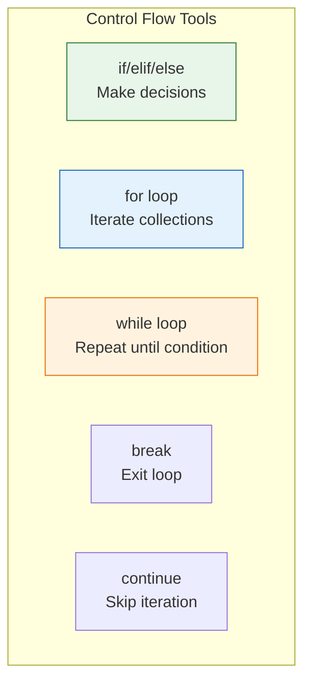
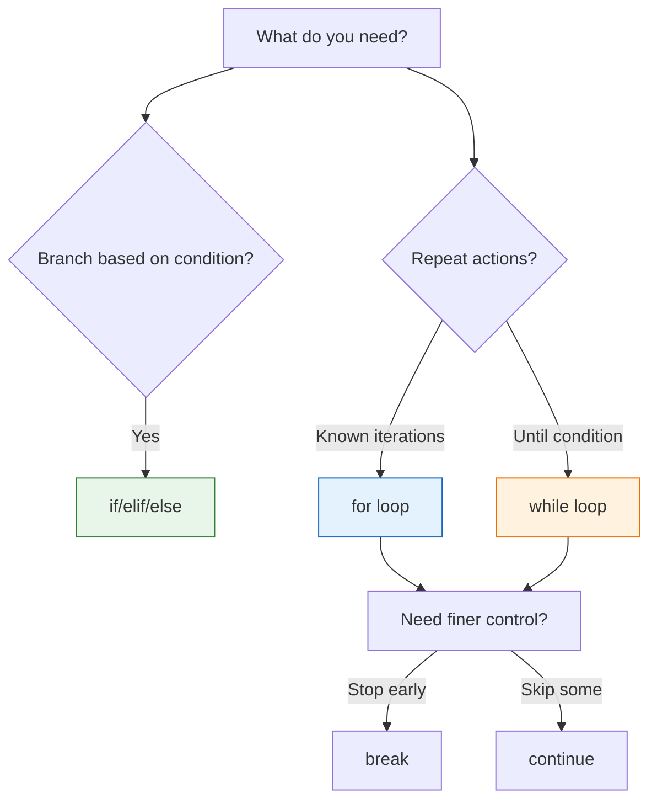

# Lesson 3.20: Control Flow Q&A

> **Duration**: 10 min | **Section**: C - Control Flow (Wrap-up)

## 📋 Section C Summary



## 🧠 Concept Check

| Concept | Question | Answer |
|:--------|:---------|:-------|
| if | What does `if x:` check? | Truthiness of x (not just True/False) |
| elif | How many elif can you have? | As many as needed |
| else | When does else run? | When all if/elif conditions are False |
| for | What does for iterate? | Any iterable (list, str, range, dict, file) |
| while | When does while stop? | When condition becomes False |
| break | What does break do? | Exits innermost loop immediately |
| continue | What does continue do? | Skips to next iteration |
| else on loop | When does it run? | When loop completes without break |

## ❓ Frequently Asked Questions

### Conditionals

| Question | Answer |
|----------|--------|
| `if x:` vs `if x == True:`? | `if x:` is better (more Pythonic, checks truthiness). |
| How to check None? | `if x is None:` (not `==`) |
| Can elif come after else? | No, else must be last. |
| Ternary syntax? | `value = a if condition else b` |

### for Loops

| Question | Answer |
|----------|--------|
| How to get index? | `for i, item in enumerate(items):` |
| Loop two lists together? | `for a, b in zip(list1, list2):` |
| Loop over dict? | `for k, v in d.items():` |
| How does range work? | `range(stop)` or `range(start, stop, step)` |

### while Loops

| Question | Answer |
|----------|--------|
| When for vs while? | for: known iterations. while: until condition. |
| How to loop forever? | `while True:` with `break` to exit |
| What if condition never False? | Infinite loop! Always ensure exit condition. |

### Loop Control

| Question | Answer |
|----------|--------|
| break exits all loops? | No, only innermost. Use function return for all. |
| What's else on loop for? | Runs if loop completes without break. |
| When use continue? | To skip certain iterations cleanly. |

## 🔗 Quick Reference

```python
# === CONDITIONALS ===
if condition:
    pass
elif other:
    pass
else:
    pass

# Ternary
x = a if cond else b

# === FOR LOOPS ===
for item in collection:
    pass

for i in range(n):
    pass

for i, item in enumerate(items):
    pass

for a, b in zip(list1, list2):
    pass

for k, v in dict.items():
    pass

# === WHILE LOOPS ===
while condition:
    pass

while True:
    if done:
        break

# === CONTROL ===
break      # Exit loop
continue   # Skip iteration

for x in items:
    pass
else:      # Runs if no break
    pass
```

## 📊 Decision Tree



## 💥 Common Pitfalls

| Pitfall | What Happens | Fix |
|---------|--------------|-----|
| `if x = 5:` | SyntaxError | Use `==` for comparison |
| `while True:` without `break` | Infinite loop, program hangs | Always have exit condition |
| Forgetting `range()` returns iterator | Can't index directly | Convert: `list(range(5))` |
| Off-by-one with `range(n)` | Stops at n-1 | `range(n)` is 0 to n-1 |
| Nested loop `break` | Only exits inner loop | Use function + return, or flag |

## 🔑 Key Takeaways

1. **if checks truthiness** - Not just True/False, but any value
2. **for iterates collections** - Strings, lists, dicts, files, anything iterable
3. **while repeats until False** - For unknown iteration counts
4. **break exits immediately** - Only innermost loop
5. **continue skips current** - Jumps to next iteration
6. **else on loops is rare** - Runs when no break occurred

## ✅ Section Complete!

You now understand:
- Making decisions with if/elif/else
- Iterating with for loops
- Repeating with while loops
- Controlling flow with break/continue/else

**Next up**: Section D - Functions

We'll explore:
- Defining reusable functions
- Parameters and arguments
- Scope and closures
- Lambda functions
