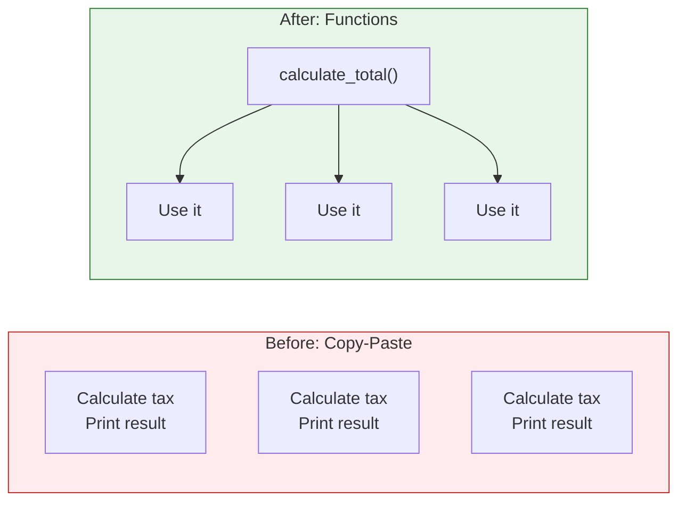

# Lesson 3.21: The Repetition Problem

> **Duration**: 5 min | **Section**: D - Functions (Intro)

## 🎯 The Problem

Look at this code:

```python
# Calculate tax for order 1
subtotal1 = 100
tax1 = subtotal1 * 0.08
total1 = subtotal1 + tax1
print(f"Total: ${total1:.2f}")

# Calculate tax for order 2
subtotal2 = 250
tax2 = subtotal2 * 0.08
total2 = subtotal2 + tax2
print(f"Total: ${total2:.2f}")

# Calculate tax for order 3
subtotal3 = 75
tax3 = subtotal3 * 0.08
total3 = subtotal3 + tax3
print(f"Total: ${total3:.2f}")
```

**What's wrong?**
- Same logic repeated 3 times
- If tax rate changes to 0.10, you fix it in 3 places
- Easy to miss one, create bugs
- Code is 15 lines when it could be 5

## 💭 What We Need

A way to write logic ONCE and reuse it:



## 📍 What You'll Learn

In this section:
1. **Defining functions** - Create reusable code blocks
2. **Parameters** - Make functions flexible
3. **Return values** - Get results back
4. **Scope** - How variables work inside functions
5. **Advanced patterns** - *args, **kwargs, lambdas

## ✨ The Solution Preview

```python
# Define ONCE
def calculate_total(subtotal, tax_rate=0.08):
    tax = subtotal * tax_rate
    return subtotal + tax

# Use MANY times
print(calculate_total(100))   # $108.00
print(calculate_total(250))   # $270.00
print(calculate_total(75))    # $81.00
```

**Benefits**:
- Write logic once
- Change in one place affects all uses
- Clearer, more readable code
- Easier to test and debug

Let's learn functions!
