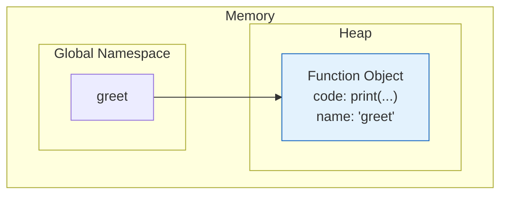
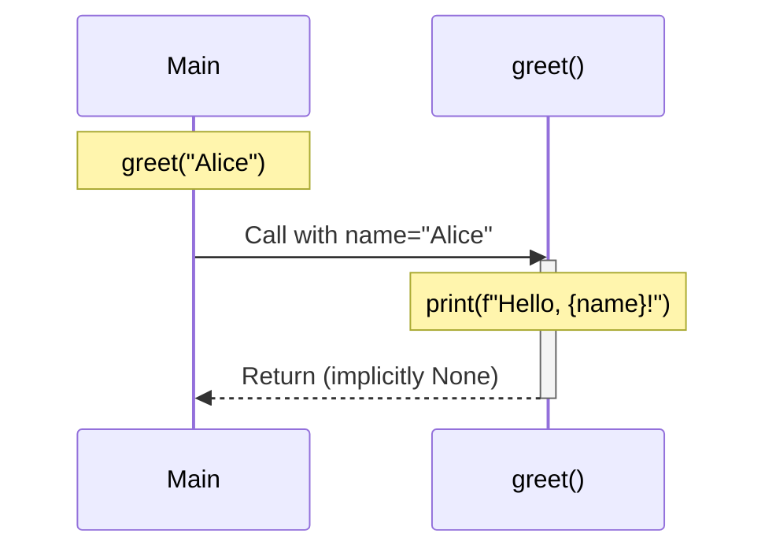

# Lesson 3.22: Defining Functions

> **Duration**: 25 min | **Section**: D - Functions

## 🎯 The Problem (3-5 min)

You need to:
- Reuse code without copy-pasting
- Give meaningful names to code blocks
- Break complex logic into manageable pieces

> **Scenario**: A greeting system that says hello in different ways. You need it throughout your app.

## 🧪 Try It: Basic Functions (5-10 min)

### Defining a Function

```python
def greet():
    print("Hello, World!")

# Call the function
greet()  # Output: Hello, World!
greet()  # Can call many times!
```

**Anatomy**:
- `def` keyword starts definition
- `greet` is the function name
- `()` holds parameters (empty here)
- `:` starts the body
- Body is indented

### Function with Parameters

```python
def greet(name):
    print(f"Hello, {name}!")

greet("Alice")   # Hello, Alice!
greet("Bob")     # Hello, Bob!
```

### Function with Return Value

```python
def add(a, b):
    return a + b

result = add(5, 3)
print(result)  # 8
```

## 🔍 Under the Hood (10-15 min)

### Function Object Creation

When Python sees `def`, it creates a function object:



Functions are **first-class objects** in Python—they can be:
- Stored in variables
- Passed to other functions
- Returned from functions

### Call Stack



### Return Values

```python
def add(a, b):
    result = a + b
    return result  # Send value back to caller

# The caller gets the returned value
total = add(5, 3)  # total = 8
```

**No return statement = returns `None`**:

```python
def greet(name):
    print(f"Hello, {name}!")
    # No return statement

result = greet("Alice")
print(result)  # None
```

### Multiple Returns

```python
def get_name_parts(full_name):
    parts = full_name.split()
    return parts[0], parts[-1]  # Return tuple

first, last = get_name_parts("Alice Johnson")
print(first)  # Alice
print(last)   # Johnson
```

### Early Return

```python
def divide(a, b):
    if b == 0:
        return None  # Exit early
    return a / b

print(divide(10, 2))  # 5.0
print(divide(10, 0))  # None
```

### Docstrings

Document what your function does:

```python
def calculate_tax(amount, rate=0.08):
    """
    Calculate tax for a given amount.
    
    Args:
        amount: The base amount (float or int)
        rate: Tax rate as decimal (default 0.08)
    
    Returns:
        The tax amount (float)
    """
    return amount * rate

# Access the docstring
print(calculate_tax.__doc__)
help(calculate_tax)  # Shows the docstring
```

### Type Hints

Optional but helpful for documentation:

```python
def add(a: int, b: int) -> int:
    """Add two integers."""
    return a + b

def greet(name: str) -> None:
    """Print a greeting."""
    print(f"Hello, {name}!")
```

**Note**: Type hints are not enforced at runtime—they're for documentation and tools like mypy.

## 💥 Where It Breaks (3-5 min)

| Problem | Cause | Fix |
|:--------|:------|:----|
| `NameError` | Called before definition | Define before calling |
| Missing return | Forgot return statement | Add return |
| Modifying argument | Mutable default arg | Use None as default |
| UnboundLocalError | Same name as global | Be careful with scope |

### Common Mistakes

```python
# WRONG: Calling before definition
greet()  # NameError: name 'greet' is not defined
def greet():
    print("Hi")

# RIGHT: Define first
def greet():
    print("Hi")
greet()  # Works!

# WRONG: Expecting modified value
def add_one(x):
    x = x + 1  # Creates new local variable

num = 5
add_one(num)
print(num)  # Still 5! (Not 6)

# RIGHT: Return the new value
def add_one(x):
    return x + 1

num = add_one(5)  # num = 6
```

## ✅ The Fix (5-10 min)

### Best Practices

```python
# 1. One function, one job
def calculate_total(items):
    """Calculate total price of items."""
    return sum(item.price for item in items)

# 2. Use descriptive names
def get_user_by_email(email):  # Clear what it does
    pass

def gube(e):  # What does this do?? Don't do this
    pass

# 3. Keep functions short (ideally < 20 lines)
# 4. Return early to avoid deep nesting

def process_order(order):
    if not order:
        return None
    if not order.is_valid:
        return None
    # Process valid order...
    return result
```

### Quick Reference

```python
# Basic function
def function_name():
    # body
    pass

# With parameters
def greet(name):
    print(f"Hello, {name}!")

# With return
def add(a, b):
    return a + b

# With type hints
def add(a: int, b: int) -> int:
    return a + b

# With docstring
def calculate(x):
    """Short description."""
    return x * 2

# Multiple return values
def get_coords():
    return x, y  # Returns tuple

x, y = get_coords()  # Unpack
```

## 🎯 Practice

1. Create a greeting function:
   ```python
   # Define greet(name) that prints "Hello, {name}!"
   ```

2. Create a function with return:
   ```python
   # Define square(n) that returns n squared
   ```

3. Multiple return values:
   ```python
   # Define min_max(numbers) that returns (min, max)
   ```

4. Add type hints and docstring:
   ```python
   # Define celsius_to_fahrenheit(celsius) with hints and docs
   ```

## 🔑 Key Takeaways

- `def` creates a function object
- Parameters go in parentheses
- `return` sends value back to caller
- No return = returns `None`
- Functions are first-class objects
- Use docstrings for documentation
- Type hints are optional but helpful

## ❓ Common Questions

| Question | Answer |
|----------|--------|
| def vs return? | def creates function. return sends value back. |
| What if no return? | Function returns None implicitly. |
| Can I return multiple values? | Yes, as a tuple: `return a, b` |
| Are type hints enforced? | No, they're for documentation/tools only. |

## 🔗 Further Reading

- [Defining Functions](https://docs.python.org/3/tutorial/controlflow.html#defining-functions)
- [Function Annotations](https://docs.python.org/3/tutorial/controlflow.html#function-annotations)
