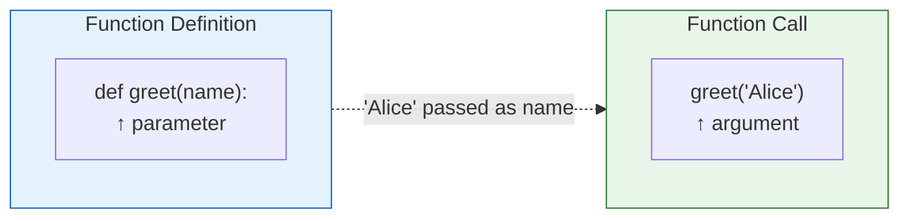
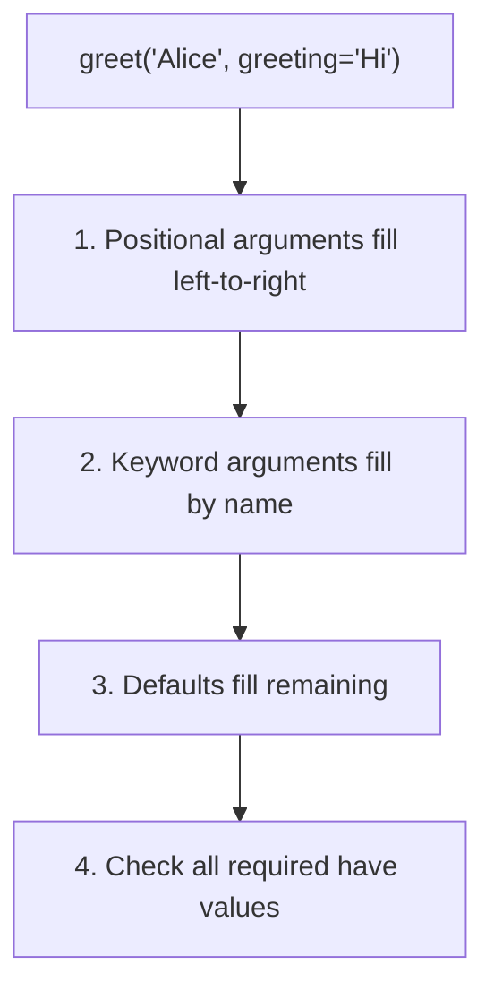

# Lesson 3.23: Parameters and Arguments

> **Duration**: 30 min | **Section**: D - Functions

## 🎯 The Problem (3-5 min)

Functions need to accept input in flexible ways:

> **Scenario**: A `send_email` function might need: to, subject, body, cc, bcc, attachments, priority... Some are required, some are optional. How do you handle all these?

## 🧪 Try It: Parameter Types (5-10 min)

### Positional Arguments

```python
def greet(name, greeting):
    print(f"{greeting}, {name}!")

greet("Alice", "Hello")  # Hello, Alice!
greet("Hello", "Alice")  # Alice, Hello! (wrong order!)
```

### Keyword Arguments

```python
def greet(name, greeting):
    print(f"{greeting}, {name}!")

# Explicitly name arguments
greet(name="Alice", greeting="Hello")  # Hello, Alice!
greet(greeting="Hello", name="Alice")  # Hello, Alice! (order doesn't matter)
```

### Default Values

```python
def greet(name, greeting="Hello"):
    print(f"{greeting}, {name}!")

greet("Alice")           # Hello, Alice! (uses default)
greet("Alice", "Hi")     # Hi, Alice! (overrides default)
```

### Required vs Optional

```python
def send_email(to, subject, body, cc=None, priority="normal"):
    print(f"To: {to}")
    print(f"Subject: {subject}")
    print(f"Priority: {priority}")
    if cc:
        print(f"CC: {cc}")
    print(f"Body: {body}")

# Only required arguments
send_email("bob@example.com", "Hello", "Hi Bob!")

# With optional arguments
send_email("bob@example.com", "Urgent", "Please respond", 
           cc="manager@example.com", priority="high")
```

## 🔍 Under the Hood (10-15 min)

### Parameter vs Argument



- **Parameter**: Variable in function definition
- **Argument**: Actual value passed when calling

### Argument Resolution Order



### *args - Variable Positional

Collect unlimited positional arguments:

```python
def add_all(*numbers):
    print(f"Received: {numbers}")  # It's a tuple!
    return sum(numbers)

print(add_all(1, 2))        # 3
print(add_all(1, 2, 3, 4))  # 10
print(add_all())            # 0
```

**Under the hood**: `*args` packs extra positional args into a tuple.

```python
def example(first, *rest):
    print(f"First: {first}")
    print(f"Rest: {rest}")

example(1, 2, 3, 4)
# First: 1
# Rest: (2, 3, 4)
```

### **kwargs - Variable Keyword

Collect unlimited keyword arguments:

```python
def print_info(**data):
    print(f"Received: {data}")  # It's a dict!
    for key, value in data.items():
        print(f"{key}: {value}")

print_info(name="Alice", age=30, city="NYC")
# Received: {'name': 'Alice', 'age': 30, 'city': 'NYC'}
# name: Alice
# age: 30
# city: NYC
```

### Combining All Types

```python
def super_function(required, 
                   default="value",
                   *args, 
                   keyword_only=None,
                   **kwargs):
    print(f"required: {required}")
    print(f"default: {default}")
    print(f"args: {args}")
    print(f"keyword_only: {keyword_only}")
    print(f"kwargs: {kwargs}")

super_function("a", "b", 1, 2, 3, keyword_only="x", extra="y")
# required: a
# default: b
# args: (1, 2, 3)
# keyword_only: x
# kwargs: {'extra': 'y'}
```

**Parameter Order**:
1. Regular positional
2. `*args`
3. Keyword-only (after `*args`)
4. `**kwargs`

### Unpacking Arguments

**Unpack list/tuple with `*`**:
```python
def add(a, b, c):
    return a + b + c

numbers = [1, 2, 3]
print(add(*numbers))  # Same as add(1, 2, 3) = 6
```

**Unpack dict with `**`**:
```python
def greet(name, greeting):
    print(f"{greeting}, {name}!")

data = {"name": "Alice", "greeting": "Hello"}
greet(**data)  # Same as greet(name="Alice", greeting="Hello")
```

### Keyword-Only Arguments

Force certain arguments to be passed by keyword:

```python
def connect(host, port, *, timeout=30, ssl=True):
    # timeout and ssl MUST be keyword arguments
    print(f"Connecting to {host}:{port}")

connect("localhost", 8080)                    # OK
connect("localhost", 8080, timeout=60)        # OK
connect("localhost", 8080, 60)                # Error!
```

### Positional-Only Arguments (Python 3.8+)

Force arguments to be positional only:

```python
def divide(a, b, /):
    return a / b

divide(10, 2)     # OK: 5.0
divide(a=10, b=2) # Error! a and b are positional-only
```

## 💥 Where It Breaks (3-5 min)

| Problem | Cause | Fix |
|:--------|:------|:----|
| Missing argument | Required param not passed | Pass all required args |
| Positional after keyword | Wrong order in call | Positional args first |
| Mutable default | `def f(x=[]):` | Use `None` as default |

### The Mutable Default Trap

```python
# WRONG: Mutable default argument
def add_item(item, items=[]):
    items.append(item)
    return items

print(add_item("a"))  # ['a']
print(add_item("b"))  # ['a', 'b'] ← Same list!
print(add_item("c"))  # ['a', 'b', 'c'] ← Still same list!

# RIGHT: Use None
def add_item(item, items=None):
    if items is None:
        items = []
    items.append(item)
    return items

print(add_item("a"))  # ['a']
print(add_item("b"))  # ['b'] ← Fresh list each time!
```

**Why?** Default values are evaluated ONCE at function definition, not each call.

## ✅ The Fix (5-10 min)

### Best Practices

```python
# 1. Required arguments first, optional last
def create_user(email, password, name=None, role="user"):
    pass

# 2. Use keyword args for clarity when > 2-3 args
create_user("a@b.com", "pw123", name="Alice", role="admin")

# 3. Use None for mutable defaults
def process(items=None):
    items = items or []
    
# 4. Use *args for wrappers
def log_call(func, *args, **kwargs):
    print(f"Calling {func.__name__}")
    return func(*args, **kwargs)
```

### Quick Reference

```python
# Positional
def f(a, b):
    pass
f(1, 2)

# Keyword
f(a=1, b=2)
f(b=2, a=1)

# Default values
def f(a, b=10):
    pass
f(1)  # b uses default

# *args
def f(*args):  # args is tuple
    pass
f(1, 2, 3)

# **kwargs
def f(**kwargs):  # kwargs is dict
    pass
f(x=1, y=2)

# Keyword-only (after *)
def f(a, *, b):
    pass
f(1, b=2)  # b must be keyword

# Positional-only (before /)
def f(a, /):
    pass
f(1)  # a must be positional

# Unpack list
f(*[1, 2, 3])

# Unpack dict
f(**{"a": 1, "b": 2})
```

## 🎯 Practice

1. Create function with defaults:
   ```python
   # power(base, exp=2) returns base**exp
   ```

2. Use *args:
   ```python
   # multiply_all(*numbers) returns product of all
   ```

3. Use **kwargs:
   ```python
   # build_url(base, **params) builds URL with query string
   # build_url("api.com", page=1, limit=10)
   # → "api.com?page=1&limit=10"
   ```

4. Fix the mutable default:
   ```python
   def append_to(item, target=[]):
       target.append(item)
       return target
   ```

## 🔑 Key Takeaways

- Parameters = definition, Arguments = call
- Default values make parameters optional
- **Never use mutable defaults** (use `None` instead)
- `*args` collects extra positional args as tuple
- `**kwargs` collects extra keyword args as dict
- Use `*` to unpack sequences, `**` to unpack dicts
- After `*args`, all parameters are keyword-only

## ❓ Common Questions

| Question | Answer |
|----------|--------|
| *args vs **kwargs? | `*args` = tuple of positional. `**kwargs` = dict of keyword. |
| Can I use both? | Yes: `def f(*args, **kwargs)` |
| Why avoid mutable defaults? | They're shared across all calls! |
| Order of parameters? | Positional, *args, keyword-only, **kwargs |

## 🔗 Further Reading

- [More on Defining Functions](https://docs.python.org/3/tutorial/controlflow.html#more-on-defining-functions)
- [Special Parameters](https://docs.python.org/3/tutorial/controlflow.html#special-parameters)
