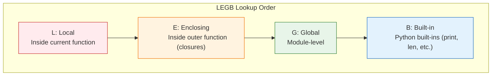
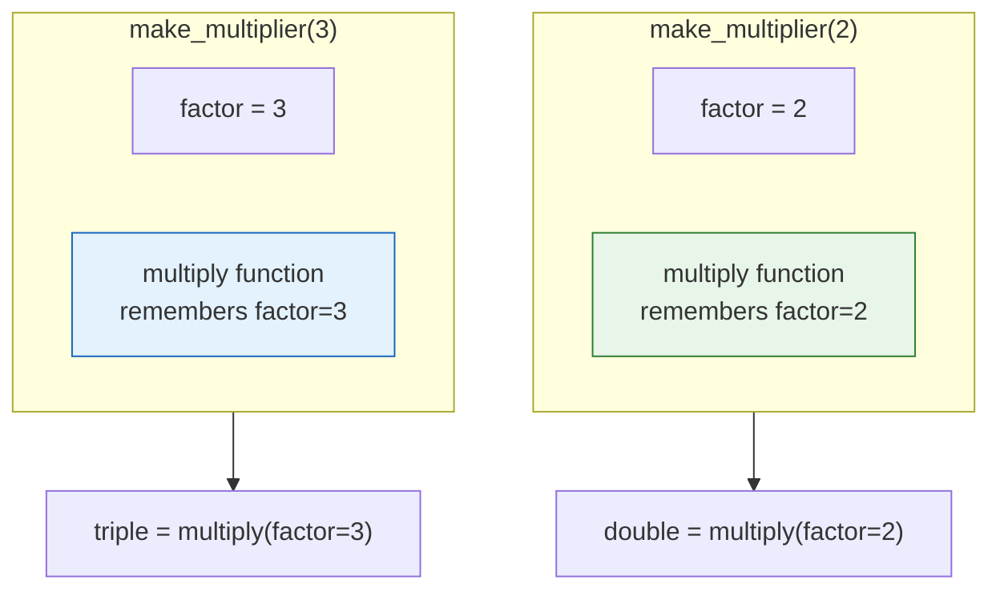

# Lesson 3.24: Scope and Closures

> **Duration**: 25 min | **Section**: D - Functions

## 🎯 The Problem (3-5 min)

Where do variables "live"? What can access what?

```python
x = 10

def example():
    x = 20
    print(x)

example()   # What prints?
print(x)    # What prints?
```

Understanding **scope** is essential for avoiding confusing bugs.

## 🧪 Try It: Scope Basics (5-10 min)

### Local Scope

Variables created inside a function are **local**:

```python
def my_function():
    local_var = "I'm local"
    print(local_var)

my_function()  # I'm local
print(local_var)  # NameError: local_var is not defined
```

### Global Scope

Variables created outside functions are **global**:

```python
global_var = "I'm global"

def my_function():
    print(global_var)  # Can read global

my_function()  # I'm global
print(global_var)  # I'm global
```

### The Shadowing Problem

```python
x = 10

def example():
    x = 20  # Creates NEW local variable, doesn't change global
    print(f"Inside: {x}")

example()          # Inside: 20
print(f"Outside: {x}")  # Outside: 10
```

## 🔍 Under the Hood (10-15 min)

### The LEGB Rule

Python looks up names in this order:



```python
# B: Built-in
print, len, range, etc.

# G: Global
count = 0

def outer():
    # E: Enclosing
    message = "outer"
    
    def inner():
        # L: Local
        x = 10
        print(x)       # L: Found locally
        print(message) # E: Found in enclosing
        print(count)   # G: Found globally
        print(len)     # B: Found in built-ins
    
    inner()
```

### The `global` Keyword

To modify a global variable inside a function:

```python
count = 0

def increment():
    global count  # Tell Python we mean the global one
    count += 1

increment()
print(count)  # 1
increment()
print(count)  # 2
```

**Without `global`**:
```python
count = 0

def increment():
    count += 1  # UnboundLocalError!
    # Python sees assignment, assumes local, but local isn't defined yet

increment()
```

### Closures

A function that "remembers" variables from its enclosing scope:

```python
def make_multiplier(factor):
    def multiply(x):
        return x * factor  # factor comes from enclosing scope
    return multiply

double = make_multiplier(2)
triple = make_multiplier(3)

print(double(5))  # 10
print(triple(5))  # 15
```

**How it works**:



Each closure has its own "memory" of the enclosing scope.

### The `nonlocal` Keyword

To modify a variable from an enclosing (but not global) scope:

```python
def counter():
    count = 0
    
    def increment():
        nonlocal count  # Modify enclosing scope variable
        count += 1
        return count
    
    return increment

my_counter = counter()
print(my_counter())  # 1
print(my_counter())  # 2
print(my_counter())  # 3
```

### Practical Closure Example

```python
def create_logger(prefix):
    def log(message):
        print(f"[{prefix}] {message}")
    return log

info = create_logger("INFO")
error = create_logger("ERROR")

info("User logged in")    # [INFO] User logged in
error("File not found")   # [ERROR] File not found
```

## 💥 Where It Breaks (3-5 min)

| Problem | Cause | Fix |
|:--------|:------|:----|
| UnboundLocalError | Assignment makes it local | Use `global` or `nonlocal` |
| Wrong value | Shadowing global | Use different name or explicit `global` |
| Closure captures reference | Late binding | Use default arg or factory |

### Late Binding Trap

```python
# WRONG: All functions see i=2 (final value)
funcs = []
for i in range(3):
    funcs.append(lambda: i)

print([f() for f in funcs])  # [2, 2, 2] ← Not [0, 1, 2]!

# RIGHT: Capture current value with default arg
funcs = []
for i in range(3):
    funcs.append(lambda i=i: i)  # i=i captures current value

print([f() for f in funcs])  # [0, 1, 2]
```

## ✅ The Fix (5-10 min)

### Best Practices

```python
# 1. Avoid global variables when possible
# Instead of:
counter = 0
def increment():
    global counter
    counter += 1

# Use a class or closure:
def create_counter():
    count = 0
    def increment():
        nonlocal count
        count += 1
        return count
    return increment

# 2. Use descriptive names to avoid shadowing
user_count = 0  # global
def process_users(users):
    count = len(users)  # local, different name

# 3. Pass data explicitly
# Instead of:
data = []
def add_item(item):
    data.append(item)  # Uses global

# Do:
def add_item(item, data):
    data.append(item)
    return data
```

### Quick Reference

```python
# Global variable
x = 10

def func():
    # Read global
    print(x)  # OK
    
    # Modify global
    global x
    x += 1    # OK with global

# Closure
def outer():
    y = 10
    
    def inner():
        # Read enclosing
        print(y)  # OK
        
        # Modify enclosing
        nonlocal y
        y += 1    # OK with nonlocal
    
    return inner

# LEGB: Local → Enclosing → Global → Built-in
```

## 🎯 Practice

1. Predict the output:
   ```python
   x = 1
   def foo():
       x = 2
       def bar():
           x = 3
           print(x)
       bar()
       print(x)
   foo()
   print(x)
   ```

2. Create a counter closure:
   ```python
   # Create make_counter() that returns a function
   # Each call to the returned function increments and returns count
   ```

3. Fix the late binding:
   ```python
   multipliers = []
   for i in range(1, 4):
       multipliers.append(lambda x: x * i)
   # Make [f(10) for f in multipliers] return [10, 20, 30]
   ```

## 🔑 Key Takeaways

- Python uses LEGB rule for name lookup
- Assignment in function creates local variable
- `global` keyword accesses global scope
- `nonlocal` keyword accesses enclosing scope
- Closures "remember" enclosing scope variables
- Avoid global mutable state when possible
- Watch for late binding in loops

## ❓ Common Questions

| Question | Answer |
|----------|--------|
| When use global? | Rarely. Usually indicates design issue. |
| What's a closure? | Function + its enclosing scope variables. |
| nonlocal vs global? | nonlocal: enclosing function. global: module level. |
| How to avoid shadowing? | Use descriptive, different names. |

## 🔗 Further Reading

- [Python Scopes and Namespaces](https://docs.python.org/3/tutorial/classes.html#python-scopes-and-namespaces)
- [Closures in Python](https://realpython.com/python-closure/)
