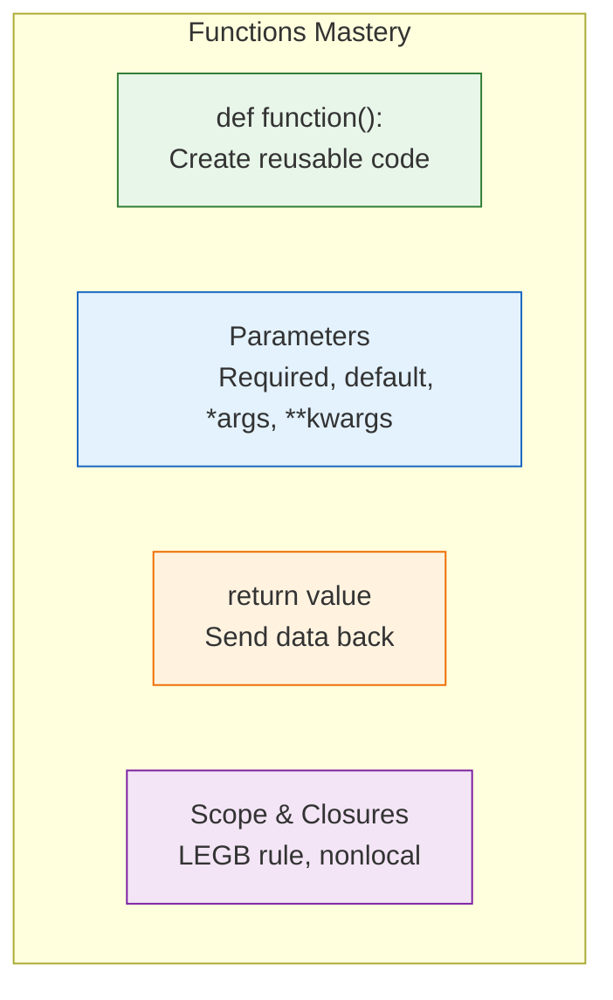
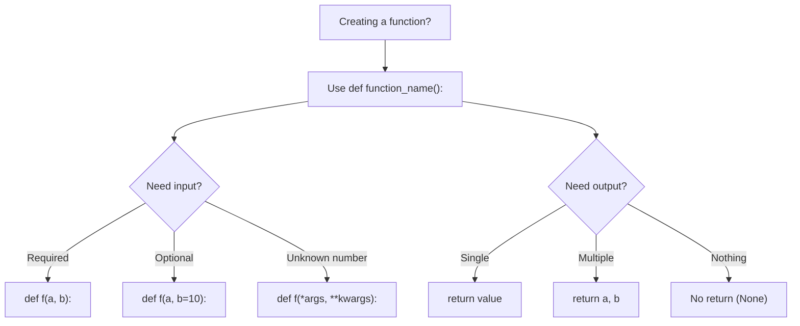

# Lesson 3.25: Functions Q&A

> **Duration**: 10 min | **Section**: D - Functions (Wrap-up)

## 📋 Section D Summary



## 🧠 Concept Check

| Concept | Question | Answer |
|:--------|:---------|:-------|
| def | What does `def` create? | A function object |
| return | What if no return? | Returns `None` implicitly |
| *args | What type is args? | Tuple of positional arguments |
| **kwargs | What type is kwargs? | Dict of keyword arguments |
| default | When is default evaluated? | Once at function definition |
| global | What does global do? | Accesses module-level variable |
| nonlocal | What does nonlocal do? | Accesses enclosing scope variable |
| closure | What's a closure? | Function + its enclosing scope |

## ❓ Frequently Asked Questions

### Function Basics

| Question | Answer |
|----------|--------|
| Function vs method? | Method is function bound to an object (comes later with classes). |
| Can I return multiple values? | Yes, as a tuple: `return a, b, c` |
| What's a docstring for? | Documentation. Access via `help(func)` or `func.__doc__`. |
| Type hints enforced? | No, they're for tools and documentation only. |

### Parameters

| Question | Answer |
|----------|--------|
| *args vs **kwargs? | `*args`: tuple of extra positional. `**kwargs`: dict of extra keyword. |
| Why avoid mutable defaults? | They're shared across all calls (created once). |
| How to require keyword args? | Use `*` separator: `def f(a, *, b):` |

### Scope

| Question | Answer |
|----------|--------|
| LEGB meaning? | Local → Enclosing → Global → Built-in |
| When use global? | Rarely. Usually indicates need for refactoring. |
| Late binding fix? | Use default arg: `lambda x=x: x` |

## 🔗 Quick Reference

```python
# === DEFINING FUNCTIONS ===
def function_name(params):
    """Docstring."""
    return value

# Type hints
def add(a: int, b: int) -> int:
    return a + b

# === PARAMETERS ===
# Required
def f(a, b):
    pass

# Default
def f(a, b=10):
    pass

# *args (tuple)
def f(*args):
    pass

# **kwargs (dict)
def f(**kwargs):
    pass

# All together
def f(required, default=1, *args, **kwargs):
    pass

# Keyword-only (after *)
def f(a, *, b):
    pass

# Positional-only (before /)
def f(a, /, b):
    pass

# === RETURN ===
return value          # Return single
return a, b           # Return tuple
return                # Return None
# (no return)         # Also returns None

# === UNPACKING ===
f(*[1, 2, 3])         # Unpack list
f(**{"a": 1})         # Unpack dict

# === SCOPE ===
global var            # Access global
nonlocal var          # Access enclosing

# === LAMBDA ===
lambda x: x * 2       # Anonymous function

# === CLOSURES ===
def outer():
    x = 1
    def inner():
        return x      # Remembers x
    return inner
```

## 🎯 Lambda Functions (Bonus)

Anonymous, one-expression functions:

```python
# Regular function
def double(x):
    return x * 2

# Lambda equivalent
double = lambda x: x * 2

# Common uses
numbers = [1, 2, 3, 4, 5]

# With sorted
sorted(numbers, key=lambda x: -x)  # [5, 4, 3, 2, 1]

# With map
list(map(lambda x: x ** 2, numbers))  # [1, 4, 9, 16, 25]

# With filter
list(filter(lambda x: x % 2 == 0, numbers))  # [2, 4]
```

**When to use lambda**:
- Short, simple operations
- As arguments to higher-order functions (map, filter, sorted)
- When you don't need to reuse the function

**When NOT to use**:
- Complex logic (use regular def)
- Need docstring or type hints
- Need multiple statements

## 📊 Decision Tree



## 💥 Common Pitfalls

| Pitfall | What Happens | Fix |
|---------|--------------|-----|
| Mutable default `def f(lst=[])` | List shared across calls | Use `def f(lst=None): lst = lst or []` |
| Forgetting `return` | Function returns `None` | Always return explicitly |
| Modifying global without `global` | Creates new local variable | Use `global var` (or avoid globals) |
| Late binding in closures | All lambdas use final value | `lambda x=x: x` to capture |
| Too many parameters | Hard to use, easy to misorder | Use `**kwargs` or config object |

## 🔑 Key Takeaways

1. **Functions are objects** - Can be assigned, passed, returned
2. **Parameters define interface** - Required, default, *args, **kwargs
3. **Return sends data back** - No return = `None`
4. **Scope is LEGB** - Local → Enclosing → Global → Built-in
5. **Closures capture state** - Inner function remembers outer scope
6. **Lambda for simple cases** - One expression, anonymous

## ✅ Section Complete!

You now understand:
- Defining and calling functions
- All parameter types (positional, keyword, default, *args, **kwargs)
- Return values and multiple returns
- Scope, LEGB rule, and closures
- Lambda functions

**Next up**: Section E - Classes & OOP

We'll explore:
- Defining classes
- Instance and class attributes
- Methods and self
- Inheritance and polymorphism
