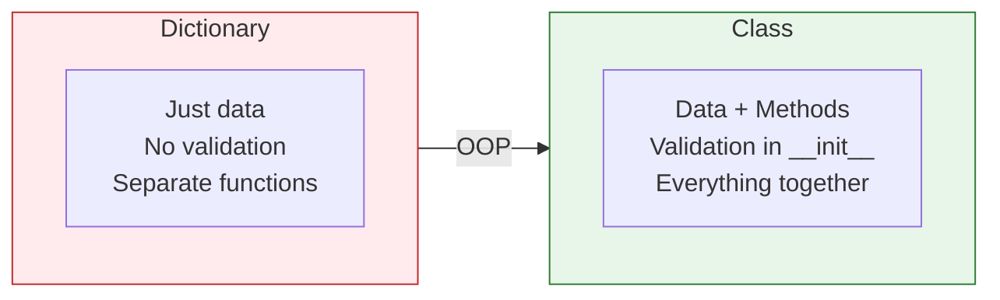

# Lesson 3.26: The Modeling Problem

> **Duration**: 5 min | **Section**: E - Classes & OOP (Intro)

## 🎯 The Problem

You're building a user management system. Each user has:
- Name, email, password
- Created date, last login
- Role, permissions
- Actions: login, logout, change password

How do you represent this?

### Attempt 1: Separate Variables

```python
user1_name = "Alice"
user1_email = "alice@example.com"
user1_role = "admin"

user2_name = "Bob"
user2_email = "bob@example.com"
user2_role = "user"
```

**Problems**: Can't scale. Can't pass "a user" to functions.

### Attempt 2: Dictionaries

```python
user1 = {
    "name": "Alice",
    "email": "alice@example.com",
    "role": "admin"
}

def login(user):
    print(f"{user['name']} logged in")
```

**Better, but**:
- No validation (can add any key)
- No methods (functions are separate)
- No structure guarantee

## 💭 What We Need

A way to:
- Bundle data AND behavior together
- Create templates for similar objects
- Ensure structure consistency



## 📍 What You'll Learn

In this section:
1. **Classes** - Templates for creating objects
2. **Instance attributes** - Data each object owns
3. **Methods** - Functions attached to objects
4. **`self`** - How methods access instance data
5. **Inheritance** - Reusing and extending classes
6. **Special methods** - `__init__`, `__str__`, etc.

## ✨ The Solution Preview

```python
class User:
    def __init__(self, name, email):
        self.name = name
        self.email = email
    
    def login(self):
        print(f"{self.name} logged in")
    
    def __str__(self):
        return f"User({self.name})"

# Create users
alice = User("Alice", "alice@example.com")
bob = User("Bob", "bob@example.com")

alice.login()     # Alice logged in
print(alice)      # User(Alice)
```

Let's learn Object-Oriented Programming!
