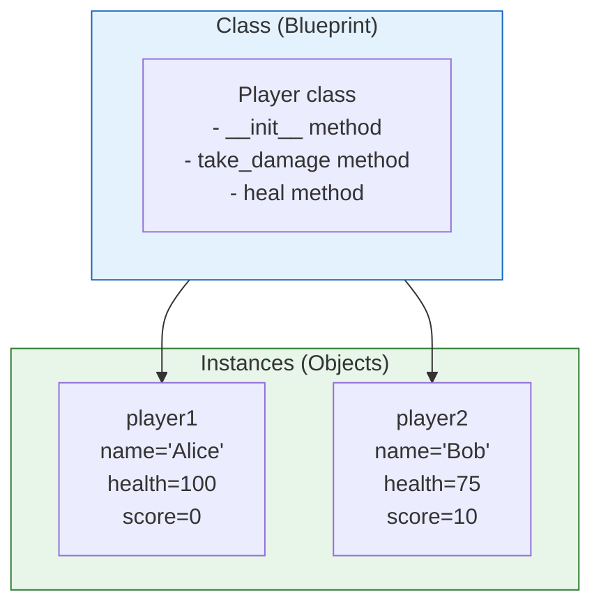
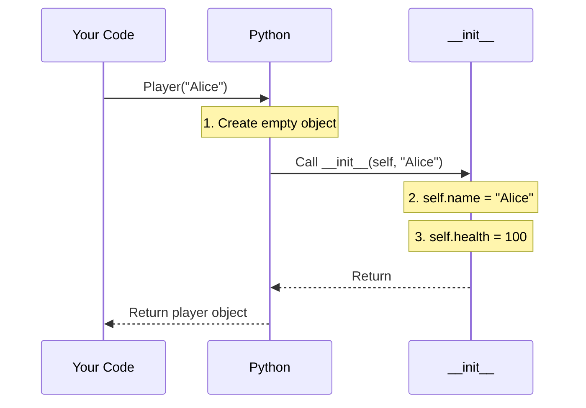
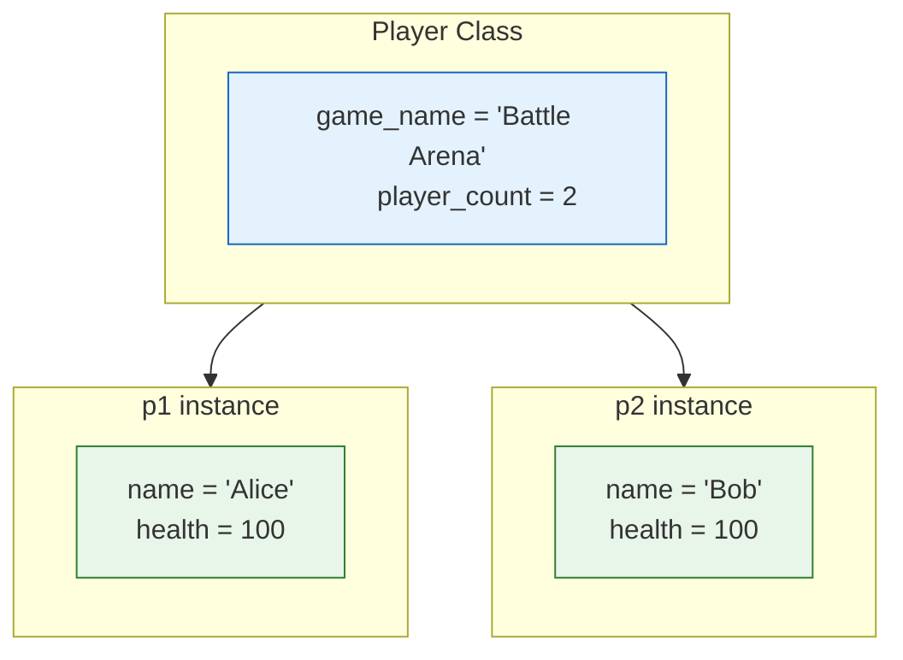

# Lesson 3.27: Defining Classes

> **Duration**: 30 min | **Section**: E - Classes & OOP

## 🎯 The Problem (3-5 min)

You need to create many similar objects, each with:
- Its own data (attributes)
- Shared behavior (methods)

> **Scenario**: A game with 100 players. Each has name, health, score. Each can attack, heal, level_up. You need a template.

## 🧪 Try It: Basic Classes (5-10 min)

### Defining a Class

```python
class Player:
    """A game player."""
    
    def __init__(self, name):
        self.name = name
        self.health = 100
        self.score = 0

# Create instances
player1 = Player("Alice")
player2 = Player("Bob")

print(player1.name)    # Alice
print(player2.name)    # Bob
print(player1.health)  # 100
```

**Key parts**:
- `class Player:` - Class definition
- `__init__` - Constructor (initializer)
- `self` - Reference to the instance
- `self.name` - Instance attribute

### Adding Methods

```python
class Player:
    def __init__(self, name):
        self.name = name
        self.health = 100
        self.score = 0
    
    def take_damage(self, amount):
        self.health -= amount
        if self.health < 0:
            self.health = 0
        print(f"{self.name} took {amount} damage. Health: {self.health}")
    
    def heal(self, amount):
        self.health += amount
        if self.health > 100:
            self.health = 100
        print(f"{self.name} healed. Health: {self.health}")
    
    def add_score(self, points):
        self.score += points

player = Player("Alice")
player.take_damage(30)  # Alice took 30 damage. Health: 70
player.heal(20)         # Alice healed. Health: 90
```

## 🔍 Under the Hood (10-15 min)

### Class vs Instance



- **Class**: Template/blueprint
- **Instance**: Actual object created from class
- Each instance has its own attribute values

### What Happens When You Create an Instance

```python
player = Player("Alice")
```



### What is `self`?

`self` is a reference to the **current instance**:

```python
class Player:
    def __init__(self, name):
        self.name = name  # self is the new player being created
    
    def greet(self):
        print(f"I am {self.name}")  # self is the player calling greet

alice = Player("Alice")
bob = Player("Bob")

alice.greet()  # I am Alice (self refers to alice)
bob.greet()    # I am Bob (self refers to bob)
```

**Under the hood**:
```python
# When you call:
alice.greet()

# Python translates to:
Player.greet(alice)  # self = alice
```

### Instance Attributes vs Class Attributes

```python
class Player:
    # Class attribute (shared by all instances)
    game_name = "Battle Arena"
    player_count = 0
    
    def __init__(self, name):
        # Instance attributes (unique to each instance)
        self.name = name
        self.health = 100
        Player.player_count += 1

p1 = Player("Alice")
p2 = Player("Bob")

print(Player.game_name)     # Battle Arena
print(p1.game_name)         # Battle Arena (falls back to class)
print(Player.player_count)  # 2

# Instance attributes are unique
print(p1.name)  # Alice
print(p2.name)  # Bob
```



### Method Types

```python
class Player:
    count = 0
    
    def __init__(self, name):
        self.name = name
        Player.count += 1
    
    # Instance method (most common)
    def attack(self, target):
        print(f"{self.name} attacks {target.name}")
    
    # Class method (works with class, not instance)
    @classmethod
    def get_count(cls):
        return cls.count
    
    # Static method (utility, no self or cls)
    @staticmethod
    def calculate_damage(base, multiplier):
        return base * multiplier

# Usage
p = Player("Alice")
p.attack(Player("Bob"))     # Instance method: needs instance
Player.get_count()          # Class method: works on class
Player.calculate_damage(10, 1.5)  # Static: just a function
```

## 💥 Where It Breaks (3-5 min)

| Problem | Cause | Fix |
|:--------|:------|:----|
| `TypeError: __init__() takes 1 positional argument` | Forgot `self` | Add `self` as first parameter |
| `AttributeError: 'Player' has no attribute 'name'` | Forgot `self.` | Use `self.name = name` |
| All instances share same list | Used mutable class attribute | Initialize in `__init__` |

### The Mutable Class Attribute Trap

```python
# WRONG: Shared list
class Player:
    inventory = []  # Shared by ALL players!
    
    def add_item(self, item):
        self.inventory.append(item)

p1 = Player()
p2 = Player()
p1.add_item("sword")
print(p2.inventory)  # ['sword'] ← p2 has it too!

# RIGHT: Instance attribute
class Player:
    def __init__(self):
        self.inventory = []  # Each player has own list
```

## ✅ The Fix (5-10 min)

### Best Practices

```python
class User:
    """Represents a user in the system."""
    
    # Class constant
    MAX_LOGIN_ATTEMPTS = 3
    
    def __init__(self, email: str, name: str):
        # Always initialize in __init__
        self.email = email
        self.name = name
        self._login_attempts = 0  # _ suggests "private"
    
    def login(self, password: str) -> bool:
        """Attempt to log in."""
        if self._verify_password(password):
            self._login_attempts = 0
            return True
        self._login_attempts += 1
        return False
    
    def _verify_password(self, password: str) -> bool:
        """Internal method (by convention, _prefix)."""
        return True  # Placeholder
```

### Quick Reference

```python
# Define class
class ClassName:
    """Docstring."""
    
    class_attribute = "shared"
    
    def __init__(self, param):
        self.instance_attribute = param
    
    def method(self, arg):
        return self.instance_attribute + arg
    
    @classmethod
    def class_method(cls):
        return cls.class_attribute
    
    @staticmethod
    def static_method():
        return "utility"

# Create instance
obj = ClassName("value")

# Access attributes
obj.instance_attribute
ClassName.class_attribute

# Call methods
obj.method("arg")
ClassName.class_method()
ClassName.static_method()
```

## 🎯 Practice

1. Create a `BankAccount` class:
   ```python
   # Attributes: owner, balance (default 0)
   # Methods: deposit(amount), withdraw(amount), get_balance()
   ```

2. Add a class attribute:
   ```python
   # Track total number of accounts created
   ```

3. Create a `Rectangle` class:
   ```python
   # Attributes: width, height
   # Methods: area(), perimeter()
   ```

## 🔑 Key Takeaways

- Classes are blueprints for creating objects
- `__init__` initializes new instances
- `self` refers to the current instance
- Instance attributes: unique per object (define in `__init__`)
- Class attributes: shared by all instances
- Methods are functions bound to instances
- Always initialize mutable attributes in `__init__`

## ❓ Common Questions

| Question | Answer |
|----------|--------|
| What is `self`? | Reference to the instance calling the method. |
| Why `self` in all methods? | Python passes instance explicitly. |
| Class vs instance attribute? | Class: shared. Instance: unique per object. |
| When use @classmethod? | When you need class, not instance (like factory methods). |

## 🔗 Further Reading

- [Classes](https://docs.python.org/3/tutorial/classes.html)
- [Class and Instance Variables](https://docs.python.org/3/tutorial/classes.html#class-and-instance-variables)
