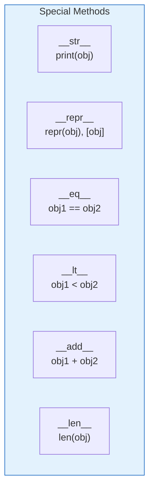

# Lesson 3.28: Special Methods (Dunder Methods)

> **Duration**: 25 min | **Section**: E - Classes & OOP

## 🎯 The Problem (3-5 min)

You created a class, but:

```python
class Point:
    def __init__(self, x, y):
        self.x = x
        self.y = y

p = Point(3, 4)
print(p)  # <__main__.Point object at 0x...> ← Not helpful!

p1 = Point(1, 2)
p2 = Point(1, 2)
print(p1 == p2)  # False ← Why? Same values!

# Can't add points
p1 + p2  # TypeError
```

How do you make your objects work with built-in Python operations?

## 🧪 Try It: Special Methods (5-10 min)

### `__str__` - Human-Readable String

```python
class Point:
    def __init__(self, x, y):
        self.x = x
        self.y = y
    
    def __str__(self):
        return f"Point({self.x}, {self.y})"

p = Point(3, 4)
print(p)  # Point(3, 4) ← Much better!
```

### `__repr__` - Developer String

```python
class Point:
    def __init__(self, x, y):
        self.x = x
        self.y = y
    
    def __repr__(self):
        return f"Point({self.x}, {self.y})"
    
    def __str__(self):
        return f"({self.x}, {self.y})"

p = Point(3, 4)
print(p)       # (3, 4) - uses __str__
print(repr(p)) # Point(3, 4) - uses __repr__
print([p])     # [Point(3, 4)] - lists use __repr__
```

### `__eq__` - Equality

```python
class Point:
    def __init__(self, x, y):
        self.x = x
        self.y = y
    
    def __eq__(self, other):
        if not isinstance(other, Point):
            return False
        return self.x == other.x and self.y == other.y

p1 = Point(1, 2)
p2 = Point(1, 2)
p3 = Point(3, 4)

print(p1 == p2)  # True ← Now works!
print(p1 == p3)  # False
```

## 🔍 Under the Hood (10-15 min)

### Dunder Methods Table

"Dunder" = **D**ouble **UNDER**score



| Method | Called By | Purpose |
|:-------|:----------|:--------|
| `__init__` | `ClassName()` | Initialize instance |
| `__str__` | `str(obj)`, `print(obj)` | Human-readable string |
| `__repr__` | `repr(obj)`, debugger | Developer string |
| `__eq__` | `obj1 == obj2` | Equality comparison |
| `__lt__` | `obj1 < obj2` | Less than |
| `__le__` | `obj1 <= obj2` | Less than or equal |
| `__add__` | `obj1 + obj2` | Addition |
| `__sub__` | `obj1 - obj2` | Subtraction |
| `__len__` | `len(obj)` | Length |
| `__getitem__` | `obj[key]` | Indexing |
| `__contains__` | `x in obj` | Membership |
| `__bool__` | `if obj:` | Truthiness |

### Complete Example

```python
class Vector:
    def __init__(self, x, y):
        self.x = x
        self.y = y
    
    def __repr__(self):
        return f"Vector({self.x}, {self.y})"
    
    def __str__(self):
        return f"<{self.x}, {self.y}>"
    
    def __eq__(self, other):
        return self.x == other.x and self.y == other.y
    
    def __add__(self, other):
        return Vector(self.x + other.x, self.y + other.y)
    
    def __sub__(self, other):
        return Vector(self.x - other.x, self.y - other.y)
    
    def __mul__(self, scalar):
        return Vector(self.x * scalar, self.y * scalar)
    
    def __abs__(self):
        return (self.x ** 2 + self.y ** 2) ** 0.5
    
    def __bool__(self):
        return self.x != 0 or self.y != 0

# Usage
v1 = Vector(3, 4)
v2 = Vector(1, 2)

print(v1)           # <3, 4>
print(repr(v1))     # Vector(3, 4)
print(v1 + v2)      # <4, 6>
print(v1 - v2)      # <2, 2>
print(v1 * 2)       # <6, 8>
print(abs(v1))      # 5.0
print(bool(Vector(0, 0)))  # False
```

### Container-Like Methods

```python
class Deck:
    def __init__(self):
        self.cards = []
    
    def __len__(self):
        return len(self.cards)
    
    def __getitem__(self, index):
        return self.cards[index]
    
    def __contains__(self, card):
        return card in self.cards
    
    def __iter__(self):
        return iter(self.cards)

deck = Deck()
deck.cards = ["Ace", "King", "Queen"]

print(len(deck))        # 3
print(deck[0])          # Ace
print("King" in deck)   # True
for card in deck:       # Works because of __iter__
    print(card)
```

### Context Manager Methods

```python
class FileManager:
    def __init__(self, filename, mode):
        self.filename = filename
        self.mode = mode
        self.file = None
    
    def __enter__(self):
        self.file = open(self.filename, self.mode)
        return self.file
    
    def __exit__(self, exc_type, exc_val, exc_tb):
        if self.file:
            self.file.close()
        return False  # Don't suppress exceptions

# Usage with 'with'
with FileManager("test.txt", "w") as f:
    f.write("Hello")
# File automatically closed!
```

### Comparison Methods

```python
from functools import total_ordering

@total_ordering  # Generates missing comparison methods
class Student:
    def __init__(self, name, grade):
        self.name = name
        self.grade = grade
    
    def __eq__(self, other):
        return self.grade == other.grade
    
    def __lt__(self, other):
        return self.grade < other.grade

# Now has ==, !=, <, <=, >, >= automatically!
s1 = Student("Alice", 90)
s2 = Student("Bob", 85)
print(s1 > s2)  # True
```

## 💥 Where It Breaks (3-5 min)

| Problem | Cause | Fix |
|:--------|:------|:----|
| `__str__` returns None | Forgot to `return` | Return a string |
| TypeError with `+` | Wrong return type | Return same class |
| Infinite recursion | Called same operation inside dunder | Use parent attributes |

### Common Mistakes

```python
# WRONG: Returns wrong type
def __add__(self, other):
    result = self.x + other.x
    return result  # Returns int, not Vector!

# RIGHT: Return proper type
def __add__(self, other):
    return Vector(self.x + other.x, self.y + other.y)

# WRONG: No isinstance check
def __eq__(self, other):
    return self.x == other.x  # Fails if other isn't same type

# RIGHT: Check type
def __eq__(self, other):
    if not isinstance(other, Vector):
        return NotImplemented  # Let Python try other.__eq__
    return self.x == other.x and self.y == other.y
```

## ✅ The Fix (5-10 min)

### Recommended Dunders

For most classes, implement these:

```python
class MyClass:
    def __init__(self, value):
        self.value = value
    
    def __repr__(self):
        """Always implement - for debugging."""
        return f"MyClass({self.value!r})"
    
    def __str__(self):
        """For user-facing output (optional if __repr__ is good)."""
        return f"MyClass: {self.value}"
    
    def __eq__(self, other):
        """If comparing makes sense."""
        if not isinstance(other, MyClass):
            return NotImplemented
        return self.value == other.value
    
    def __hash__(self):
        """Required if using as dict key (and __eq__ defined)."""
        return hash(self.value)
```

### Quick Reference

```python
# String representations
__repr__(self) -> str      # Developer/debugging
__str__(self) -> str       # User-facing

# Comparisons
__eq__(self, other)        # ==
__ne__(self, other)        # !=
__lt__(self, other)        # <
__le__(self, other)        # <=
__gt__(self, other)        # >
__ge__(self, other)        # >=

# Arithmetic
__add__(self, other)       # +
__sub__(self, other)       # -
__mul__(self, other)       # *
__truediv__(self, other)   # /
__floordiv__(self, other)  # //
__mod__(self, other)       # %
__pow__(self, other)       # **

# Container
__len__(self)              # len()
__getitem__(self, key)     # obj[key]
__setitem__(self, key, val)# obj[key] = val
__contains__(self, item)   # item in obj
__iter__(self)             # for x in obj

# Other
__bool__(self)             # bool(), if obj:
__call__(self, *args)      # obj()
__hash__(self)             # hash(), dict key
```

## 🎯 Practice

1. Add `__str__` and `__repr__` to BankAccount:
   ```python
   # __str__: "Account of Alice: $100"
   # __repr__: "BankAccount('Alice', 100)"
   ```

2. Make a `Fraction` class comparable:
   ```python
   # Support ==, <, >, etc.
   # Fraction(1, 2) == Fraction(2, 4) should be True
   ```

3. Create a `ShoppingCart` with `__len__` and `__contains__`:
   ```python
   # len(cart) returns number of items
   # "apple" in cart checks if item in cart
   ```

## 🔑 Key Takeaways

- Dunder methods let objects work with Python operators
- `__repr__`: for developers (should be unambiguous)
- `__str__`: for users (can be readable)
- `__eq__`: for `==` comparison
- Return `NotImplemented` for unsupported comparisons
- Implement `__hash__` if defining `__eq__` for dict keys
- Use `@total_ordering` for easy comparison implementations

## ❓ Common Questions

| Question | Answer |
|----------|--------|
| __str__ vs __repr__? | __repr__ for debugging. __str__ for display. |
| When need __hash__? | When __eq__ is defined and using as dict key. |
| What's NotImplemented? | Special value for "try the other operand." |
| All dunders needed? | No, only what makes sense for your class. |

## 🔗 Further Reading

- [Data Model - Special Method Names](https://docs.python.org/3/reference/datamodel.html#special-method-names)
- [functools.total_ordering](https://docs.python.org/3/library/functools.html#functools.total_ordering)
