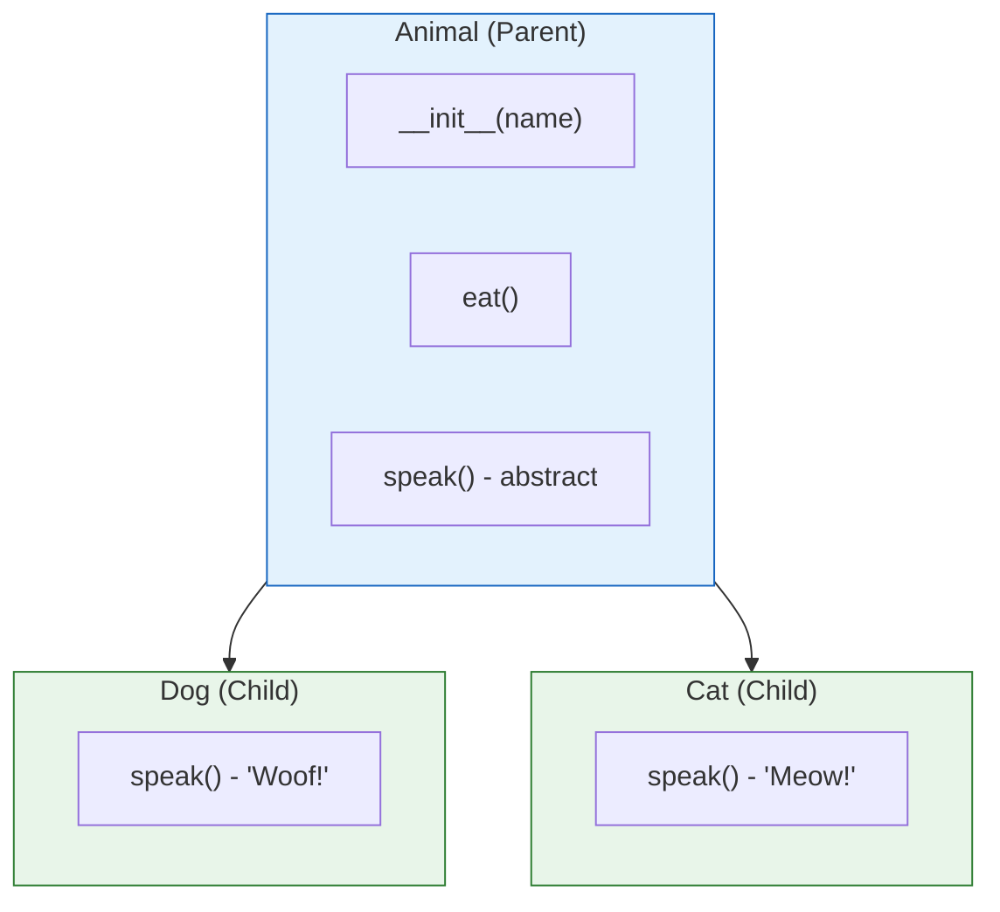
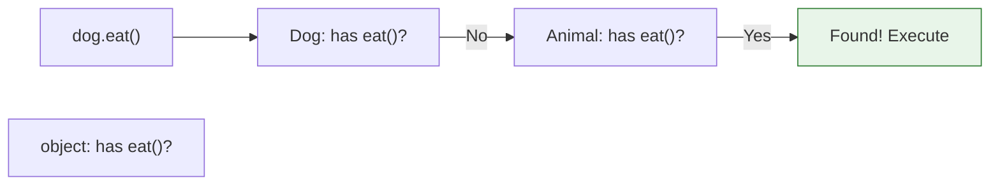

# Lesson 3.29: Inheritance

> **Duration**: 30 min | **Section**: E - Classes & OOP

## 🎯 The Problem (3-5 min)

You have similar classes with duplicated code:

```python
class Dog:
    def __init__(self, name):
        self.name = name
    
    def speak(self):
        return f"{self.name} says Woof!"
    
    def eat(self):
        return f"{self.name} is eating"

class Cat:
    def __init__(self, name):
        self.name = name
    
    def speak(self):
        return f"{self.name} says Meow!"
    
    def eat(self):
        return f"{self.name} is eating"  # Duplicate!
```

`eat()` is identical. `__init__` is identical. Only `speak()` differs. How do you avoid repetition?

## 🧪 Try It: Basic Inheritance (5-10 min)

### Parent Class (Base Class)

```python
class Animal:
    """Base class for all animals."""
    
    def __init__(self, name):
        self.name = name
    
    def eat(self):
        return f"{self.name} is eating"
    
    def speak(self):
        raise NotImplementedError("Subclass must implement")
```

### Child Classes (Derived Classes)

```python
class Dog(Animal):  # Dog inherits from Animal
    def speak(self):
        return f"{self.name} says Woof!"

class Cat(Animal):  # Cat inherits from Animal
    def speak(self):
        return f"{self.name} says Meow!"

# Usage
dog = Dog("Rex")
cat = Cat("Whiskers")

print(dog.speak())  # Rex says Woof!
print(cat.speak())  # Whiskers says Meow!
print(dog.eat())    # Rex is eating (inherited!)
print(cat.eat())    # Whiskers is eating (inherited!)
```

## 🔍 Under the Hood (10-15 min)

### Inheritance Hierarchy



### Method Resolution Order (MRO)

When you call a method, Python searches:
1. Current class
2. Parent class
3. Parent's parent, etc.
4. object (base of everything)

```python
print(Dog.__mro__)
# (<class 'Dog'>, <class 'Animal'>, <class 'object'>)
```



### Extending `__init__`

```python
class Animal:
    def __init__(self, name):
        self.name = name

class Dog(Animal):
    def __init__(self, name, breed):
        super().__init__(name)  # Call parent's __init__
        self.breed = breed      # Add new attribute

dog = Dog("Rex", "German Shepherd")
print(dog.name)   # Rex (from Animal)
print(dog.breed)  # German Shepherd (from Dog)
```

### `super()` Explained

`super()` gives access to the parent class:

```python
class Parent:
    def greet(self):
        return "Hello from Parent"

class Child(Parent):
    def greet(self):
        parent_greeting = super().greet()  # Call parent method
        return f"{parent_greeting} and Child"

c = Child()
print(c.greet())  # Hello from Parent and Child
```

### Method Overriding

Child can replace parent's method:

```python
class Animal:
    def speak(self):
        return "Some sound"

class Dog(Animal):
    def speak(self):  # Overrides Animal.speak
        return "Woof!"

class Cat(Animal):
    def speak(self):  # Overrides Animal.speak
        return "Meow!"
```

### Polymorphism

Same method name, different behavior:

```python
animals = [Dog("Rex"), Cat("Whiskers"), Dog("Buddy")]

for animal in animals:
    print(animal.speak())  # Calls the right speak() for each!
# Rex says Woof!
# Whiskers says Meow!
# Buddy says Woof!
```

### isinstance() and issubclass()

```python
dog = Dog("Rex")

print(isinstance(dog, Dog))     # True
print(isinstance(dog, Animal))  # True (Dog IS-A Animal)
print(isinstance(dog, Cat))     # False

print(issubclass(Dog, Animal))  # True
print(issubclass(Cat, Animal))  # True
print(issubclass(Dog, Cat))     # False
```

### Multiple Inheritance

A class can inherit from multiple parents:

```python
class Swimmer:
    def swim(self):
        return f"{self.name} swims"

class Walker:
    def walk(self):
        return f"{self.name} walks"

class Duck(Animal, Swimmer, Walker):
    def speak(self):
        return f"{self.name} says Quack!"

duck = Duck("Donald")
print(duck.speak())  # Donald says Quack!
print(duck.swim())   # Donald swims
print(duck.walk())   # Donald walks
```

**MRO with multiple inheritance**:
```python
print(Duck.__mro__)
# (Duck, Animal, Swimmer, Walker, object)
```

## 💥 Where It Breaks (3-5 min)

| Problem | Cause | Fix |
|:--------|:------|:----|
| Parent `__init__` not called | Forgot `super().__init__()` | Always call super() |
| Diamond problem | Multiple inheritance conflict | Use super() correctly |
| Tight coupling | Too much inheritance | Prefer composition |

### The Diamond Problem

```python
class A:
    def method(self):
        print("A")

class B(A):
    def method(self):
        print("B")
        super().method()

class C(A):
    def method(self):
        print("C")
        super().method()

class D(B, C):  # Diamond: D -> B -> A, D -> C -> A
    def method(self):
        print("D")
        super().method()

D().method()
# D
# B
# C
# A (only once due to MRO!)
```

## ✅ The Fix (5-10 min)

### Best Practices

```python
# 1. Always call super().__init__ in children
class Child(Parent):
    def __init__(self, new_arg, **kwargs):
        super().__init__(**kwargs)  # Forward unknown args
        self.new_arg = new_arg

# 2. Use abstract base classes for interfaces
from abc import ABC, abstractmethod

class Animal(ABC):
    @abstractmethod
    def speak(self):
        """Subclass MUST implement."""
        pass

class Dog(Animal):
    def speak(self):  # Required!
        return "Woof"

# 3. Prefer composition over inheritance
class Engine:
    def start(self):
        return "Engine started"

class Car:
    def __init__(self):
        self.engine = Engine()  # Has-A, not Is-A
    
    def start(self):
        return self.engine.start()
```

### When to Use Inheritance

**Use inheritance** when:
- Child IS-A type of parent (Dog IS-A Animal)
- You want polymorphism
- Sharing common behavior

**Use composition** when:
- Child HAS-A component (Car HAS-A Engine)
- More flexible relationships
- Avoid deep hierarchies

## 🎯 Practice

1. Create a shape hierarchy:
   ```python
   # Shape (base) with name
   # Rectangle(Shape) with width, height, area()
   # Square(Rectangle) with size (width = height)
   ```

2. Create an employee hierarchy:
   ```python
   # Employee: name, salary, describe()
   # Manager(Employee): add team_size
   # Developer(Employee): add language
   ```

3. Use super() correctly:
   ```python
   # Extend __init__ in child classes above
   ```

## 🔑 Key Takeaways

- Inheritance: Child class gets Parent's attributes/methods
- `super()` accesses parent class
- Override: Child replaces parent's method
- Polymorphism: Same interface, different behavior
- MRO: Method Resolution Order determines lookup path
- ABC: Abstract Base Class enforces implementation
- Prefer composition over deep inheritance

## ❓ Common Questions

| Question | Answer |
|----------|--------|
| When use inheritance? | When IS-A relationship exists (Dog IS-A Animal). |
| What's super() for? | Access parent class methods. |
| Multiple inheritance OK? | Use carefully. Prefer mixins or composition. |
| What's polymorphism? | Same method name, different behavior per class. |

## 🔗 Further Reading

- [Inheritance](https://docs.python.org/3/tutorial/classes.html#inheritance)
- [Multiple Inheritance](https://docs.python.org/3/tutorial/classes.html#multiple-inheritance)
- [ABC module](https://docs.python.org/3/library/abc.html)
