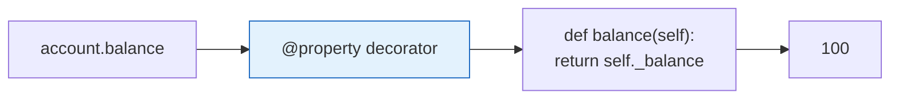
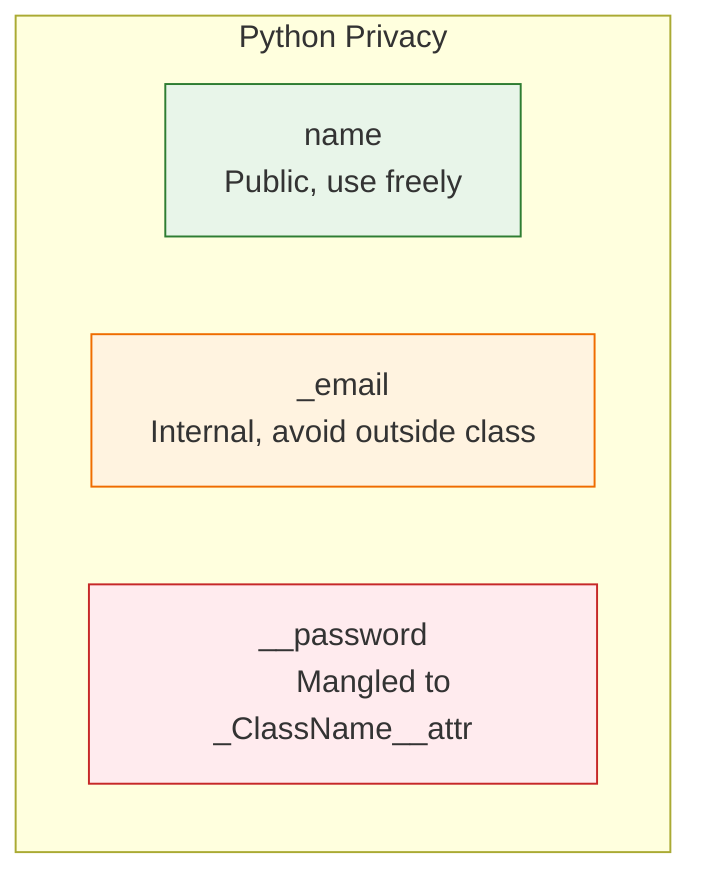

# Lesson 3.30: Properties and Encapsulation

> **Duration**: 20 min | **Section**: E - Classes & OOP

## 🎯 The Problem (3-5 min)

Direct attribute access is dangerous:

```python
class BankAccount:
    def __init__(self, balance):
        self.balance = balance

account = BankAccount(100)
account.balance = -1000  # This shouldn't be allowed!
```

How do you control access to attributes?

## 🧪 Try It: Properties (5-10 min)

### Getter and Setter Properties

```python
class BankAccount:
    def __init__(self, balance):
        self._balance = balance  # Convention: _ means "private"
    
    @property
    def balance(self):
        """Get the balance."""
        return self._balance
    
    @balance.setter
    def balance(self, value):
        """Set the balance with validation."""
        if value < 0:
            raise ValueError("Balance cannot be negative")
        self._balance = value

# Usage - looks like attribute access!
account = BankAccount(100)
print(account.balance)    # 100 (calls getter)
account.balance = 150     # Calls setter with validation
account.balance = -50     # ValueError!
```

### Read-Only Property

```python
class Circle:
    def __init__(self, radius):
        self._radius = radius
    
    @property
    def radius(self):
        return self._radius
    
    @property
    def area(self):
        """Computed property - no setter."""
        return 3.14159 * self._radius ** 2

circle = Circle(5)
print(circle.area)  # 78.53975
circle.area = 100   # AttributeError: can't set attribute
```

## 🔍 Under the Hood (10-15 min)

### How Properties Work



Properties intercept attribute access:
- **Get**: Calls the `@property` method
- **Set**: Calls the `@x.setter` method
- **Delete**: Calls the `@x.deleter` method

### Privacy Conventions

Python doesn't have true private attributes, only conventions:

```python
class User:
    def __init__(self, name, password):
        self.name = name           # Public
        self._email = None         # "Protected" - internal use
        self.__password = password # "Private" - name mangled

user = User("Alice", "secret123")
print(user.name)          # Alice - OK
print(user._email)        # None - accessible but discouraged
print(user.__password)    # AttributeError!
print(user._User__password)  # secret123 - name mangling revealed
```



### Full Property Example

```python
class Temperature:
    def __init__(self, celsius=0):
        self._celsius = celsius
    
    @property
    def celsius(self):
        return self._celsius
    
    @celsius.setter
    def celsius(self, value):
        if value < -273.15:
            raise ValueError("Below absolute zero!")
        self._celsius = value
    
    @property
    def fahrenheit(self):
        return self._celsius * 9/5 + 32
    
    @fahrenheit.setter
    def fahrenheit(self, value):
        self.celsius = (value - 32) * 5/9  # Uses celsius setter!
    
    @property
    def kelvin(self):
        return self._celsius + 273.15

# Usage
temp = Temperature(20)
print(temp.celsius)     # 20
print(temp.fahrenheit)  # 68.0
print(temp.kelvin)      # 293.15

temp.fahrenheit = 86    # Set via Fahrenheit
print(temp.celsius)     # 30.0
```

### Encapsulation Benefits

```python
# Without encapsulation - tight coupling
class UserV1:
    def __init__(self):
        self.name = ""  # Direct access

# If you later want to change internal storage, all code breaks!

# With encapsulation - loose coupling
class UserV2:
    def __init__(self):
        self._name = ""
    
    @property
    def name(self):
        return self._name.title()  # Can transform!
    
    @name.setter
    def name(self, value):
        self._name = value.strip()  # Can validate!

# Internal changes don't break external code
```

## 💥 Where It Breaks (3-5 min)

| Problem | Cause | Fix |
|:--------|:------|:----|
| Infinite recursion | Setter calls itself | Use `self._attr` not `self.attr` |
| Can't set property | No setter defined | Add `@attr.setter` |
| AttributeError on private | Used `__name` | Use `_ClassName__name` or `_name` |

### Common Mistake

```python
# WRONG: Infinite recursion
class Bad:
    @property
    def value(self):
        return self.value  # Calls itself forever!
    
    @value.setter
    def value(self, v):
        self.value = v     # Calls itself forever!

# RIGHT: Use underscore attribute
class Good:
    @property
    def value(self):
        return self._value  # Access internal storage
    
    @value.setter
    def value(self, v):
        self._value = v
```

## ✅ The Fix (5-10 min)

### When to Use Properties

```python
# 1. Validation
@property
def age(self):
    return self._age

@age.setter
def age(self, value):
    if not 0 <= value <= 150:
        raise ValueError("Invalid age")
    self._age = value

# 2. Computed values
@property
def full_name(self):
    return f"{self.first_name} {self.last_name}"

# 3. Lazy loading
@property
def data(self):
    if self._data is None:
        self._data = self._load_expensive_data()
    return self._data

# 4. Deprecation
@property
def old_name(self):
    import warnings
    warnings.warn("old_name is deprecated", DeprecationWarning)
    return self.new_name
```

### Quick Reference

```python
class MyClass:
    def __init__(self, value):
        self._value = value  # Internal storage
    
    # Getter
    @property
    def value(self):
        return self._value
    
    # Setter
    @value.setter
    def value(self, new_value):
        self._value = new_value
    
    # Deleter (rare)
    @value.deleter
    def value(self):
        del self._value

# Privacy conventions
self.public         # Public attribute
self._protected     # Convention: internal use
self.__private      # Name mangling: _ClassName__private
```

## 🎯 Practice

1. Add validation to BankAccount:
   ```python
   # balance property that prevents negative values
   # owner property that strips whitespace
   ```

2. Create a Rectangle with computed properties:
   ```python
   # width, height as stored properties
   # area, perimeter as computed (read-only)
   ```

3. Add a celsius/fahrenheit converter to Temperature.

## 🔑 Key Takeaways

- `@property` makes methods look like attributes
- Use `@x.setter` for write access
- Properties enable validation, computation, and encapsulation
- `_name`: Convention for internal/protected
- `__name`: Name mangling to `_ClassName__name`
- Python trusts developers—no true private
- Properties allow changing internals without breaking API

## ❓ Common Questions

| Question | Answer |
|----------|--------|
| Why use properties? | Validation, computed values, encapsulation. |
| Is `_` truly private? | No, just a convention. Accessible but discouraged. |
| `__` makes private? | No, it's name mangling. Still accessible. |
| When setter needed? | When you want to allow modification. |

## 🔗 Further Reading

- [property() Built-in](https://docs.python.org/3/library/functions.html#property)
- [Descriptor HowTo Guide](https://docs.python.org/3/howto/descriptor.html)
