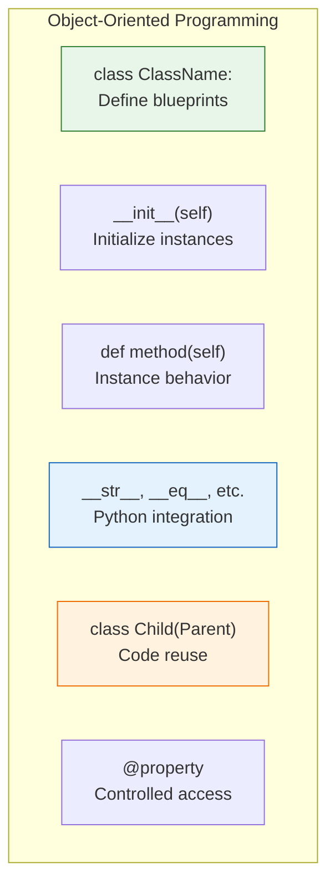
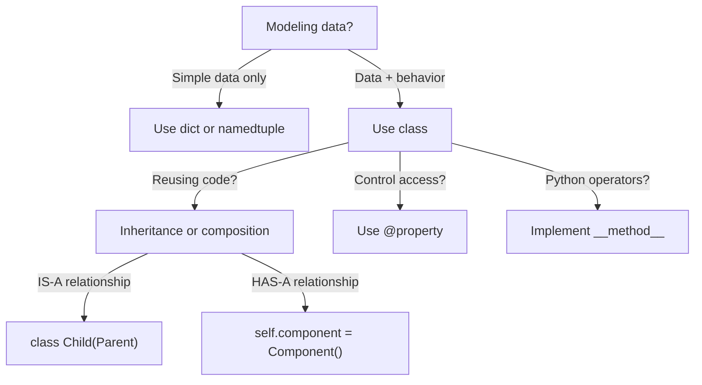

# Lesson 3.31: Classes Q&A

> **Duration**: 10 min | **Section**: E - Classes & OOP (Wrap-up)

## 📋 Section E Summary



## 🧠 Concept Check

| Concept | Question | Answer |
|:--------|:---------|:-------|
| class | What does a class define? | Blueprint for creating objects |
| __init__ | When is it called? | When creating new instance |
| self | What does self refer to? | The current instance |
| @property | What does it enable? | Attribute-like access with methods |
| inheritance | What does it provide? | Code reuse and polymorphism |
| super() | What does it access? | Parent class methods |
| __str__ | When is it called? | By print() and str() |
| __eq__ | What does it define? | Behavior for == operator |

## ❓ Frequently Asked Questions

### Classes Basics

| Question | Answer |
|----------|--------|
| Class vs instance? | Class is blueprint. Instance is object created from it. |
| Why always self? | Python explicitly passes instance to methods. |
| Class vs instance attribute? | Class: shared. Instance: unique per object. |
| When use @classmethod? | When method needs class, not instance. |

### Special Methods

| Question | Answer |
|----------|--------|
| __str__ vs __repr__? | __str__: readable. __repr__: unambiguous, for debugging. |
| Which dunders to implement? | At minimum: __repr__. Add others as needed. |
| What's NotImplemented? | Return value for unsupported operations. |

### Inheritance

| Question | Answer |
|----------|--------|
| When to use inheritance? | When IS-A relationship exists. |
| When to use composition? | When HAS-A relationship, or more flexibility needed. |
| What's polymorphism? | Same method, different behavior per class. |
| Diamond problem? | MRO resolves it. Use super() correctly. |

### Properties

| Question | Answer |
|----------|--------|
| Why use properties? | Validation, computed values, encapsulation. |
| Is _ private? | No, just convention for "internal use." |
| Is __ private? | Name mangling, not true private. |

## 🔗 Quick Reference

```python
# === CLASS DEFINITION ===
class ClassName:
    """Docstring."""
    
    # Class attribute
    class_attr = "shared"
    
    def __init__(self, value):
        """Initialize instance."""
        self.instance_attr = value
    
    # Instance method
    def method(self):
        return self.instance_attr
    
    # Class method
    @classmethod
    def from_string(cls, string):
        return cls(string)
    
    # Static method
    @staticmethod
    def utility():
        return "utility"
    
    # Property
    @property
    def read_only(self):
        return self._internal
    
    @read_only.setter
    def read_only(self, value):
        self._internal = value
    
    # Special methods
    def __repr__(self):
        return f"ClassName({self.instance_attr!r})"
    
    def __str__(self):
        return f"Instance: {self.instance_attr}"
    
    def __eq__(self, other):
        if not isinstance(other, ClassName):
            return NotImplemented
        return self.instance_attr == other.instance_attr

# === INHERITANCE ===
class Parent:
    def __init__(self, a):
        self.a = a
    
    def method(self):
        return "parent"

class Child(Parent):
    def __init__(self, a, b):
        super().__init__(a)
        self.b = b
    
    def method(self):
        return f"child + {super().method()}"

# === ABSTRACT BASE CLASS ===
from abc import ABC, abstractmethod

class Interface(ABC):
    @abstractmethod
    def required_method(self):
        pass

class Implementation(Interface):
    def required_method(self):
        return "implemented"

# === PRIVACY CONVENTIONS ===
self.public          # Anyone can use
self._protected      # Internal use suggested
self.__private       # Becomes _ClassName__private
```

## 📊 Decision Tree



## 💥 Common Pitfalls

| Pitfall | What Happens | Fix |
|---------|--------------|-----|
| Forgetting `self` in method | TypeError: missing argument | Always include `self` as first param |
| Class attr mutable (list/dict) | Shared across all instances | Define in `__init__` instead |
| Not calling `super().__init__()` | Parent not initialized | Always call super in child `__init__` |
| Comparing objects without `__eq__` | Compares identity, not value | Implement `__eq__` method |
| Overriding without understanding MRO | Wrong method called | Use `super()`, check `Class.mro()` |

## 🔑 Key Takeaways

1. **Class = blueprint** - Defines attributes and methods
2. **self = this instance** - Passed automatically to methods
3. **__init__ initializes** - Called when creating instance
4. **Inheritance for IS-A** - Child extends parent
5. **Composition for HAS-A** - Object contains other objects
6. **Dunder methods integrate** - Make your class work with Python operators

## ✅ Section Complete!

You now understand:
- Defining classes with attributes and methods
- Using `self` and `__init__`
- Special methods for Python integration
- Inheritance and `super()`
- Properties for encapsulation
- Privacy conventions

**Next up**: Section F - Error Handling & File I/O

We'll explore:
- Exception handling (try/except)
- Raising exceptions
- Reading and writing files
- Context managers (with statement)
