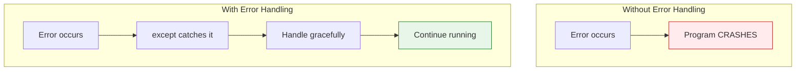

# Lesson 3.32: The Failure Problem

> **Duration**: 5 min | **Section**: F - Error Handling & Files (Intro)

## 🎯 The Problem

Programs fail. Always. What happens when they do?

```python
# User enters "abc" instead of number
age = int(input("Enter age: "))  # ValueError!

# File doesn't exist
with open("missing.txt") as f:   # FileNotFoundError!
    data = f.read()

# Division by zero
result = 100 / 0                  # ZeroDivisionError!

# Key not in dict
user = {"name": "Alice"}
email = user["email"]             # KeyError!
```

Without handling, your program **crashes**.

## 💭 What We Need

A way to:
- Catch errors before they crash the program
- Handle different errors appropriately
- Ensure cleanup happens (close files, connections)



## 📍 What You'll Learn

In this section:
1. **try/except** - Catch and handle errors
2. **Exception types** - Different error categories
3. **Raising exceptions** - Create your own errors
4. **Files** - Read, write, and work with files

## ✨ The Solution Preview

```python
try:
    age = int(input("Enter age: "))
except ValueError:
    print("Please enter a valid number")
    age = 0

try:
    with open("config.txt") as f:
        config = f.read()
except FileNotFoundError:
    print("Using default config")
    config = "default"
```

Let's learn to handle failures gracefully!
