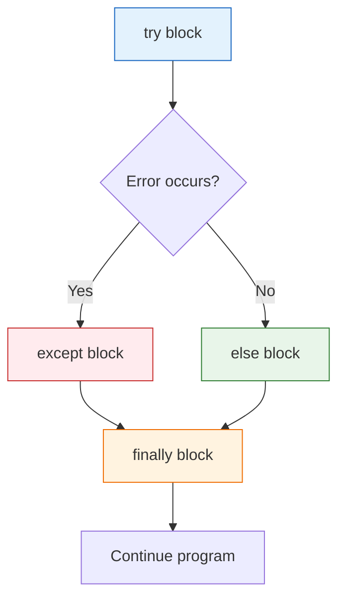
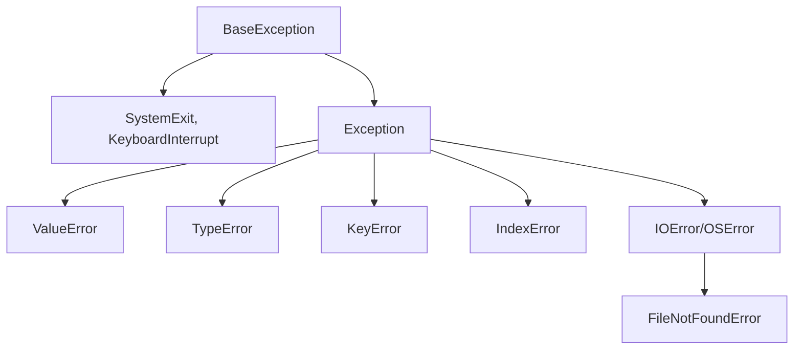

# Lesson 3.33: Exception Handling

> **Duration**: 30 min | **Section**: F - Error Handling & Files

## 🎯 The Problem (3-5 min)

Your code can fail in many ways:

```python
# These all crash your program
int("not a number")      # ValueError
1 / 0                    # ZeroDivisionError
my_list[999]             # IndexError
my_dict["missing"]       # KeyError
open("nope.txt")         # FileNotFoundError
```

You need to handle these gracefully.

## 🧪 Try It: try/except (5-10 min)

### Basic try/except

```python
try:
    age = int(input("Enter age: "))
    print(f"You are {age} years old")
except ValueError:
    print("That's not a valid number!")
```

### Multiple except Blocks

```python
try:
    num = int(input("Enter a number: "))
    result = 100 / num
    print(f"100 / {num} = {result}")
except ValueError:
    print("Not a valid number!")
except ZeroDivisionError:
    print("Can't divide by zero!")
```

### Catch Multiple in One Block

```python
try:
    risky_operation()
except (ValueError, TypeError, KeyError) as e:
    print(f"Something went wrong: {e}")
```

### else and finally

```python
try:
    file = open("data.txt")
except FileNotFoundError:
    print("File not found!")
else:
    # Runs only if NO exception
    content = file.read()
    print(content)
finally:
    # ALWAYS runs (cleanup)
    print("Done!")
```

## 🔍 Under the Hood (10-15 min)

### Exception Flow



### Common Exception Types

| Exception | Cause |
|:----------|:------|
| `ValueError` | Wrong value type |
| `TypeError` | Wrong type |
| `KeyError` | Dict key not found |
| `IndexError` | List index out of range |
| `FileNotFoundError` | File doesn't exist |
| `ZeroDivisionError` | Division by zero |
| `AttributeError` | Attribute doesn't exist |
| `ImportError` | Import failed |
| `RuntimeError` | Generic runtime error |

### Exception Hierarchy



### Accessing Exception Details

```python
try:
    x = 1 / 0
except ZeroDivisionError as e:
    print(f"Error type: {type(e).__name__}")
    print(f"Error message: {e}")
    print(f"Error args: {e.args}")
```

### Re-raising Exceptions

```python
try:
    risky_operation()
except ValueError:
    print("Logging the error...")
    raise  # Re-raise the same exception
```

### Raising Exceptions

```python
def set_age(age):
    if age < 0:
        raise ValueError("Age cannot be negative")
    if age > 150:
        raise ValueError("Age seems unrealistic")
    return age

try:
    set_age(-5)
except ValueError as e:
    print(e)  # Age cannot be negative
```

### Custom Exceptions

```python
class InsufficientFundsError(Exception):
    """Raised when withdrawal exceeds balance."""
    def __init__(self, balance, amount):
        self.balance = balance
        self.amount = amount
        super().__init__(f"Cannot withdraw ${amount} from ${balance}")

class BankAccount:
    def __init__(self, balance):
        self.balance = balance
    
    def withdraw(self, amount):
        if amount > self.balance:
            raise InsufficientFundsError(self.balance, amount)
        self.balance -= amount
        return amount

# Usage
account = BankAccount(100)
try:
    account.withdraw(150)
except InsufficientFundsError as e:
    print(e)              # Cannot withdraw $150 from $100
    print(e.balance)      # 100
    print(e.amount)       # 150
```

### Exception Chaining

```python
try:
    open("config.txt")
except FileNotFoundError as e:
    raise RuntimeError("Configuration failed") from e

# Output shows both: RuntimeError and original FileNotFoundError
```

## 💥 Where It Breaks (3-5 min)

| Problem | Cause | Fix |
|:--------|:------|:----|
| Silent failures | Bare `except:` | Always catch specific exceptions |
| Wrong exception caught | Too broad | Use specific exception types |
| Cleanup not happening | No finally | Use finally or context manager |

### Anti-Patterns

```python
# WRONG: Catches everything, hides bugs!
try:
    risky_code()
except:  # Bare except
    pass

# WRONG: Too broad
try:
    result = complex_operation()
except Exception:  # Could be anything!
    print("Something went wrong")

# RIGHT: Specific
try:
    result = int(user_input)
except ValueError:
    print("Please enter a number")
```

## ✅ The Fix (5-10 min)

### Best Practices

```python
# 1. Be specific
try:
    data = json.load(file)
except json.JSONDecodeError as e:
    print(f"Invalid JSON: {e}")

# 2. Handle what you expect, let unexpected propagate
def process_file(filename):
    try:
        with open(filename) as f:
            return f.read()
    except FileNotFoundError:
        return None  # Expected case
    # Other exceptions propagate up

# 3. Use finally for cleanup
file = None
try:
    file = open("data.txt")
    data = file.read()
finally:
    if file:
        file.close()

# 4. Better: use context manager
with open("data.txt") as f:
    data = f.read()  # Automatically closed!

# 5. Create custom exceptions for your domain
class ValidationError(Exception):
    pass

class NotFoundError(Exception):
    pass
```

### Quick Reference

```python
# Basic try/except
try:
    risky_code()
except SomeError:
    handle_error()

# Multiple exceptions
try:
    code()
except (TypeError, ValueError) as e:
    print(e)

# Full pattern
try:
    code()
except SomeError:
    handle()
else:
    # No exception
    success()
finally:
    # Always runs
    cleanup()

# Raise exception
raise ValueError("Bad value")

# Re-raise
except SomeError:
    log()
    raise

# Custom exception
class MyError(Exception):
    pass
```

## 🎯 Practice

1. Handle user input safely:
   ```python
   # Get integer from user, default to 0 on error
   ```

2. Create safe division function:
   ```python
   # safe_divide(a, b) returns None if b is 0
   ```

3. Create custom exception:
   ```python
   # PasswordTooShortError for passwords < 8 chars
   ```

4. Use finally for cleanup:
   ```python
   # Open file, read, ensure close
   ```

## 🔑 Key Takeaways

- `try` contains risky code
- `except` catches specific exceptions
- `else` runs if no exception
- `finally` always runs (cleanup)
- Be specific about which exceptions to catch
- Never use bare `except:`
- Use `raise` to throw exceptions
- Create custom exceptions for your domain

## ❓ Common Questions

| Question | Answer |
|----------|--------|
| Why not catch all with `except:`? | Hides bugs, catches even keyboard interrupt. |
| When use else? | When code should only run if try succeeded. |
| When use finally? | For cleanup that must always happen. |
| raise vs raise from? | `raise from` shows exception chain. |

## 🔗 Further Reading

- [Errors and Exceptions](https://docs.python.org/3/tutorial/errors.html)
- [Built-in Exceptions](https://docs.python.org/3/library/exceptions.html)
