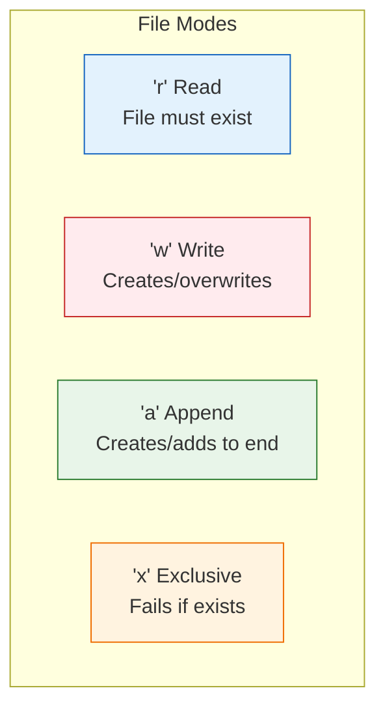
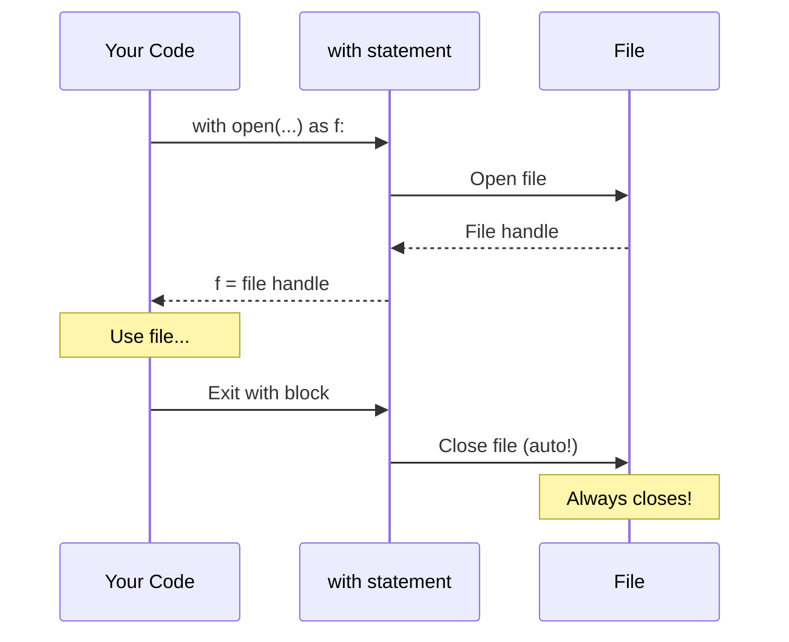

# Lesson 3.34: File I/O

> **Duration**: 30 min | **Section**: F - Error Handling & Files

## 🎯 The Problem (3-5 min)

Programs need to read and write data that persists:

- Configuration files
- User data
- Logs
- Exports (CSV, JSON)

How do you interact with the filesystem?

## 🧪 Try It: Basic File Operations (5-10 min)

### Reading Files

```python
# Method 1: Context manager (recommended)
with open("data.txt", "r") as file:
    content = file.read()
    print(content)

# Method 2: Manual (not recommended)
file = open("data.txt", "r")
content = file.read()
file.close()  # Easy to forget!
```

### Writing Files

```python
# Write (overwrites!)
with open("output.txt", "w") as file:
    file.write("Hello, World!\n")
    file.write("Second line\n")

# Append (adds to end)
with open("log.txt", "a") as file:
    file.write("New log entry\n")
```

### Reading Line by Line

```python
# Read all lines as list
with open("data.txt") as file:
    lines = file.readlines()  # ['line1\n', 'line2\n', ...]

# Iterate line by line (memory efficient)
with open("data.txt") as file:
    for line in file:
        print(line.strip())  # strip() removes \n
```

## 🔍 Under the Hood (10-15 min)

### File Modes

| Mode | Description |
|:-----|:------------|
| `'r'` | Read (default) |
| `'w'` | Write (overwrites!) |
| `'a'` | Append (add to end) |
| `'x'` | Exclusive create (fails if exists) |
| `'b'` | Binary mode (`'rb'`, `'wb'`) |
| `'+'` | Read and write (`'r+'`, `'w+'`) |



### Why Context Managers (`with`)



**Benefits**:
- File always closed (even on error)
- Cleaner code
- No "forgot to close" bugs

### Text vs Binary Mode

```python
# Text mode (default) - strings
with open("file.txt", "r") as f:
    text = f.read()  # str

# Binary mode - bytes
with open("image.png", "rb") as f:
    data = f.read()  # bytes
```

### Encoding

```python
# Specify encoding (UTF-8 recommended)
with open("data.txt", "r", encoding="utf-8") as f:
    content = f.read()

# Handle encoding errors
with open("data.txt", "r", encoding="utf-8", errors="ignore") as f:
    content = f.read()
```

### File Methods

```python
with open("data.txt", "r") as f:
    # Read all content
    content = f.read()
    
    # Read up to n characters
    chunk = f.read(100)
    
    # Read one line
    line = f.readline()
    
    # Read all lines as list
    lines = f.readlines()
    
    # Current position
    pos = f.tell()
    
    # Go to position
    f.seek(0)  # Go to start
```

### Working with Paths

```python
from pathlib import Path

# Create path object
path = Path("data/config.json")

# Check existence
if path.exists():
    print("File exists!")

# Read/write with Path
content = path.read_text()
path.write_text("new content")

# Path operations
path.name        # "config.json"
path.stem        # "config"
path.suffix      # ".json"
path.parent      # Path("data")
path.is_file()   # True/False
path.is_dir()    # True/False

# Create directories
Path("data/logs").mkdir(parents=True, exist_ok=True)

# List files
for file in Path(".").glob("*.txt"):
    print(file)
```

### Reading/Writing JSON

```python
import json

# Read JSON
with open("config.json", "r") as f:
    config = json.load(f)  # Parse to dict

# Write JSON
data = {"name": "Alice", "age": 30}
with open("output.json", "w") as f:
    json.dump(data, f, indent=2)

# String operations
json_string = json.dumps(data)
parsed = json.loads(json_string)
```

### Reading/Writing CSV

```python
import csv

# Read CSV
with open("data.csv", "r") as f:
    reader = csv.reader(f)
    for row in reader:
        print(row)  # ['col1', 'col2', ...]

# Read as dictionaries
with open("data.csv", "r") as f:
    reader = csv.DictReader(f)
    for row in reader:
        print(row["name"])  # Access by column name

# Write CSV
with open("output.csv", "w", newline="") as f:
    writer = csv.writer(f)
    writer.writerow(["name", "age"])  # Header
    writer.writerow(["Alice", 30])
    writer.writerow(["Bob", 25])
```

## 💥 Where It Breaks (3-5 min)

| Problem | Cause | Fix |
|:--------|:------|:----|
| FileNotFoundError | File doesn't exist | Check with `Path.exists()` or try/except |
| PermissionError | No access rights | Check permissions, run as admin |
| UnicodeDecodeError | Wrong encoding | Specify correct encoding |
| Data loss | Used 'w' mode | Use 'a' to append, or check first |

### Common Mistakes

```python
# WRONG: File not closed on error
file = open("data.txt")
content = file.read()  # If this fails, file stays open
file.close()

# RIGHT: Context manager
with open("data.txt") as file:
    content = file.read()  # Auto-closed on error

# WRONG: Overwrites existing file!
with open("important.txt", "w") as f:
    f.write("oops")

# RIGHT: Check first or use 'x' mode
path = Path("important.txt")
if not path.exists():
    path.write_text("new content")
```

## ✅ The Fix (5-10 min)

### Best Practices

```python
from pathlib import Path

# 1. Always use context managers
with open("file.txt") as f:
    data = f.read()

# 2. Use pathlib for paths
path = Path("data") / "config.json"
if path.exists():
    config = path.read_text()

# 3. Handle errors
try:
    with open("data.txt") as f:
        data = f.read()
except FileNotFoundError:
    data = default_data

# 4. Specify encoding
with open("file.txt", encoding="utf-8") as f:
    content = f.read()

# 5. Use appropriate format
# JSON for structured data
# CSV for tabular data
# Plain text for simple data
```

### Quick Reference

```python
# Read file
with open("file.txt", "r") as f:
    content = f.read()

# Write file
with open("file.txt", "w") as f:
    f.write("content")

# Append
with open("file.txt", "a") as f:
    f.write("more content")

# Read lines
with open("file.txt") as f:
    for line in f:
        print(line.strip())

# Path operations
from pathlib import Path
path = Path("data/file.txt")
path.exists()
path.read_text()
path.write_text("content")

# JSON
import json
json.load(file)    # file → dict
json.dump(data, file)  # dict → file

# CSV
import csv
csv.reader(file)      # rows
csv.DictReader(file)  # dicts
```

## 🎯 Practice

1. Read and print file contents:
   ```python
   # Read "sample.txt" and print each line
   ```

2. Write list to file:
   ```python
   items = ["apple", "banana", "cherry"]
   # Write each item on its own line
   ```

3. Count lines in file:
   ```python
   # Return number of lines in a file
   ```

4. Read/write JSON:
   ```python
   # Read config.json, modify a value, write back
   ```

## 🔑 Key Takeaways

- Always use `with` statement (context manager)
- `'r'` read, `'w'` write (overwrites!), `'a'` append
- Files auto-close with `with`
- Use `pathlib.Path` for path operations
- Specify `encoding="utf-8"` for text files
- Use `json` module for JSON files
- Use `csv` module for CSV files

## ❓ Common Questions

| Question | Answer |
|----------|--------|
| Why use `with`? | Auto-closes file, even on errors. |
| read() vs readlines()? | read(): one string. readlines(): list of lines. |
| 'r' vs 'rb'? | 'r': text (str). 'rb': binary (bytes). |
| How to check if file exists? | `Path(file).exists()` |

## 🔗 Further Reading

- [Reading and Writing Files](https://docs.python.org/3/tutorial/inputoutput.html#reading-and-writing-files)
- [pathlib — Object-oriented filesystem paths](https://docs.python.org/3/library/pathlib.html)
- [json — JSON encoder and decoder](https://docs.python.org/3/library/json.html)
