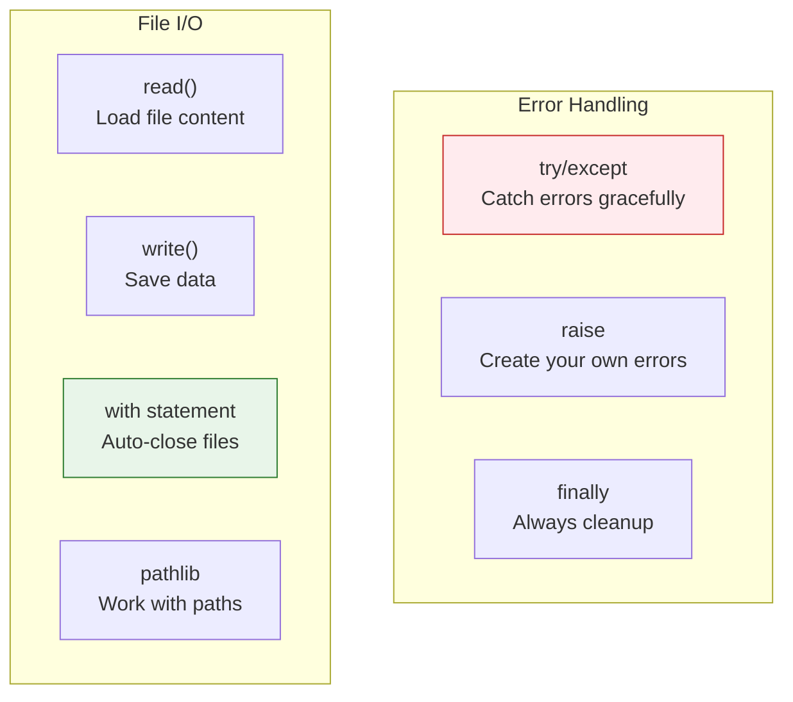
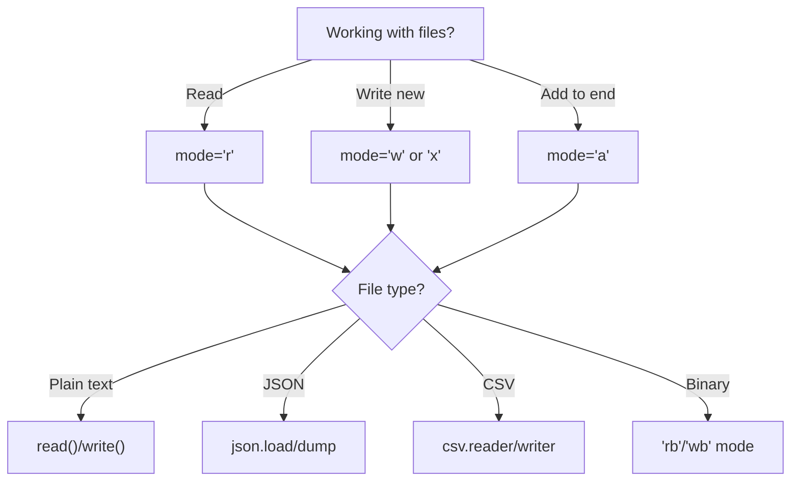

# Lesson 3.35: Error Handling & Files Q&A

> **Duration**: 10 min | **Section**: F - Error Handling & Files (Wrap-up)

## 📋 Section F Summary



## 🧠 Concept Check

| Concept | Question | Answer |
|:--------|:---------|:-------|
| try | What goes in try block? | Code that might raise exception |
| except | When does it run? | When matching exception raised |
| else | When does it run? | When NO exception raised |
| finally | When does it run? | ALWAYS, exception or not |
| raise | What does it do? | Throws an exception |
| with | Why use it for files? | Auto-closes, even on error |
| 'r' vs 'w' | Difference? | Read vs Write (write overwrites!) |
| 'a' | What does it do? | Append to end of file |

## ❓ Frequently Asked Questions

### Exception Handling

| Question | Answer |
|----------|--------|
| Why not `except:` alone? | Catches everything including KeyboardInterrupt, hides bugs. |
| Multiple exceptions? | `except (ValueError, TypeError):` |
| How to get error message? | `except ValueError as e: print(e)` |
| When create custom exception? | When domain-specific errors needed. |

### File I/O

| Question | Answer |
|----------|--------|
| Why `with` always? | Ensures file closes, even on error. |
| How to read line by line? | `for line in file:` (memory efficient). |
| Text vs binary? | `'r'` for text, `'rb'` for images/bytes. |
| Best path handling? | Use `pathlib.Path`. |

## 🔗 Quick Reference

```python
# === EXCEPTION HANDLING ===
try:
    risky_code()
except ValueError as e:
    print(f"Value error: {e}")
except (TypeError, KeyError):
    print("Type or key error")
else:
    print("No exception!")
finally:
    print("Always runs")

# Raise exception
raise ValueError("Bad value")

# Re-raise
except SomeError:
    log_error()
    raise

# Custom exception
class MyError(Exception):
    pass

# === FILE I/O ===
# Read entire file
with open("file.txt", "r", encoding="utf-8") as f:
    content = f.read()

# Read lines
with open("file.txt") as f:
    for line in f:
        print(line.strip())

# Write file
with open("file.txt", "w") as f:
    f.write("content\n")

# Append
with open("file.txt", "a") as f:
    f.write("more\n")

# === PATHLIB ===
from pathlib import Path

path = Path("data/file.txt")
path.exists()
path.is_file()
path.read_text()
path.write_text("content")
path.parent  # Path("data")
path.name    # "file.txt"
path.suffix  # ".txt"

# Create directories
Path("data/logs").mkdir(parents=True, exist_ok=True)

# List files
for f in Path(".").glob("*.py"):
    print(f)

# === JSON ===
import json

# Read
with open("data.json") as f:
    data = json.load(f)

# Write
with open("data.json", "w") as f:
    json.dump(data, f, indent=2)

# === CSV ===
import csv

# Read
with open("data.csv") as f:
    for row in csv.reader(f):
        print(row)

# Write
with open("data.csv", "w", newline="") as f:
    writer = csv.writer(f)
    writer.writerow(["name", "age"])
```

## 📊 Decision Tree



## 🔧 Common Patterns

```python
# Safe file read with default
def read_config(path, default=None):
    try:
        with open(path) as f:
            return json.load(f)
    except FileNotFoundError:
        return default

# Write only if different
def write_if_changed(path, content):
    path = Path(path)
    if path.exists() and path.read_text() == content:
        return False  # No change
    path.write_text(content)
    return True

# Ensure directory exists
def save_file(path, content):
    path = Path(path)
    path.parent.mkdir(parents=True, exist_ok=True)
    path.write_text(content)
```

## 💥 Common Pitfalls

| Pitfall | What Happens | Fix |
|---------|--------------|-----|
| Bare `except:` | Catches everything including Ctrl+C | Specify exception: `except ValueError:` |
| `open()` without `with` | File may not close on error | Always use `with open(...) as f:` |
| `'w'` mode on existing file | Overwrites without warning | Use `'x'` for exclusive create, or check first |
| Forgetting encoding | UnicodeDecodeError on special chars | Use `encoding='utf-8'` |
| `json.loads()` vs `json.load()` | Wrong input type | `loads` = string, `load` = file |

## 🔑 Key Takeaways

1. **try/except for expected errors** - Network, user input, files
2. **Specific exceptions first** - Catch narrow before broad
3. **finally always runs** - For cleanup regardless of error
4. **with = context manager** - Auto-cleanup, even on exception
5. **pathlib > os.path** - Modern, cleaner path handling
6. **JSON for data exchange** - dict ↔ JSON is seamless

## ✅ Section Complete!

You now understand:
- Exception handling with try/except/else/finally
- Raising and creating custom exceptions
- Reading and writing files
- Context managers (with statement)
- Working with paths using pathlib
- JSON and CSV file formats

**Next up**: Section G - Modules & Packages

We'll explore:
- Importing modules
- Creating your own modules
- Package structure
- Virtual environments
