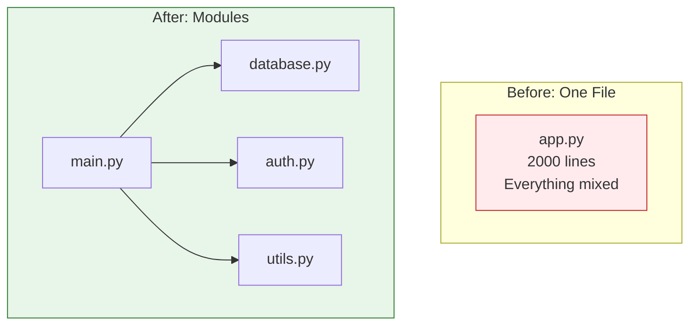

# Lesson 3.36: The Organization Problem

> **Duration**: 5 min | **Section**: G - Modules & Packages (Intro)

## 🎯 The Problem

Your project is growing. One file has 2000 lines:

```python
# app.py (2000 lines!)
# Database functions (lines 1-300)
# User authentication (lines 301-600)
# API handlers (lines 601-1200)
# Utility functions (lines 1201-1500)
# Configuration (lines 1501-1700)
# Main application (lines 1701-2000)
```

**Problems**:
- Hard to navigate
- Hard to test parts independently
- Hard for teams to work on different sections
- Can't reuse pieces in other projects

## 💭 What We Need

Break code into **modules** (files) and **packages** (folders):

```
project/
├── database.py        # Database functions
├── auth.py            # Authentication
├── api/
│   ├── __init__.py
│   ├── users.py       # User API
│   └── products.py    # Product API
├── utils.py           # Utilities
├── config.py          # Configuration
└── main.py            # Entry point
```



## 📍 What You'll Learn

In this section:
1. **Importing** - Use code from other files
2. **Creating modules** - Make your own importable files
3. **Packages** - Organize modules into folders
4. **Virtual environments** - Isolate project dependencies

## ✨ The Solution Preview

```python
# main.py
from database import connect
from auth import login_user
from utils import format_date

# Use functions from other files!
db = connect()
user = login_user("alice", "password")
print(f"Logged in: {format_date(user.last_login)}")
```

Let's learn code organization!
