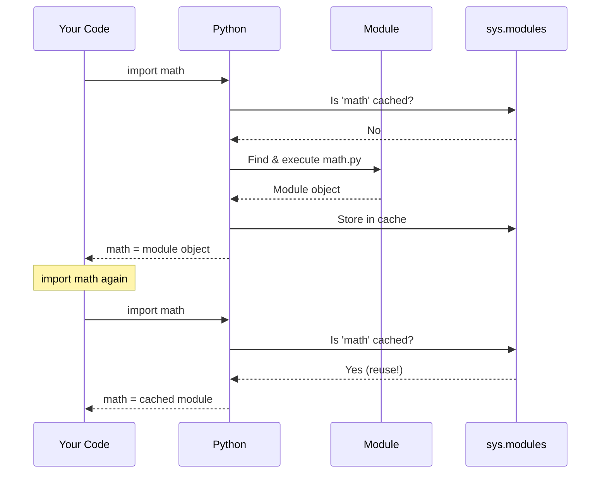

# Lesson 3.37: Importing Modules

> **Duration**: 25 min | **Section**: G - Modules & Packages

## 🎯 The Problem (3-5 min)

Python's power comes from reusable code. But how do you:
- Use Python's built-in libraries?
- Use third-party packages?
- Use code from other files in your project?

## 🧪 Try It: Basic Imports (5-10 min)

### Import Entire Module

```python
import math

print(math.pi)        # 3.141592653589793
print(math.sqrt(16))  # 4.0
print(math.ceil(3.2)) # 4
```

### Import Specific Items

```python
from math import pi, sqrt

print(pi)       # 3.141592653589793
print(sqrt(16)) # 4.0
```

### Import with Alias

```python
import numpy as np
import pandas as pd

data = np.array([1, 2, 3])
df = pd.DataFrame(data)
```

### Import All (Avoid!)

```python
from math import *  # Imports everything

print(pi)
print(sqrt(16))
# Hard to know where functions come from!
```

## 🔍 Under the Hood (10-15 min)

### What Happens on Import



**Key point**: Modules are executed ONCE, then cached.

### Import Search Order

Python looks for modules in this order:

1. **Built-in modules** (sys, os, math, etc.)
2. **sys.path locations**:
   - Current directory
   - PYTHONPATH environment variable
   - Standard library
   - Site-packages (pip installed)

```python
import sys
print(sys.path)
# ['/current/dir', '/usr/lib/python3.x', '/usr/lib/python3.x/site-packages', ...]
```

### Import Styles Compared

```python
# Style 1: Import module
import os
os.path.exists("file.txt")  # Clear where 'exists' comes from

# Style 2: Import specific items
from os.path import exists
exists("file.txt")  # Shorter, but less clear origin

# Style 3: Import with alias
from os.path import exists as file_exists
file_exists("file.txt")  # Renamed for clarity

# Style 4: Import all (avoid!)
from os.path import *
exists("file.txt")  # Where did 'exists' come from??
```

### Common Standard Library Modules

```python
# Operating system
import os
os.getcwd()              # Current directory
os.listdir(".")          # List files
os.environ["HOME"]       # Environment variables

# System
import sys
sys.argv                 # Command line arguments
sys.exit(0)              # Exit program

# Dates and times
from datetime import datetime, timedelta
now = datetime.now()
yesterday = now - timedelta(days=1)

# Random
import random
random.randint(1, 10)    # Random integer
random.choice([1, 2, 3]) # Random choice
random.shuffle(items)    # Shuffle in place

# Regular expressions
import re
re.match(r"\d+", "123")  # Pattern matching

# JSON
import json
json.loads('{"a": 1}')   # Parse JSON

# HTTP requests (built-in, basic)
from urllib.request import urlopen
response = urlopen("https://example.com")

# Collections extensions
from collections import defaultdict, Counter, deque

# Itertools
from itertools import chain, groupby, combinations

# Pathlib
from pathlib import Path
```

### Import from Submodules

```python
# os.path is a submodule
import os.path
os.path.exists("file.txt")

# Alternative
from os import path
path.exists("file.txt")

# Just the function
from os.path import exists
exists("file.txt")
```

### Conditional Imports

```python
# Handle optional dependencies
try:
    import numpy as np
    HAS_NUMPY = True
except ImportError:
    HAS_NUMPY = False

# Platform-specific imports
import sys
if sys.platform == "win32":
    import winreg
else:
    import posix
```

## 💥 Where It Breaks (3-5 min)

| Problem | Cause | Fix |
|:--------|:------|:----|
| ModuleNotFoundError | Module not installed | `pip install module` |
| ImportError | Item doesn't exist | Check spelling, module version |
| Circular import | A imports B, B imports A | Restructure code |

### Circular Import Problem

```python
# a.py
from b import func_b  # Tries to import b

def func_a():
    return "A"

# b.py
from a import func_a  # Tries to import a → ERROR!

def func_b():
    return func_a()
```

**Fix**: Import inside function, or restructure:

```python
# b.py
def func_b():
    from a import func_a  # Import when needed
    return func_a()
```

## ✅ The Fix (5-10 min)

### Best Practices

```python
# 1. Group imports in order
import os          # Standard library
import sys

import numpy       # Third-party

from myapp import utils  # Local

# 2. Be explicit
from collections import defaultdict  # Better than: from collections import *

# 3. Use clear aliases (standard conventions)
import numpy as np
import pandas as pd
import matplotlib.pyplot as plt

# 4. Avoid circular imports by:
#    - Moving shared code to separate module
#    - Importing inside functions
#    - Using late binding
```

### Quick Reference

```python
# Import module
import math
math.sqrt(16)

# Import items
from math import sqrt, pi
sqrt(16)

# Import with alias
import numpy as np
np.array([1, 2, 3])

# Import from submodule
from os.path import exists

# Check if module is available
try:
    import optional
except ImportError:
    optional = None
```

## 🎯 Practice

1. Import and use datetime:
   ```python
   # Get current date and time
   # Calculate date 7 days from now
   ```

2. Import random properly:
   ```python
   # Generate random number 1-100
   # Pick random item from list
   ```

3. Use pathlib:
   ```python
   # Check if file exists
   # List all .py files in current directory
   ```

## 🔑 Key Takeaways

- `import module` - access as `module.item`
- `from module import item` - access as `item`
- `import module as alias` - shorter name
- Avoid `from module import *`
- Modules are cached after first import
- Python searches sys.path for modules
- Group imports: standard → third-party → local

## ❓ Common Questions

| Question | Answer |
|----------|--------|
| import vs from import? | `import`: qualified name. `from`: direct access. |
| Why avoid import *? | Hard to know where names come from, can override. |
| When use alias? | Long module names or standard conventions (np, pd). |
| Circular import fix? | Restructure or import inside function. |

## 🔗 Further Reading

- [The import system](https://docs.python.org/3/reference/import.html)
- [Python Standard Library](https://docs.python.org/3/library/)
