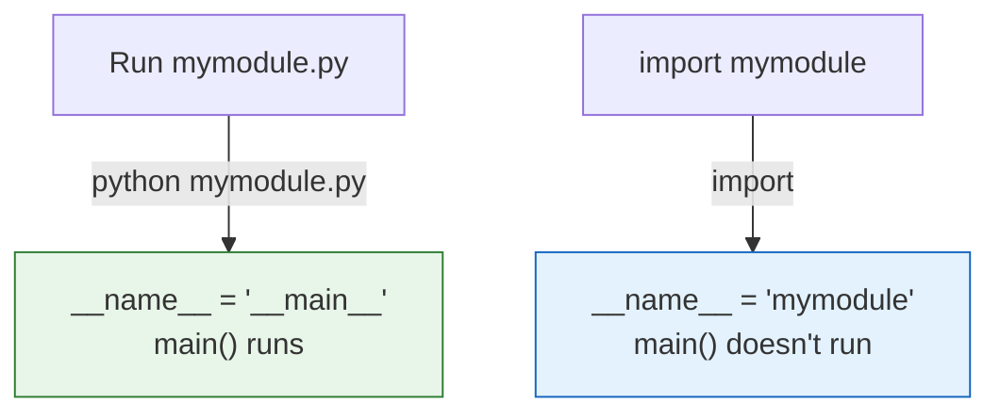

# Lesson 3.38: Creating Modules

> **Duration**: 25 min | **Section**: G - Modules & Packages

## 🎯 The Problem (3-5 min)

You have useful functions you want to reuse:

```python
# All in one file...
def calculate_tax(amount):
    return amount * 0.08

def format_currency(amount):
    return f"${amount:,.2f}"

def validate_email(email):
    return "@" in email

# ... plus 500 more lines of main code
```

How do you organize this into reusable modules?

## 🧪 Try It: Creating a Module (5-10 min)

### Step 1: Create the Module File

```python
# utils.py
"""Utility functions for the project."""

TAX_RATE = 0.08  # Module-level constant

def calculate_tax(amount):
    """Calculate tax for given amount."""
    return amount * TAX_RATE

def format_currency(amount):
    """Format number as currency string."""
    return f"${amount:,.2f}"

def validate_email(email):
    """Check if email is valid."""
    return "@" in email and "." in email
```

### Step 2: Import and Use

```python
# main.py
import utils

tax = utils.calculate_tax(100)
print(utils.format_currency(tax))  # $8.00

# Or import specific functions
from utils import calculate_tax, format_currency

tax = calculate_tax(100)
print(format_currency(tax))
```

## 🔍 Under the Hood (10-15 min)

### Module Structure

Every Python file is a module!

```
project/
├── main.py        # Entry point
├── utils.py       # Utility functions
├── database.py    # Database functions
└── config.py      # Configuration
```

```python
# config.py
DATABASE_URL = "postgresql://localhost/mydb"
DEBUG = True
SECRET_KEY = "abc123"

# database.py
from config import DATABASE_URL

def connect():
    return create_connection(DATABASE_URL)

# main.py
from config import DEBUG
from database import connect
from utils import format_currency
```

### The `__name__` Variable

Every module has a special `__name__` variable:

```python
# mymodule.py
print(f"__name__ is: {__name__}")

def main():
    print("Running main function")

# This block only runs if file is executed directly
if __name__ == "__main__":
    main()
```



**Use case**: Module can be both importable AND runnable:

```python
# math_utils.py
def add(a, b):
    return a + b

def multiply(a, b):
    return a * b

if __name__ == "__main__":
    # Only runs when executed directly
    print("Running tests...")
    assert add(2, 3) == 5
    assert multiply(2, 3) == 6
    print("All tests passed!")
```

### What Gets Imported

By default, `import *` imports names without underscore prefix:

```python
# mymodule.py
public_var = "I'm public"
_private_var = "I'm private by convention"

def public_function():
    pass

def _private_function():
    pass

# Using __all__ to control what import * gets
__all__ = ["public_var", "public_function"]
```

```python
# Using module
from mymodule import *
print(public_var)      # Works
print(_private_var)    # NameError (wasn't imported)
```

### Module Initialization

Code at module level runs on import:

```python
# database.py
print("Database module loading...")  # Runs on import!

connection = None  # Module-level state

def get_connection():
    global connection
    if connection is None:
        connection = create_connection()
    return connection

print("Database module ready")  # Also runs on import!
```

### Relative Imports (Within Package)

```python
# In mypackage/utils.py
from . import config           # Import sibling module
from .config import DEBUG      # Import from sibling
from .. import parent_module   # Import from parent package
```

## 💥 Where It Breaks (3-5 min)

| Problem | Cause | Fix |
|:--------|:------|:----|
| ModuleNotFoundError | Not in Python path | Check file location, __init__.py |
| ImportError: cannot import | Circular imports | Restructure or import in function |
| Changes not reflected | Module cached | Restart interpreter or use importlib.reload |

### Module Caching

```python
# Modules are cached - changes need restart!
import importlib
import mymodule

# Force reload (for development)
importlib.reload(mymodule)
```

## ✅ The Fix (5-10 min)

### Module Best Practices

```python
# mymodule.py
"""
Module description.

This module provides utilities for...
"""

# 1. Imports at top
import os
from typing import Optional

# 2. Module-level constants
DEFAULT_TIMEOUT = 30
MAX_RETRIES = 3

# 3. __all__ for public API
__all__ = ["public_function", "PublicClass"]

# 4. Private helpers with underscore
def _helper():
    pass

# 5. Public functions
def public_function():
    """Well-documented public function."""
    pass

# 6. Classes
class PublicClass:
    """Well-documented class."""
    pass

# 7. Main block for testing/running
if __name__ == "__main__":
    # Run tests or main code
    pass
```

### Organizing by Feature

```
myproject/
├── main.py
├── models/
│   ├── __init__.py
│   ├── user.py
│   └── product.py
├── services/
│   ├── __init__.py
│   ├── auth.py
│   └── payment.py
└── utils/
    ├── __init__.py
    └── helpers.py
```

### Quick Reference

```python
# Create module: just create a .py file!

# Module-level code
"""Docstring"""
CONSTANT = "value"

def function():
    pass

class MyClass:
    pass

# Control public API
__all__ = ["function", "MyClass"]

# Make file runnable AND importable
if __name__ == "__main__":
    main()
```

## 🎯 Practice

1. Create a `math_utils.py` module:
   ```python
   # Functions: add, subtract, multiply, divide
   # Handle division by zero
   # Add tests in if __name__ == "__main__"
   ```

2. Create a `validators.py` module:
   ```python
   # validate_email(email) -> bool
   # validate_phone(phone) -> bool
   # validate_password(password) -> list of errors
   ```

3. Create a `config.py` module:
   ```python
   # Environment-based configuration
   # Different values for DEBUG, DATABASE_URL based on env
   ```

## 🔑 Key Takeaways

- Any `.py` file is a module
- Import with `import module` or `from module import item`
- Use `__name__ == "__main__"` for runnable modules
- Use `__all__` to control public API
- Prefix private items with underscore
- Document with docstrings
- Code at module level runs on import

## ❓ Common Questions

| Question | Answer |
|----------|--------|
| When is module code run? | Once, on first import. |
| Why use __name__ == "__main__"? | Code only runs when executed directly, not imported. |
| What's __all__? | Defines what `import *` includes. |
| How to reload module? | `importlib.reload(module)` |

## 🔗 Further Reading

- [Modules](https://docs.python.org/3/tutorial/modules.html)
- [Python Module of the Week](https://pymotw.com/3/)
