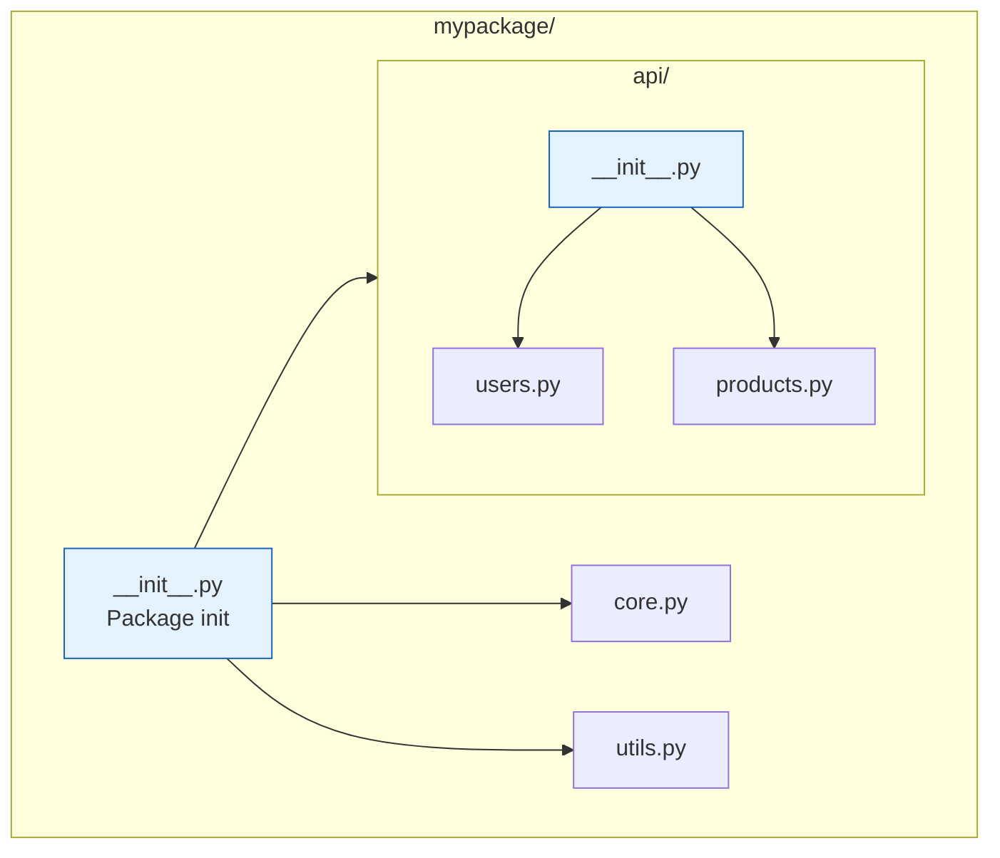
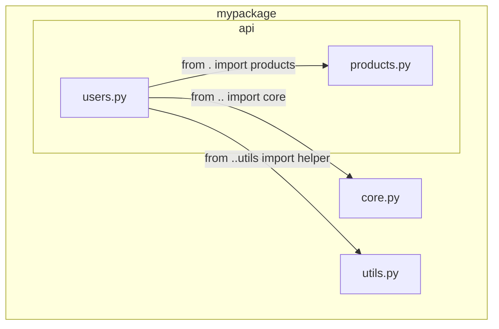
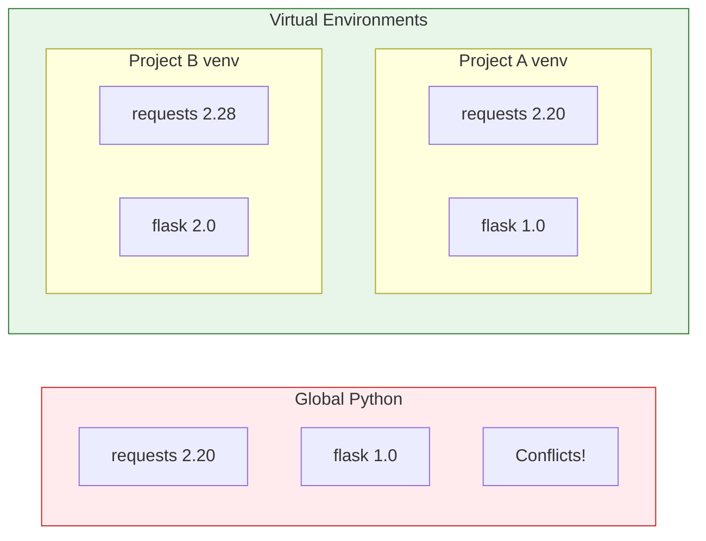

# Lesson 3.39: Packages and Virtual Environments

> **Duration**: 30 min | **Section**: G - Modules & Packages

## 🎯 The Problem (3-5 min)

### Problem 1: Project Grows Beyond Files

```
myproject/
├── database.py
├── auth.py
├── api.py
├── models.py
├── utils.py
├── helpers.py
├── validators.py
└── ... 20 more files
```

How do you organize many modules logically?

### Problem 2: Dependency Conflicts

```bash
# Project A needs: requests==2.20.0
# Project B needs: requests==2.28.0
# Can't have both installed globally!
```

How do you isolate project dependencies?

## 🧪 Try It: Packages (5-10 min)

### Creating a Package

A **package** is a directory with `__init__.py`:

```
mypackage/
├── __init__.py      # Makes it a package!
├── core.py
├── utils.py
└── api/
    ├── __init__.py  # Sub-package
    ├── users.py
    └── products.py
```

### Importing from Packages

```python
# Import module from package
from mypackage import core
from mypackage.api import users

# Import specific items
from mypackage.core import main_function
from mypackage.api.users import create_user

# Import package (runs __init__.py)
import mypackage
```

### The `__init__.py` File

```python
# mypackage/__init__.py
"""My Package - A helpful library."""

__version__ = "1.0.0"
__author__ = "Your Name"

# Make items available at package level
from .core import main_function
from .utils import helper

# Now users can do:
# from mypackage import main_function
```

## 🔍 Under the Hood: Packages (10-15 min)

### Package Structure



### `__init__.py` Purposes

```python
# 1. Mark directory as package (can be empty)
# mypackage/__init__.py
pass

# 2. Package initialization
# mypackage/__init__.py
print("Initializing mypackage...")

# 3. Convenient imports
# mypackage/__init__.py
from .module_a import ClassA
from .module_b import function_b

# Now: from mypackage import ClassA, function_b

# 4. Define __all__
__all__ = ["ClassA", "function_b"]
```

### Relative Imports

Inside a package, use dots for relative imports:

```python
# mypackage/api/users.py

# From same directory
from . import products              # mypackage.api.products
from .products import Product       # mypackage.api.products.Product

# From parent directory
from .. import core                 # mypackage.core
from ..core import main_function    # mypackage.core.main_function

# From parent's sibling
from ..utils import helper          # mypackage.utils.helper
```



## 🧪 Try It: Virtual Environments (5-10 min)

### Create Virtual Environment

```bash
# Create venv
python -m venv venv

# Activate (Unix/Mac)
source venv/bin/activate

# Activate (Windows)
venv\Scripts\activate

# Your prompt changes
(venv) $
```

### Install Packages

```bash
# Install package
pip install requests

# Install specific version
pip install requests==2.28.0

# Install from requirements file
pip install -r requirements.txt

# See installed packages
pip list

# Freeze current packages
pip freeze > requirements.txt

# Deactivate
deactivate
```

### requirements.txt

```
# requirements.txt
requests==2.28.0
flask>=2.0.0
pandas~=1.4.0
numpy
```

Version specifiers:
- `==2.28.0` - Exact version
- `>=2.0.0` - Minimum version
- `~=1.4.0` - Compatible (~1.4.x)
- (none) - Latest version

## 🔍 Under the Hood: Virtual Environments (5 min)

### Why Virtual Environments?



### What venv Creates

```
venv/
├── bin/              # (Scripts/ on Windows)
│   ├── activate      # Activation script
│   ├── python        # Python executable
│   └── pip           # Pip for this env
├── lib/
│   └── python3.x/
│       └── site-packages/  # Installed packages
└── pyvenv.cfg        # Configuration
```

### How Activation Works

```bash
# Before activation
which python
# /usr/bin/python

# After activation
source venv/bin/activate
which python
# /path/to/project/venv/bin/python
```

Activation modifies `PATH` to use venv's Python first.

## 💥 Where It Breaks (3-5 min)

| Problem | Cause | Fix |
|:--------|:------|:----|
| ModuleNotFoundError | Package structure wrong | Check __init__.py exists |
| ImportError with relative | Running as script | Run as module: `python -m package.module` |
| Wrong Python version | venv not activated | Activate venv first |

### Relative Import Error

```bash
# WRONG: Running as script
python mypackage/api/users.py
# ImportError: attempted relative import with no known parent package

# RIGHT: Run as module
python -m mypackage.api.users
```

## ✅ The Fix (5-10 min)

### Recommended Project Structure

```
myproject/
├── src/
│   └── mypackage/
│       ├── __init__.py
│       ├── core.py
│       └── utils.py
├── tests/
│   ├── __init__.py
│   └── test_core.py
├── requirements.txt
├── setup.py or pyproject.toml
└── README.md
```

### Quick Reference

```bash
# === VIRTUAL ENVIRONMENTS ===
# Create
python -m venv venv

# Activate (Unix)
source venv/bin/activate

# Activate (Windows)
venv\Scripts\activate

# Install packages
pip install package_name
pip install -r requirements.txt

# Save dependencies
pip freeze > requirements.txt

# Deactivate
deactivate
```

```python
# === PACKAGES ===
# __init__.py (in package directory)
"""Package docstring."""
__version__ = "1.0.0"
from .module import function

# Relative imports (inside package)
from . import sibling
from .sibling import item
from .. import parent
from ..parent import item
```

## 🎯 Practice

1. Create a package structure:
   ```
   mytools/
   ├── __init__.py
   ├── math/
   │   ├── __init__.py
   │   └── calculator.py
   └── text/
       ├── __init__.py
       └── formatter.py
   ```

2. Set up a virtual environment:
   ```bash
   # Create venv
   # Activate it
   # Install requests
   # Freeze to requirements.txt
   ```

3. Make functions accessible from package root:
   ```python
   # from mytools import Calculator, format_text
   ```

## 🔑 Key Takeaways

- Package = directory with `__init__.py`
- `__init__.py` can be empty or set up package API
- Use relative imports inside packages (`.` and `..`)
- Virtual environments isolate project dependencies
- Always use venv for projects
- `pip freeze > requirements.txt` to save dependencies
- `pip install -r requirements.txt` to restore

## ❓ Common Questions

| Question | Answer |
|----------|--------|
| Empty __init__.py OK? | Yes, just marks directory as package. |
| When use relative imports? | Always inside packages. |
| One venv per project? | Yes, keep dependencies isolated. |
| requirements.txt vs setup.py? | requirements.txt for dev. setup.py for distribution. |

## 🔗 Further Reading

- [Packages](https://docs.python.org/3/tutorial/modules.html#packages)
- [venv — Virtual Environments](https://docs.python.org/3/library/venv.html)
- [pip User Guide](https://pip.pypa.io/en/stable/user_guide/)
