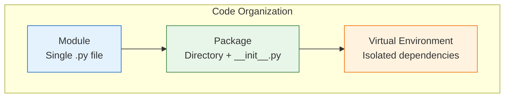
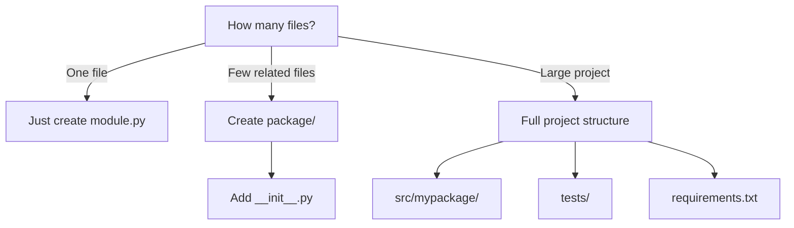

# Lesson 3.40: Modules & Packages Q&A

> **Duration**: 10 min | **Section**: G - Modules & Packages (Wrap-up)

## 📋 Section G Summary



## 🧠 Concept Check

| Concept | Question | Answer |
|:--------|:---------|:-------|
| Module | What is it? | Any .py file |
| import | What does it do? | Loads and caches module |
| from import | Difference? | Imports specific items directly |
| __init__.py | Purpose? | Marks directory as package, initializes |
| __name__ | What is it? | Module's name, or "__main__" if run directly |
| __all__ | Purpose? | Controls what `import *` includes |
| venv | Why use it? | Isolate project dependencies |
| pip | What does it do? | Installs Python packages |

## ❓ Frequently Asked Questions

### Importing

| Question | Answer |
|----------|--------|
| import vs from import? | `import`: qualified access. `from`: direct access. |
| Why avoid import *? | Unclear origins, namespace pollution. |
| When use alias? | Long names or conventions (np, pd). |
| Circular import fix? | Restructure or import inside function. |

### Modules

| Question | Answer |
|----------|--------|
| When is code run? | Once, on first import. |
| Why __name__ == "__main__"? | Run code only when executed directly. |
| How to reload? | `importlib.reload(module)` |
| Private convention? | Underscore prefix: `_private` |

### Packages

| Question | Answer |
|----------|--------|
| Empty __init__.py? | Fine, just marks as package. |
| Relative imports? | `.` for same dir, `..` for parent. |
| When use relative? | Always inside packages. |

### Virtual Environments

| Question | Answer |
|----------|--------|
| One per project? | Yes, isolate dependencies. |
| How to activate? | `source venv/bin/activate` (Unix) |
| requirements.txt? | Lists dependencies with versions. |
| pip freeze? | Exports installed packages. |

## 🔗 Quick Reference

```bash
# === VIRTUAL ENVIRONMENTS ===
python -m venv venv           # Create
source venv/bin/activate      # Activate (Unix)
venv\Scripts\activate         # Activate (Windows)
pip install package           # Install
pip freeze > requirements.txt # Export
pip install -r requirements.txt # Import
deactivate                    # Deactivate
```

```python
# === IMPORTING ===
import module                 # Full module
import module as alias        # With alias
from module import item       # Specific item
from module import a, b, c    # Multiple items

# === MODULE STRUCTURE ===
"""Docstring."""

import os  # Standard library
import numpy  # Third-party
from . import local  # Local

CONSTANT = "value"
__all__ = ["public_function"]

def _private():
    pass

def public_function():
    pass

if __name__ == "__main__":
    main()

# === PACKAGE STRUCTURE ===
# mypackage/__init__.py
"""Package docstring."""
__version__ = "1.0.0"
from .core import main_function

# === RELATIVE IMPORTS ===
from . import sibling         # Same directory
from .sibling import item
from .. import parent         # Parent directory
from ..parent import item
```

## 📊 Decision Tree



## 🔧 Common Patterns

```python
# === LAZY LOADING ===
# Defer heavy imports
def process_data():
    import pandas as pd  # Only imported when needed
    return pd.DataFrame()

# === OPTIONAL DEPENDENCIES ===
try:
    import numpy as np
    HAS_NUMPY = True
except ImportError:
    HAS_NUMPY = False
    np = None

# === PACKAGE API ===
# mypackage/__init__.py
from .module_a import ClassA
from .module_b import function_b

__all__ = ["ClassA", "function_b"]

# === RUNNABLE MODULE ===
if __name__ == "__main__":
    import argparse
    parser = argparse.ArgumentParser()
    # Parse args and run
```

## 💥 Common Pitfalls

| Pitfall | What Happens | Fix |
|---------|--------------|-----|
| `from module import *` | Namespace pollution, unclear origins | Import specific names or use alias |
| Circular imports | ImportError | Restructure or import inside function |
| Forgetting to activate venv | Uses system Python | Check prompt or `which python` |
| `pip install` in wrong env | Package in wrong place | Activate venv first |
| Missing `__init__.py` | Directory not recognized as package | Add empty `__init__.py` |

## 🔑 Key Takeaways

1. **Module = any .py file** - Importable by name
2. **Package = directory + __init__.py** - Organizes related modules
3. **venv isolates dependencies** - One per project
4. **requirements.txt = reproducibility** - Pin versions for stability
5. **`if __name__ == "__main__":`** - Run only when executed directly
6. **Relative imports in packages** - `.` for same dir, `..` for parent

## ✅ Section Complete!

You now understand:
- Importing modules and packages
- Creating your own modules
- Package structure with `__init__.py`
- Relative imports within packages
- Virtual environments for isolation
- Managing dependencies with pip

**Next up**: Section H - HTTP & APIs

We'll explore:
- Making HTTP requests
- Working with REST APIs
- Parsing JSON responses
- Error handling for network calls
