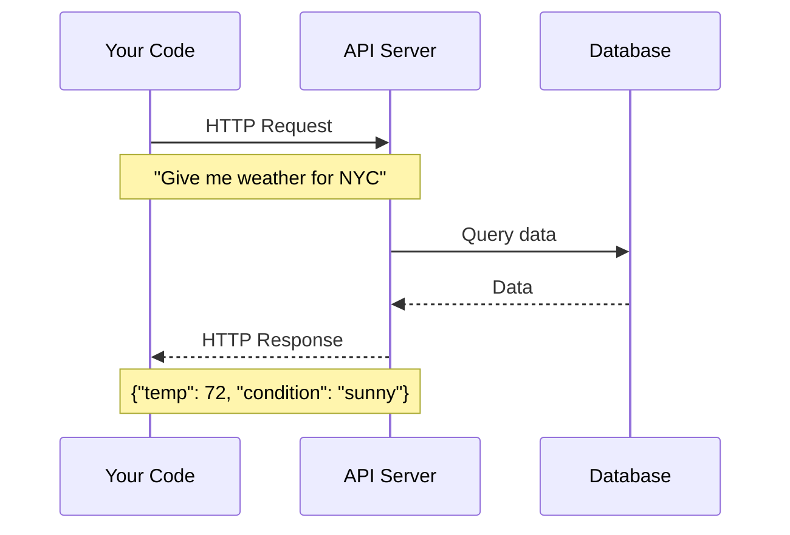

# Lesson 3.41: The External Data Problem

> **Duration**: 5 min | **Section**: H - HTTP & APIs (Intro)

## 🎯 The Problem

Your program needs data from the outside world:

- Weather for a city
- Stock prices
- User data from a database
- AI model responses
- Payment processing

This data lives on **other computers** (servers). How do you get it?

## 💭 The Solution: APIs

**API** = Application Programming Interface

It's how programs talk to each other:



## 📍 What You'll Learn

In this section:
1. **HTTP basics** - How web requests work
2. **The requests library** - Making API calls
3. **JSON parsing** - Handling API responses
4. **Error handling** - Network failures
5. **Real API examples** - Weather, GPT, etc.

## ✨ The Solution Preview

```python
import requests

# Get weather data
response = requests.get("https://api.weather.com/NYC")
data = response.json()
print(f"Temperature: {data['temp']}°F")

# Call an AI API
response = requests.post(
    "https://api.openai.com/v1/chat/completions",
    headers={"Authorization": "Bearer YOUR_KEY"},
    json={"model": "gpt-4", "messages": [{"role": "user", "content": "Hello!"}]}
)
print(response.json()["choices"][0]["message"]["content"])
```

Let's connect to the world!
