# Lesson 3.42: HTTP Fundamentals

> **Duration**: 25 min | **Section**: H - HTTP & APIs

## 🎯 The Problem (3-5 min)

Before making API calls, you need to understand how web communication works.

> **Scenario**: You type "google.com" in a browser. What actually happens?

## 🧪 Try It: HTTP Basics (5-10 min)

### Anatomy of a URL

```
https://api.example.com:443/v1/users?limit=10&page=2#section
└─┬─┘  └──────┬──────┘└┬┘└───┬───┘└───────┬───────┘└───┬───┘
scheme      host    port  path        query        fragment
```

| Part | Purpose |
|:-----|:--------|
| **Scheme** | Protocol (http, https) |
| **Host** | Server address |
| **Port** | Connection port (443 for HTTPS) |
| **Path** | Resource location |
| **Query** | Parameters (?key=value) |
| **Fragment** | Page section (client-side only) |

### HTTP Methods

| Method | Purpose | Example |
|:-------|:--------|:--------|
| `GET` | Retrieve data | Get user profile |
| `POST` | Create data | Create new user |
| `PUT` | Replace data | Update entire user |
| `PATCH` | Partial update | Update just email |
| `DELETE` | Remove data | Delete user |

```mermaid
flowchart LR
    subgraph CRUD["CRUD Operations"]
        C["Create → POST"]
        R["Read → GET"]
        U["Update → PUT/PATCH"]
        D["Delete → DELETE"]
    end
```



### HTTP Status Codes

| Range | Meaning | Examples |
|:------|:--------|:---------|
| 1xx | Informational | 100 Continue |
| 2xx | Success | 200 OK, 201 Created |
| 3xx | Redirect | 301 Moved, 302 Found |
| 4xx | Client error | 400 Bad Request, 401 Unauthorized, 404 Not Found |
| 5xx | Server error | 500 Internal Error, 503 Unavailable |

## 🔍 Under the Hood (10-15 min)

### Request and Response


### Request Structure

```http
GET /api/users/123 HTTP/1.1
Host: api.example.com
Authorization: Bearer eyJhbGciOiJS...
Accept: application/json
User-Agent: Python/requests
```

### Response Structure

```http
HTTP/1.1 200 OK
Content-Type: application/json
Content-Length: 42

{"id": 123, "name": "Alice", "email": "alice@example.com"}
```

### Headers

**Common Request Headers**:
```
Authorization: Bearer <token>    # Authentication
Content-Type: application/json   # What you're sending
Accept: application/json         # What you want back
User-Agent: MyApp/1.0           # Your app identifier
```

**Common Response Headers**:
```
Content-Type: application/json   # What's being returned
Content-Length: 1234             # Size in bytes
Cache-Control: max-age=3600      # Caching rules
X-RateLimit-Remaining: 99        # API rate limit
```

### REST Principles

REST = **Re**presentational **S**tate **T**ransfer

| Principle | Meaning |
|:----------|:--------|
| **Stateless** | Each request is independent |
| **Resource-based** | URLs point to resources |
| **Standard methods** | GET, POST, PUT, DELETE |
| **JSON format** | Usually JSON for data |

**RESTful URL patterns**:
```
GET    /users         # List all users
GET    /users/123     # Get user 123
POST   /users         # Create user
PUT    /users/123     # Update user 123
DELETE /users/123     # Delete user 123

GET    /users/123/posts    # Get posts by user 123
```

### JSON Data Format

APIs typically use JSON:

```json
{
  "id": 123,
  "name": "Alice",
  "email": "alice@example.com",
  "roles": ["admin", "user"],
  "profile": {
    "age": 30,
    "city": "NYC"
  }
}
```

## 💥 Where It Breaks (3-5 min)

| Problem | Cause | Fix |
|:--------|:------|:----|
| 401 Unauthorized | Bad/missing auth | Check API key/token |
| 403 Forbidden | No permission | Check scopes/roles |
| 404 Not Found | Wrong URL | Verify endpoint |
| 429 Too Many Requests | Rate limited | Slow down, add delays |
| 500 Server Error | Server problem | Retry later |

## ✅ The Fix (5-10 min)

### Best Practices

1. **Always check status codes**
2. **Use HTTPS** (encrypted)
3. **Include proper headers**
4. **Handle errors gracefully**
5. **Respect rate limits**

### Quick Reference

```python
# HTTP Methods
GET    → Read data
POST   → Create data  
PUT    → Replace data
PATCH  → Partial update
DELETE → Remove data

# Common Status Codes
200 → OK
201 → Created
400 → Bad Request
401 → Unauthorized
403 → Forbidden
404 → Not Found
429 → Rate Limited
500 → Server Error

# Headers
Authorization: Bearer <token>
Content-Type: application/json
Accept: application/json
```

## 🎯 Practice

1. Identify URL parts:
   ```
   https://api.github.com/users/octocat/repos?page=1&per_page=10
   ```
   What is: scheme, host, path, query?

2. Which HTTP method for:
   - Getting a user profile?
   - Creating a new post?
   - Deleting a comment?
   - Updating a password?

3. What do these status codes mean:
   - 200
   - 404
   - 401
   - 500

## 🔑 Key Takeaways

- HTTP is request/response protocol
- URLs have: scheme, host, path, query
- Methods: GET (read), POST (create), PUT/PATCH (update), DELETE (remove)
- Status codes: 2xx success, 4xx client error, 5xx server error
- Headers carry metadata (auth, content type)
- REST APIs use resources and standard methods
- JSON is the standard data format

## ❓ Common Questions

| Question | Answer |
|----------|--------|
| GET vs POST? | GET retrieves. POST sends data/creates. |
| PUT vs PATCH? | PUT replaces entire resource. PATCH updates part. |
| What's a header? | Metadata about request/response. |
| Why 401 vs 403? | 401: who are you? 403: you can't do this. |

## 🔗 Further Reading

- [HTTP Overview (MDN)](https://developer.mozilla.org/en-US/docs/Web/HTTP/Overview)
- [HTTP Status Codes](https://developer.mozilla.org/en-US/docs/Web/HTTP/Status)
- [RESTful API Design](https://restfulapi.net/)
