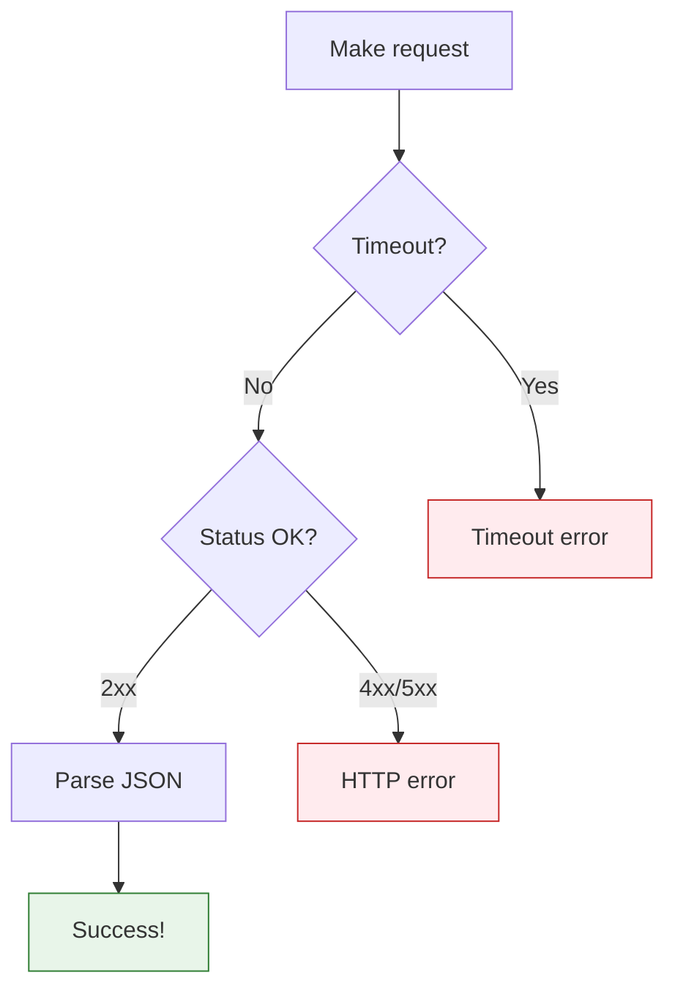

# Lesson 3.43: The Requests Library

> **Duration**: 30 min | **Section**: H - HTTP & APIs

## 🎯 The Problem (3-5 min)

Python's built-in `urllib` is verbose:

```python
# Built-in way (verbose!)
from urllib.request import urlopen, Request
from urllib.parse import urlencode
import json

url = "https://api.example.com/data"
req = Request(url, headers={"Authorization": "Bearer token"})
with urlopen(req) as response:
    data = json.loads(response.read().decode())
```

There's a better way!

## 🧪 Try It: requests Library (5-10 min)

### Installation

```bash
pip install requests
```

### Basic GET Request

```python
import requests

response = requests.get("https://api.github.com/users/octocat")
print(response.status_code)  # 200
print(response.json())       # Dict from JSON
```

### GET with Parameters

```python
# Query parameters
response = requests.get(
    "https://api.github.com/search/repositories",
    params={"q": "python", "sort": "stars"}
)
# Becomes: ?q=python&sort=stars

data = response.json()
print(data["total_count"])
```

### POST Request

```python
# Send JSON data
response = requests.post(
    "https://api.example.com/users",
    json={"name": "Alice", "email": "alice@example.com"}
)
print(response.status_code)  # 201 Created
print(response.json())
```

### With Headers

```python
response = requests.get(
    "https://api.example.com/protected",
    headers={
        "Authorization": "Bearer YOUR_TOKEN",
        "Accept": "application/json"
    }
)
```

## 🔍 Under the Hood (10-15 min)

### Response Object

```python
response = requests.get("https://api.github.com")

# Status
response.status_code    # 200
response.ok             # True (2xx status)
response.reason         # "OK"

# Headers
response.headers        # Dict of response headers
response.headers["Content-Type"]  # "application/json; charset=utf-8"

# Body
response.text           # Raw text (string)
response.content        # Raw bytes
response.json()         # Parsed JSON (dict/list)

# Request info
response.url            # Final URL (after redirects)
response.request        # The request that was sent
response.elapsed        # Time taken
```

### All HTTP Methods

```python
import requests

# GET - Retrieve
requests.get(url)

# POST - Create
requests.post(url, json=data)

# PUT - Replace
requests.put(url, json=data)

# PATCH - Partial update
requests.patch(url, json=data)

# DELETE - Remove
requests.delete(url)

# HEAD - Headers only (no body)
requests.head(url)

# OPTIONS - What methods allowed
requests.options(url)
```

### Sending Data

```python
# JSON data (most common for APIs)
requests.post(url, json={"key": "value"})
# Sets Content-Type: application/json automatically

# Form data
requests.post(url, data={"key": "value"})
# Sets Content-Type: application/x-www-form-urlencoded

# Files
requests.post(url, files={"file": open("doc.pdf", "rb")})
```

### Authentication

```python
# Bearer token (most common)
requests.get(url, headers={"Authorization": "Bearer TOKEN"})

# Basic auth
requests.get(url, auth=("username", "password"))

# Custom auth
from requests.auth import AuthBase

class TokenAuth(AuthBase):
    def __init__(self, token):
        self.token = token
    
    def __call__(self, r):
        r.headers["Authorization"] = f"Bearer {self.token}"
        return r

requests.get(url, auth=TokenAuth("mytoken"))
```

### Timeouts

```python
# Don't hang forever!
try:
    response = requests.get(url, timeout=5)  # 5 seconds
except requests.Timeout:
    print("Request timed out")

# Connect and read timeouts separately
response = requests.get(url, timeout=(3, 10))  # 3s connect, 10s read
```

### Sessions

Reuse connections and persist settings:

```python
session = requests.Session()
session.headers.update({"Authorization": "Bearer TOKEN"})

# All requests use the token
response1 = session.get("https://api.example.com/users")
response2 = session.get("https://api.example.com/posts")

# Cookies persist automatically
session.post("https://example.com/login", data={"user": "alice"})
session.get("https://example.com/dashboard")  # Logged in!
```

### Error Handling

```python
import requests
from requests.exceptions import RequestException, Timeout, HTTPError

try:
    response = requests.get(url, timeout=5)
    response.raise_for_status()  # Raises HTTPError for 4xx/5xx
    data = response.json()
except Timeout:
    print("Request timed out")
except HTTPError as e:
    print(f"HTTP error: {e.response.status_code}")
except RequestException as e:
    print(f"Request failed: {e}")
```



## 💥 Where It Breaks (3-5 min)

| Problem | Cause | Fix |
|:--------|:------|:----|
| ConnectionError | Network issue | Check connection, retry |
| Timeout | Server slow | Increase timeout, retry |
| JSONDecodeError | Response not JSON | Check response.text first |
| 401/403 | Auth issue | Check token/credentials |

### Common Mistakes

```python
# WRONG: No error handling
response = requests.get(url)
data = response.json()  # Crashes if not JSON or if error!

# WRONG: No timeout
response = requests.get(url)  # Could hang forever!

# RIGHT: Handle errors and timeout
try:
    response = requests.get(url, timeout=10)
    response.raise_for_status()
    data = response.json()
except requests.exceptions.RequestException as e:
    print(f"Request failed: {e}")
    data = None
```

## ✅ The Fix (5-10 min)

### Best Practices

```python
import requests
from requests.exceptions import RequestException

def api_request(url, method="GET", **kwargs):
    """Make API request with proper error handling."""
    kwargs.setdefault("timeout", 10)
    
    try:
        response = requests.request(method, url, **kwargs)
        response.raise_for_status()
        return response.json()
    except requests.Timeout:
        raise Exception("Request timed out")
    except requests.HTTPError as e:
        raise Exception(f"HTTP {e.response.status_code}: {e.response.text}")
    except RequestException as e:
        raise Exception(f"Request failed: {e}")

# Usage
try:
    data = api_request("https://api.example.com/data")
except Exception as e:
    print(e)
```

### Quick Reference

```python
import requests

# GET with params
response = requests.get(url, params={"key": "value"})

# POST JSON
response = requests.post(url, json={"key": "value"})

# With headers
response = requests.get(url, headers={"Auth": "token"})

# With timeout
response = requests.get(url, timeout=10)

# Check response
response.status_code  # 200
response.ok           # True
response.json()       # Parse JSON
response.text         # Raw text

# Error handling
response.raise_for_status()  # Raises on 4xx/5xx
```

## 🎯 Practice

1. Fetch GitHub user data:
   ```python
   # GET https://api.github.com/users/octocat
   # Print name, location, public repos count
   ```

2. Search GitHub repos:
   ```python
   # GET https://api.github.com/search/repositories
   # params: q="python", sort="stars"
   # Print top 5 repo names and star counts
   ```

3. Add error handling:
   ```python
   # Handle timeout, HTTP errors, connection errors
   # Print appropriate messages
   ```

## 🔑 Key Takeaways

- `requests` is the standard HTTP library for Python
- `response.json()` parses JSON to dict
- Use `params` for query strings
- Use `json` for POST/PUT body
- Always use `timeout`
- Always handle errors
- Use sessions for repeated requests
- `raise_for_status()` throws on 4xx/5xx

## ❓ Common Questions

| Question | Answer |
|----------|--------|
| json vs data? | json: sends JSON. data: sends form data. |
| When use session? | Multiple requests to same API (shares auth, cookies). |
| Why timeout? | Prevent hanging on slow/dead servers. |
| response.text vs .json()? | text: raw string. json(): parsed dict. |

## 🔗 Further Reading

- [Requests Documentation](https://docs.python-requests.org/)
- [Requests Quickstart](https://docs.python-requests.org/en/latest/user/quickstart/)
