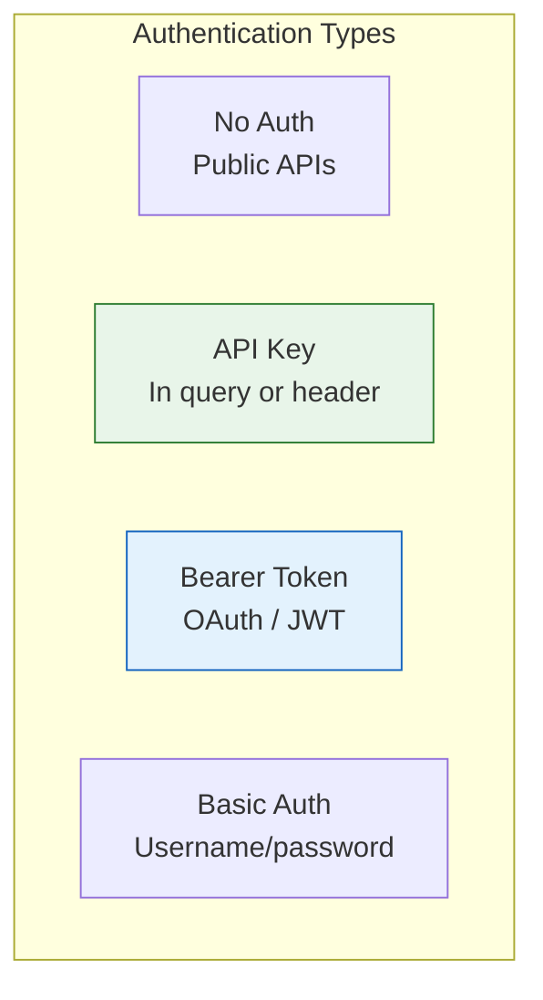

# Lesson 3.44: Working with Real APIs

> **Duration**: 30 min | **Section**: H - HTTP & APIs

## 🎯 The Problem (3-5 min)

You know HTTP and requests. Now let's use real APIs:

- Public APIs (GitHub, weather)
- Authenticated APIs (OpenAI, Stripe)
- Paginated responses
- Rate limiting

## 🧪 Try It: Real API Examples (10-15 min)

### GitHub API (No Auth)

```python
import requests

# Get user info
response = requests.get("https://api.github.com/users/octocat")
user = response.json()
print(f"Name: {user['name']}")
print(f"Repos: {user['public_repos']}")
print(f"Followers: {user['followers']}")

# Search repositories
response = requests.get(
    "https://api.github.com/search/repositories",
    params={"q": "language:python", "sort": "stars", "per_page": 5}
)
repos = response.json()["items"]
for repo in repos:
    print(f"⭐ {repo['stargazers_count']:,} - {repo['full_name']}")
```

### Weather API (Free API Key)

```python
import requests

API_KEY = "your_openweathermap_key"  # Free at openweathermap.org

response = requests.get(
    "https://api.openweathermap.org/data/2.5/weather",
    params={
        "q": "New York",
        "appid": API_KEY,
        "units": "imperial"
    }
)
weather = response.json()
print(f"Temperature: {weather['main']['temp']}°F")
print(f"Condition: {weather['weather'][0]['description']}")
```

### OpenAI API (Auth Required)

```python
import requests
import os

API_KEY = os.environ.get("OPENAI_API_KEY")

response = requests.post(
    "https://api.openai.com/v1/chat/completions",
    headers={
        "Authorization": f"Bearer {API_KEY}",
        "Content-Type": "application/json"
    },
    json={
        "model": "gpt-4",
        "messages": [
            {"role": "user", "content": "Say hello in 3 languages"}
        ]
    }
)

result = response.json()
print(result["choices"][0]["message"]["content"])
```

## 🔍 Under the Hood (10-15 min)

### API Authentication Methods



```python
# 1. No auth (public)
requests.get("https://api.github.com/users/octocat")

# 2. API key in query
requests.get(url, params={"api_key": "YOUR_KEY"})

# 3. API key in header
requests.get(url, headers={"X-API-Key": "YOUR_KEY"})

# 4. Bearer token
requests.get(url, headers={"Authorization": "Bearer TOKEN"})

# 5. Basic auth
requests.get(url, auth=("username", "password"))
```

### Handling Pagination

Many APIs return paginated results:

```python
def get_all_repos(username):
    """Fetch all repos with pagination."""
    repos = []
    page = 1
    
    while True:
        response = requests.get(
            f"https://api.github.com/users/{username}/repos",
            params={"page": page, "per_page": 100}
        )
        data = response.json()
        
        if not data:  # Empty page = done
            break
        
        repos.extend(data)
        page += 1
    
    return repos

# Or using Link header
def get_all_pages(url):
    """Follow pagination links."""
    all_data = []
    
    while url:
        response = requests.get(url)
        all_data.extend(response.json())
        
        # Check for next page link
        links = response.links
        url = links.get("next", {}).get("url")
    
    return all_data
```

### Rate Limiting

APIs limit how many requests you can make:

```python
import time
import requests

def rate_limited_request(url, max_retries=3):
    """Handle rate limiting with retry."""
    for attempt in range(max_retries):
        response = requests.get(url)
        
        if response.status_code == 429:  # Too Many Requests
            # Get retry delay from header
            retry_after = int(response.headers.get("Retry-After", 60))
            print(f"Rate limited. Waiting {retry_after}s...")
            time.sleep(retry_after)
            continue
        
        return response
    
    raise Exception("Max retries exceeded")

# Check remaining rate limit
response = requests.get("https://api.github.com/rate_limit")
limits = response.json()
print(f"Remaining: {limits['rate']['remaining']}")
print(f"Resets at: {limits['rate']['reset']}")
```

### Environment Variables for API Keys

**Never hardcode API keys!**

```python
import os

# Set in terminal:
# export OPENAI_API_KEY="sk-..."

API_KEY = os.environ.get("OPENAI_API_KEY")
if not API_KEY:
    raise ValueError("OPENAI_API_KEY not set")

# Or use python-dotenv
from dotenv import load_dotenv
load_dotenv()  # Loads from .env file
API_KEY = os.getenv("OPENAI_API_KEY")
```

```bash
# .env file (add to .gitignore!)
OPENAI_API_KEY=sk-...
GITHUB_TOKEN=ghp_...
```

### Building a Simple API Client

```python
import requests

class GitHubClient:
    """Simple GitHub API client."""
    
    BASE_URL = "https://api.github.com"
    
    def __init__(self, token=None):
        self.session = requests.Session()
        self.session.headers["Accept"] = "application/vnd.github+json"
        if token:
            self.session.headers["Authorization"] = f"Bearer {token}"
    
    def _request(self, method, path, **kwargs):
        """Make request with error handling."""
        url = f"{self.BASE_URL}{path}"
        response = self.session.request(method, url, timeout=10, **kwargs)
        response.raise_for_status()
        return response.json()
    
    def get_user(self, username):
        """Get user profile."""
        return self._request("GET", f"/users/{username}")
    
    def get_repos(self, username):
        """Get user's repositories."""
        return self._request("GET", f"/users/{username}/repos")
    
    def search_repos(self, query, sort="stars"):
        """Search repositories."""
        return self._request("GET", "/search/repositories",
                           params={"q": query, "sort": sort})

# Usage
gh = GitHubClient()
user = gh.get_user("octocat")
print(user["name"])
```

## 💥 Where It Breaks (3-5 min)

| Problem | Cause | Fix |
|:--------|:------|:----|
| 401 Unauthorized | Bad/expired token | Refresh token, check format |
| 429 Too Many Requests | Rate limited | Wait, implement backoff |
| API changed | Version mismatch | Check API version, update code |
| Nested JSON | Complex response | Navigate carefully |

### Navigating Complex JSON

```python
response = requests.get("https://api.example.com/data")
data = response.json()

# Deep nesting - be careful!
# data["results"][0]["user"]["profile"]["name"]

# Safer with .get() 
name = data.get("results", [{}])[0].get("user", {}).get("profile", {}).get("name")

# Or helper function
def safe_get(data, *keys, default=None):
    """Safely navigate nested dict."""
    for key in keys:
        if isinstance(data, dict):
            data = data.get(key, default)
        elif isinstance(data, list) and isinstance(key, int):
            data = data[key] if len(data) > key else default
        else:
            return default
    return data

name = safe_get(data, "results", 0, "user", "profile", "name")
```

## ✅ The Fix (5-10 min)

### Complete API Client Example

```python
import os
import time
import requests
from requests.exceptions import RequestException

class APIClient:
    """Robust API client with error handling."""
    
    def __init__(self, base_url, api_key=None):
        self.base_url = base_url.rstrip("/")
        self.session = requests.Session()
        if api_key:
            self.session.headers["Authorization"] = f"Bearer {api_key}"
        self.session.headers["Content-Type"] = "application/json"
    
    def request(self, method, path, retries=3, **kwargs):
        """Make request with retry and error handling."""
        url = f"{self.base_url}{path}"
        kwargs.setdefault("timeout", 30)
        
        for attempt in range(retries):
            try:
                response = self.session.request(method, url, **kwargs)
                
                # Handle rate limiting
                if response.status_code == 429:
                    wait = int(response.headers.get("Retry-After", 60))
                    time.sleep(wait)
                    continue
                
                response.raise_for_status()
                return response.json()
                
            except RequestException as e:
                if attempt == retries - 1:
                    raise
                time.sleep(2 ** attempt)  # Exponential backoff
    
    def get(self, path, **kwargs):
        return self.request("GET", path, **kwargs)
    
    def post(self, path, **kwargs):
        return self.request("POST", path, **kwargs)
```

## 🎯 Practice

1. Fetch GitHub user stats:
   ```python
   # Get user, print repos, followers, following
   ```

2. Build a weather function:
   ```python
   # get_weather(city) -> dict with temp, condition
   # Use openweathermap.org (free API key)
   ```

3. Implement pagination:
   ```python
   # Get ALL repos for a user with many repos
   # Handle multiple pages
   ```

## 🔑 Key Takeaways

- Use environment variables for API keys
- Handle rate limiting (429 status, Retry-After header)
- Implement pagination for large result sets
- Build client classes for complex APIs
- Always timeout, always handle errors
- Navigate nested JSON carefully

## ❓ Common Questions

| Question | Answer |
|----------|--------|
| Where to get API key? | Sign up on provider's website. |
| How to hide API key? | Environment variables or .env file. |
| What if rate limited? | Wait and retry. Respect Retry-After. |
| How to test without hitting API? | Use mocking (unittest.mock) or VCR. |

## 🔗 Further Reading

- [GitHub API Docs](https://docs.github.com/en/rest)
- [OpenAI API Docs](https://platform.openai.com/docs/api-reference)
- [python-dotenv](https://pypi.org/project/python-dotenv/)
