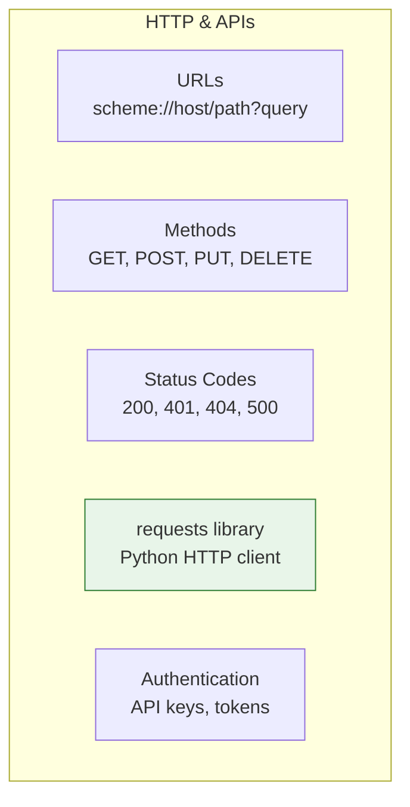
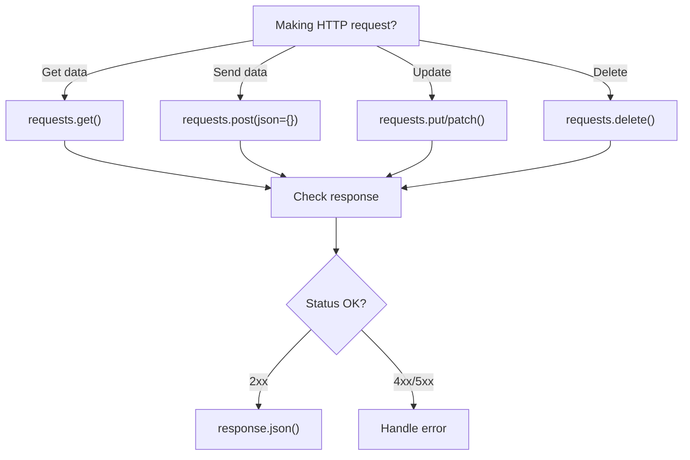

# Lesson 3.45: HTTP & APIs Q&A

> **Duration**: 10 min | **Section**: H - HTTP & APIs (Wrap-up)

## 📋 Section H Summary



## 🧠 Concept Check

| Concept | Question | Answer |
|:--------|:---------|:-------|
| GET | What's it for? | Retrieving data |
| POST | What's it for? | Creating data |
| 200 | What does it mean? | Success (OK) |
| 401 | What does it mean? | Unauthorized (auth failed) |
| 404 | What does it mean? | Not found |
| 429 | What does it mean? | Rate limited |
| requests.get() | What returns? | Response object |
| response.json() | What returns? | Parsed JSON (dict/list) |

## ❓ Frequently Asked Questions

### HTTP Basics

| Question | Answer |
|----------|--------|
| GET vs POST? | GET: read. POST: create/send data. |
| PUT vs PATCH? | PUT: replace all. PATCH: update part. |
| 401 vs 403? | 401: who are you? 403: no permission. |
| What's REST? | Architectural style using resources + HTTP methods. |

### requests Library

| Question | Answer |
|----------|--------|
| json vs data param? | json: sends JSON. data: sends form. |
| Why use timeout? | Prevent hanging on slow/dead servers. |
| Why use session? | Share auth/cookies, reuse connections. |
| How check success? | response.ok or response.raise_for_status() |

### API Best Practices

| Question | Answer |
|----------|--------|
| How store API keys? | Environment variables or .env file. |
| How handle rate limits? | Wait and retry, check Retry-After header. |
| How handle pagination? | Loop until empty page or follow next links. |
| How test without API? | Mocking or VCR libraries. |

## 🔗 Quick Reference

```python
import requests
import os

# === BASIC REQUESTS ===
# GET
response = requests.get(url)
response = requests.get(url, params={"key": "value"})

# POST
response = requests.post(url, json={"key": "value"})

# With headers
response = requests.get(url, headers={"Authorization": "Bearer TOKEN"})

# With timeout (always!)
response = requests.get(url, timeout=10)

# === RESPONSE HANDLING ===
response.status_code  # 200
response.ok           # True for 2xx
response.json()       # Parse JSON
response.text         # Raw text
response.headers      # Response headers

# Raise on error
response.raise_for_status()

# === ERROR HANDLING ===
from requests.exceptions import RequestException, Timeout, HTTPError

try:
    response = requests.get(url, timeout=10)
    response.raise_for_status()
    data = response.json()
except Timeout:
    print("Timed out")
except HTTPError as e:
    print(f"HTTP {e.response.status_code}")
except RequestException as e:
    print(f"Error: {e}")

# === SESSIONS ===
session = requests.Session()
session.headers["Authorization"] = "Bearer TOKEN"
response = session.get(url)

# === API KEYS ===
# From environment
API_KEY = os.environ.get("API_KEY")

# From .env file
from dotenv import load_dotenv
load_dotenv()
API_KEY = os.getenv("API_KEY")
```

## 📊 Decision Tree



## 🔧 Common Patterns

```python
# === RETRY WITH BACKOFF ===
import time

def request_with_retry(url, max_retries=3):
    for attempt in range(max_retries):
        try:
            response = requests.get(url, timeout=10)
            response.raise_for_status()
            return response.json()
        except requests.RequestException:
            if attempt == max_retries - 1:
                raise
            time.sleep(2 ** attempt)

# === PAGINATION ===
def get_all_pages(base_url):
    results = []
    page = 1
    while True:
        response = requests.get(base_url, params={"page": page})
        data = response.json()
        if not data:
            break
        results.extend(data)
        page += 1
    return results

# === SIMPLE API CLIENT ===
class APIClient:
    def __init__(self, base_url, api_key):
        self.base_url = base_url
        self.session = requests.Session()
        self.session.headers["Authorization"] = f"Bearer {api_key}"
    
    def get(self, path, **kwargs):
        return self.session.get(
            f"{self.base_url}{path}", 
            timeout=10, 
            **kwargs
        ).json()
```

## 💥 Common Pitfalls

| Pitfall | What Happens | Fix |
|---------|--------------|-----|
| No timeout on requests | Program hangs forever | Always use `timeout=10` |
| Hardcoded API keys | Exposed in code/git | Use environment variables |
| Not checking status code | Proceed with error response | Use `response.raise_for_status()` |
| Ignoring rate limits | 429 errors, API ban | Implement backoff and retry |
| Assuming JSON response | Error on non-JSON | Check Content-Type or catch exception |

## 🔑 Key Takeaways

1. **HTTP = request/response** - GET reads, POST creates, PUT updates, DELETE removes
2. **Status codes matter** - 2xx success, 4xx client error, 5xx server error
3. **Always use timeout** - Never trust network reliability
4. **requests library is standard** - Simple, powerful, well-documented
5. **Handle errors gracefully** - Network fails, APIs change, rate limits hit
6. **Sessions for efficiency** - Reuse connections, share auth

## 🏁 Module 3 Complete!

Congratulations! You've completed **Python Core**!

### What You've Learned:
- **Section A**: Python execution, variables, types, strings
- **Section B**: Collections (lists, dicts, tuples, sets)
- **Section C**: Control flow (if/else, loops, break/continue)
- **Section D**: Functions (parameters, scope, closures)
- **Section E**: Classes & OOP (inheritance, special methods)
- **Section F**: Error handling & File I/O
- **Section G**: Modules & Packages
- **Section H**: HTTP & APIs

### You Can Now:
- Write complete Python programs
- Structure code with functions and classes
- Handle errors gracefully
- Work with files (text, JSON, CSV)
- Make HTTP requests to APIs
- Organize code into modules and packages

**Next Module**: PostgreSQL (Database)

You'll learn:
- Relational database concepts
- SQL queries (SELECT, INSERT, UPDATE, DELETE)
- Python database integration
- Data modeling
