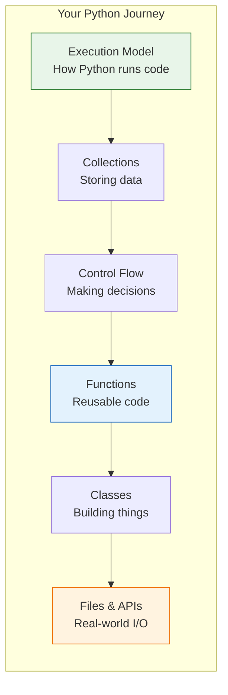
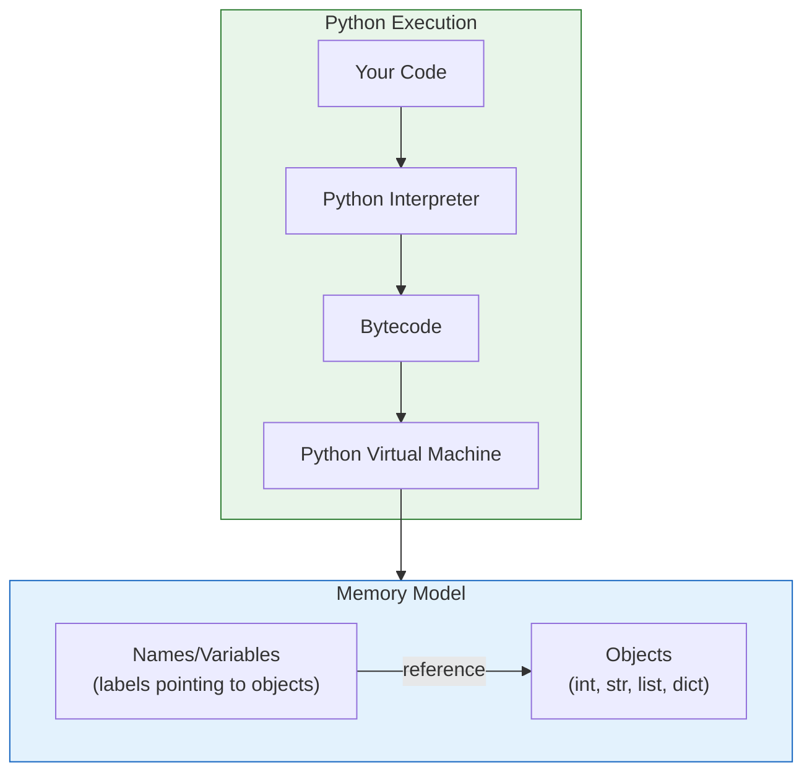

# Module 3: Python Core

> **Duration**: Week 2-3 | **Lessons**: 46 | **Project**: CLI Tool with API Integration

## Overview

This module teaches Python from first principles. You won't just write code that works—you'll understand *why* it works by building mental models of how Python executes your programs.

## The Problem We're Solving

> "You do the same task 100 times a day. Clicking, copying, pasting. Your time is worth more than this."

You need to:
- Rename 500 files
- Fetch data from 10 APIs
- Generate a report

Do it by hand? Or write 20 lines of Python?

## Learning Objectives

By the end of this module, you will:

| Skill | What You'll Master |
|:------|:-------------------|
| **Execution Model** | Understand how Python runs code line by line |
| **Variables** | Know that variables are labels pointing to objects |
| **Data Types** | Work with numbers, strings, lists, dicts, sets |
| **Control Flow** | Make decisions and repeat actions |
| **Functions** | Write reusable code with proper scope |
| **Classes** | Build objects that bundle data and behavior |
| **Errors** | Handle failures gracefully |
| **Files** | Read, write, and process data |
| **APIs** | Fetch data from the web |

## Sections

### Section A: Python Execution Model (Lessons 3.0-3.7)
How Python runs your code. Variables, types, and memory.

### Section B: Collections (Lessons 3.8-3.15)
Lists, dictionaries, tuples, sets. When to use each.

### Section C: Control Flow (Lessons 3.16-3.20)
If statements, loops, breaking and continuing.

### Section D: Functions (Lessons 3.21-3.25)
Defining functions, parameters, scope, closures.

### Section E: Classes & Objects (Lessons 3.26-3.31)
Object-oriented programming from scratch.

### Section F: Error Handling & Files (Lessons 3.32-3.35)
Exceptions, file I/O, JSON.

### Section G: Modules & Professional Setup (Lessons 3.36-3.40)
Imports, virtual environments, packages, type hints.

### Section H: HTTP & APIs (Lessons 3.41-3.45)
Making web requests, async basics.

## Lesson Index

| # | Lesson | Duration |
|:-:|:-------|:--------:|
| 3.0 | The Automation Problem | 10 min |
| 3.1 | What IS Python? | 20 min |
| 3.2 | Running Python | 15 min |
| 3.3 | Variables Under the Hood | 25 min |
| 3.4 | Data Types: Numbers & Booleans | 20 min |
| 3.5 | Data Types: Strings | 30 min |
| 3.6 | f-strings | 20 min |
| 3.7 | Python Basics Q&A | 10 min |
| 3.8 | The Multiple Items Problem | 5 min |
| 3.9 | Lists Under the Hood | 30 min |
| 3.10 | List Operations | 30 min |
| 3.11 | The Lookup Problem | 5 min |
| 3.12 | Dictionaries Under the Hood | 30 min |
| 3.13 | Dictionary Operations | 25 min |
| 3.14 | Tuples and Sets | 25 min |
| 3.15 | Collections Q&A | 10 min |
| 3.16 | The Decision Problem | 5 min |
| 3.17 | Conditionals | 25 min |
| 3.18 | Loops | 30 min |
| 3.19 | Loop Control | 20 min |
| 3.20 | Control Flow Q&A | 10 min |
| 3.21 | The Repetition Problem | 5 min |
| 3.22 | Defining Functions | 35 min |
| 3.23 | Parameters & Arguments | 30 min |
| 3.24 | Scope & Closures | 35 min |
| 3.25 | Functions Q&A | 10 min |
| 3.26 | The Modeling Problem | 5 min |
| 3.27 | Defining Classes | 40 min |
| 3.28 | Special Methods | 25 min |
| 3.29 | Inheritance | 30 min |
| 3.30 | Properties & Encapsulation | 30 min |
| 3.31 | Classes Q&A | 10 min |
| 3.32 | The Failure Problem | 5 min |
| 3.33 | Exception Handling | 30 min |
| 3.34 | File I/O | 30 min |
| 3.35 | Errors & Files Q&A | 10 min |
| 3.36 | The Organization Problem | 5 min |
| 3.37 | Importing Modules | 30 min |
| 3.38 | Creating Modules | 25 min |
| 3.39 | Packages & Venv | 25 min |
| 3.40 | Modules & Packages Q&A | 10 min |
| 3.41 | The External Data Problem | 5 min |
| 3.42 | HTTP Fundamentals | 30 min |
| 3.43 | Requests Library | 35 min |
| 3.44 | Working With APIs | 30 min |
| 3.45 | HTTP & APIs Q&A | 15 min |

## The Python Mental Model

## Project: CLI Weather Tool

Build a command-line tool that:
1. Fetches weather from an API
2. Caches results in JSON
3. Handles errors gracefully
4. Uses proper project structure

## Independence Check

After this module, you should be able to:

| Level | Question |
|:------|:---------|
| **Know** | What is a variable? What is a function? |
| **Understand** | Why are dictionaries O(1) lookup? Why use `with` for files? |
| **Apply** | Write a function that takes `*args` and returns a dict |
| **Analyze** | Debug "TypeError: 'NoneType' has no attribute 'get'" |
| **Create** | Build a CLI tool that fetches and caches API data |

## External References

- [Python Official Tutorial](https://docs.python.org/3/tutorial/)
- [Python Data Model](https://docs.python.org/3/reference/datamodel.html)
- [Real Python](https://realpython.com/)

---

**Prerequisites**: Module 1 (Linux & Terminal), Module 2 (Git & Version Control)

**Next Module**: Module 4 (PostgreSQL)
