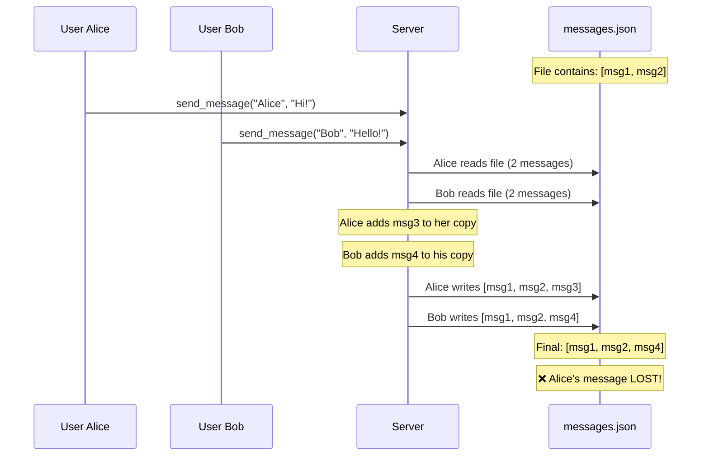
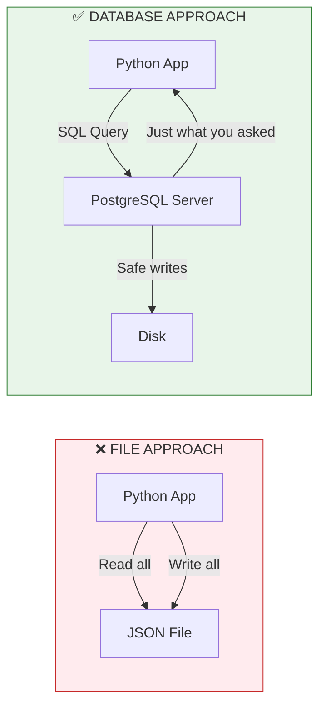

# Lesson 4.0: The Persistence Problem

> **Duration**: 10 min | **Section**: A - What IS a Database?

## 🎯 The Problem (3-5 min)

You've built something cool in Python. A chat app. Users send messages, you store them in a list:

```python
messages = []

def send_message(user, text):
    messages.append({"user": user, "text": text})
    print(f"Message stored! Total: {len(messages)}")

send_message("Alice", "Hello!")
send_message("Bob", "Hi there!")
send_message("Alice", "How are you?")

print(messages)
# [{'user': 'Alice', 'text': 'Hello!'}, 
#  {'user': 'Bob', 'text': 'Hi there!'}, 
#  {'user': 'Alice', 'text': 'How are you?'}]
```

Beautiful. It works. 

Then your server restarts.

**ALL MESSAGES GONE.**

> **Scenario**: You're building a chat app. You deployed it Friday night. Users love it! 1000 messages by Saturday morning. Saturday 2pm: server update requires a restart. Sunday morning: "Where did all my messages go?" The users are FURIOUS.

This is the **persistence problem**.

## 🧪 Try It: The Naive Approach (5-10 min)

"Easy," you think. "I'll just save to a file!"

```python
import json

MESSAGES_FILE = "messages.json"

def load_messages():
    try:
        with open(MESSAGES_FILE, "r") as f:
            return json.load(f)
    except FileNotFoundError:
        return []

def save_messages(messages):
    with open(MESSAGES_FILE, "w") as f:
        json.dump(messages, f)

def send_message(user, text, messages):
    messages.append({"user": user, "text": text})
    save_messages(messages)  # Save after every message!
    return messages

# It works!
messages = load_messages()
messages = send_message("Alice", "Hello!", messages)
messages = send_message("Bob", "Hi!", messages)
# Server restarts... no problem!
messages = load_messages()
print(messages)  # Still there!
```

You feel clever. Problem solved!

...or is it?

## 🔍 Under the Hood (10-15 min)

Let's trace what happens when TWO users send messages at the SAME TIME:



**Bob's write OVERWROTE Alice's write!** This is a **race condition**.

## 💥 Where It Breaks (3-5 min)

The file approach fails in multiple ways:

| Problem | What Happens |
|---------|--------------|
| **Race conditions** | Two users write at the same time → one loses |
| **No partial updates** | Want to update ONE message? Rewrite the ENTIRE file |
| **No queries** | "Find all messages from Alice" → read entire file, loop through |
| **Slow at scale** | 1 million messages? Load ALL of them just to add one |
| **No relationships** | "Who sent message 47?" → you stored user_id, but where's the user data? |
| **Crashes mid-write** | Server dies while writing → corrupted file, ALL data gone |

Real apps need:
- ✅ Multiple users simultaneously
- ✅ Fast lookups without reading everything
- ✅ Relationships between data
- ✅ Guarantees that data is never corrupted

## ✅ The Fix (10-15 min)

This is exactly what **databases** solve. A database is:

1. **A server** - separate process, always running
2. **Structured storage** - data organized in tables (like spreadsheets)
3. **Query engine** - ask questions without reading everything
4. **Transaction manager** - handles simultaneous users safely
5. **Durability guarantees** - data survives crashes



With PostgreSQL, our chat app becomes:

```python
import psycopg2

# Connect to database server (running separately)
conn = psycopg2.connect("postgresql://localhost/chatapp")
cursor = conn.cursor()

# Add a message - only touches ONE row
cursor.execute(
    "INSERT INTO messages (user_id, text) VALUES (%s, %s)",
    (1, "Hello!")
)
conn.commit()

# Find messages from Alice - database does the work
cursor.execute(
    "SELECT text FROM messages WHERE user_id = 1"
)
alice_messages = cursor.fetchall()

# Multiple users? Database handles it safely!
```

## 🎯 Practice

Think about apps you use daily:

1. **Instagram** - Where do your photos live when you close the app?
2. **WhatsApp** - How does it remember your messages after your phone restarts?
3. **Your bank** - Would you trust a bank that saved your balance to a JSON file?

For each, consider:
- What data needs to survive restarts?
- What happens if two people access data simultaneously?
- How would you find specific data quickly?

## 🔑 Key Takeaways

- **Python variables die** when your program ends
- **Files work** for simple cases but fail with multiple users, scale, and queries
- **Databases** are specialized servers built for persistent, concurrent, queryable data
- **PostgreSQL** is one of the most popular, reliable, and powerful databases

## ❓ Common Questions

| Question | Answer |
|----------|--------|
| "Why not just use SQLite?" | SQLite is a file-based database—great for single-user apps (mobile apps, prototypes). PostgreSQL is a server—built for multiple users, networks, scale. |
| "Can't Redis solve this?" | Redis is an in-memory store—great for caching, but data can be lost. PostgreSQL writes to disk—data survives everything. |
| "What about MongoDB?" | MongoDB is document-based (like JSON). Great for flexible schemas. PostgreSQL is relational—better for structured data with relationships. |
| "Is this why my app lost data?" | Probably! If you're storing important data in Python variables or simple files, a restart = data loss. |

## 📚 Further Reading

- [PostgreSQL: About](https://www.postgresql.org/about/)
- [What is ACID in Databases?](https://www.postgresql.org/docs/current/transaction-iso.html)
- [SQLite vs PostgreSQL](https://www.prisma.io/dataguide/postgresql/sqlite-vs-postgresql)

---

**Next Lesson**: [4.1 Databases Under the Hood](./Lesson-04-01-Databases-Under-The-Hood.md) - How do databases actually work?
