# Lesson 4.1: Databases Under the Hood

> **Duration**: 25 min | **Section**: A - What IS a Database?

## 🎯 The Problem (3-5 min)

You now know you need a database. But what actually IS one?

When you run `psql` and type `INSERT INTO users VALUES (1, 'Alice')`, what happens? Where does "Alice" go? How does the database find her again later?

> **Scenario**: Your boss asks, "Why are we paying for a managed PostgreSQL database when we could just use files?" You need to explain WHY databases exist and what they do that files don't.

## 🧪 Try It: The Naive Approach (5-10 min)

Let's think about what a database COULD be:

"It's just a bunch of files, right? Tables are files, rows are lines..."

```
# users.txt
1,Alice,alice@example.com
2,Bob,bob@example.com
3,Carol,carol@example.com
```

To find Alice:
```python
def find_user(name):
    with open("users.txt") as f:
        for line in f:
            id, user_name, email = line.strip().split(",")
            if user_name == name:
                return {"id": id, "name": user_name, "email": email}
    return None
```

This works for 10 users. What about 10 million?

## 🔍 Under the Hood (10-15 min)

A real database does **much more** than store data in files:


### The Components

| Component | Purpose | Analogy |
|-----------|---------|---------|
| **Query Parser** | Understands your SQL | Reading a recipe |
| **Query Planner** | Figures out the fastest way to get data | Planning your grocery store route |
| **Buffer Pool** | Caches frequently used data in RAM | Keeping common ingredients on the counter |
| **Write-Ahead Log** | Records changes BEFORE applying them | Writing down what you changed before doing it |
| **Indexes** | Speed up lookups | Book's index—find page without reading everything |

### The Magic: ACID Guarantees

Databases provide **ACID** properties—guarantees that files can't provide:


| Property | What It Means | Example |
|----------|---------------|---------|
| **Atomicity** | Transaction succeeds completely or not at all | Transfer $100: deduct from A AND add to B, or neither |
| **Consistency** | Data always follows the rules | Email must be unique—database rejects duplicates |
| **Isolation** | Concurrent users don't see half-done work | You don't see Bob's message until he's done composing |
| **Durability** | Once committed, data survives crashes | Power outage → data still there when you restart |

### Write-Ahead Logging (WAL) - The Safety Net

This is how databases survive crashes:

```mermaid
sequenceDiagram
    participant App
    participant DB as PostgreSQL
    participant WAL as Write-Ahead Log
    participant Data as Data Files

    App->>DB: INSERT INTO users VALUES (1, 'Alice')
    DB->>WAL: Log: "INSERT user 1, Alice"
    WAL-->>DB: Logged ✓
    DB->>App: Success!
    
    Note over DB,Data: Later (async)...
    DB->>Data: Write actual data to file
    
    Note over DB,Data: 💥 Crash happens!
    
    Note over DB,WAL: On restart...
    DB->>WAL: Read log
    WAL-->>DB: "INSERT user 1, Alice"
    DB->>Data: Replay: write user 1, Alice
    Note over Data: Data recovered! ✅
```



**The log is written BEFORE the actual data.** If the database crashes mid-write, it can replay the log to recover.

## 💥 Where It Breaks (3-5 min)

Even with all this, databases have limits:

| Limitation | Why |
|------------|-----|
| **Network latency** | Database is a server—every query is a network round-trip |
| **Connection limits** | PostgreSQL has a max number of connections (usually ~100) |
| **Disk I/O** | Ultimately limited by how fast your disk can read/write |
| **Memory** | Buffer pool is finite—can't cache everything |

That's why you'll learn about:
- **Connection pooling** (reuse connections)
- **Indexes** (avoid full table scans)
- **Caching** (Redis in front of PostgreSQL)

## ✅ The Fix (10-15 min)

Understanding the architecture helps you:

### 1. Write Better Queries

```sql
-- Bad: Forces full table scan
SELECT * FROM users WHERE email = 'alice@example.com';

-- Good: Use an index (we'll learn how to create these)
CREATE INDEX idx_users_email ON users(email);
-- Now the same query is instant!
```

### 2. Understand Why Things Are Slow

```mermaid
flowchart LR
    Q["Query"]
    
    subgraph SLOW["❌ SLOW PATH"]
        DISK["Read from disk
        (milliseconds)"]
    end
    
    subgraph FAST["✅ FAST PATH"]
        CACHE["Read from buffer pool
        (microseconds)"]
    end
    
    Q --> CACHE
    Q --> DISK
    
    style SLOW fill:#FFEBEE,stroke:#C62828
    style FAST fill:#E8F5E9,stroke:#2E7D32
```



### 3. Trust the Durability

Once PostgreSQL says "COMMIT successful," your data is safe:

```python
conn = psycopg2.connect(...)
cursor = conn.cursor()

cursor.execute("INSERT INTO orders VALUES (...)")
conn.commit()  # <-- After this returns, data is DURABLE

# Even if server crashes right here, order is saved!
```

## 🎯 Practice

Answer these questions about your mental model:

1. **When you INSERT a row, where does it go first?** (Hint: not the data file)
2. **Why is reading data sometimes fast and sometimes slow?** (Hint: buffer pool)
3. **What's the point of the Write-Ahead Log?** (Hint: crash recovery)
4. **Why can't 10,000 users connect directly to PostgreSQL?** (Hint: connection limits)

## 🔑 Key Takeaways

- **PostgreSQL is a server** with multiple sophisticated components
- **Buffer pool** caches hot data in RAM for speed
- **Write-Ahead Log** ensures durability—data survives crashes
- **ACID guarantees** are what make databases trustworthy
- **Files can't provide** atomicity, isolation, or crash recovery

## ❓ Common Questions

| Question | Answer |
|----------|--------|
| "Is PostgreSQL the only database with ACID?" | No! MySQL, Oracle, SQL Server all have ACID. SQLite does too (single-user). |
| "What's the difference between PostgreSQL and MySQL?" | PostgreSQL is more feature-rich and standards-compliant. MySQL is faster for simple queries. Both are great. |
| "Do I need to understand all this to USE a database?" | No, but understanding it helps you write better queries and debug performance issues. |
| "What about NoSQL databases?" | Many NoSQL databases trade ACID for performance/flexibility. MongoDB, Cassandra, etc. have different guarantees. |

## 📚 Further Reading

- [PostgreSQL Architecture](https://www.postgresql.org/docs/current/tutorial-arch.html)
- [Write-Ahead Logging (WAL)](https://www.postgresql.org/docs/current/wal-intro.html)
- [ACID Properties Explained](https://www.ibm.com/docs/en/cics-ts/5.4?topic=processing-acid-properties-transactions)

---

**Next Lesson**: [4.2 The Relational Model](./Lesson-04-02-Relational-Model.md) - Tables, rows, columns, and relationships
